# Microservicios — Guía Completa de Aprendizaje

> De principiante a Arquitecto de Software · Sistemas Distribuidos de alta escalabilidad
> Inspirada en prácticas reales de Netflix, Amazon, Uber, Spotify y Google.

---

## 📑 Índice

1. [Cómo usar esta guía](#cómo-usar-esta-guía)
2. [Módulo 1 · Fundamentos](#módulo-1--fundamentos-de-microservicios)
3. [Módulo 2 · Diseño (DDD)](#módulo-2--diseño-de-microservicios)
4. [Módulo 3 · Comunicación](#módulo-3--comunicación-entre-servicios)
5. [Módulo 4 · Gestión de Datos](#módulo-4--gestión-de-datos)
6. [Módulo 5 · Patrones de Arquitectura](#módulo-5--patrones-de-arquitectura)
7. [Módulo 6 · Resiliencia](#módulo-6--resiliencia)
8. [Módulo 7 · API Gateway](#módulo-7--api-gateway)
9. [Módulo 8 · Seguridad](#módulo-8--seguridad)
10. [Módulo 9 · Observabilidad](#módulo-9--observabilidad)
11. [Módulo 10 · DevOps & Cloud Native](#módulo-10--devops--cloud-native)
12. [Módulo 11 · Service Mesh](#módulo-11--service-mesh)
13. [Módulo 12 · Escalabilidad](#módulo-12--escalabilidad)
14. [Módulo 13 · Anti-Patrones](#módulo-13--anti-patrones)
15. [Módulo 14 · Casos Reales](#módulo-14--casos-reales)
16. [Módulo 15 · Testing en Microservicios](#módulo-15--testing-en-microservicios)
17. [Módulo 16 · Costos y FinOps](#módulo-16--costos-y-finops)
18. [Mejores Prácticas](#-mejores-prácticas-transversales)
19. [Roadmap de Aprendizaje](#-roadmap-de-aprendizaje)
20. [Planes de Estudio (30/60/90 días)](#-planes-de-estudio)
21. [Proyectos Prácticos](#-proyectos-prácticos-progresivos)
22. [Glosario](#-glosario)

---

## Cómo usar esta guía

Cada concepto sigue una estructura fija para que aprendas el **POR QUÉ antes que el CÓMO**:

| Sección | Pregunta que responde |
|---|---|
| **Definición** | ¿Qué es? |
| **¿Por qué existe?** | ¿Qué problema resuelve? |
| **¿Cuándo usarlo?** | ¿En qué escenarios reales aplica? |
| **Ventajas / Desventajas** | ¿Qué gano y qué pierdo? |
| **Problemas comunes** | ¿Qué suele salir mal? |
| **Mejores prácticas** | ¿Cómo lo hago bien? |
| **Ejemplo** | ¿Cómo se ve en la práctica? |

> 🧠 **Regla de oro**: Un microservicio no es "un servicio pequeño". Es un servicio con **autonomía de despliegue** y **propiedad de sus datos**. Si no puedes desplegarlo sin coordinar con otro equipo, no es un microservicio: es un monolito distribuido.

---

# Módulo 1 · Fundamentos de Microservicios

## 1.1 Evolución del software

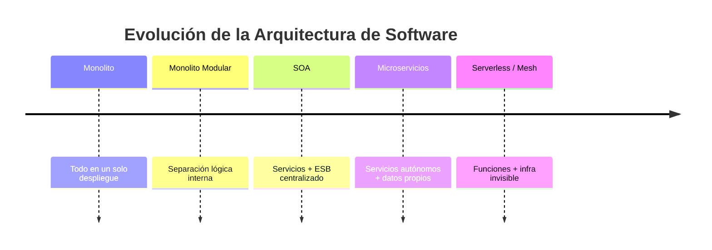

El software no evolucionó por moda, sino por **presión de escala**: más usuarios, más desarrolladores trabajando en paralelo y mayor necesidad de desplegar rápido sin romper todo.

---

## 1.2 Arquitectura Monolítica

### Definición
Una aplicación donde **toda la lógica** (UI, negocio, acceso a datos) vive en un único artefacto desplegable.

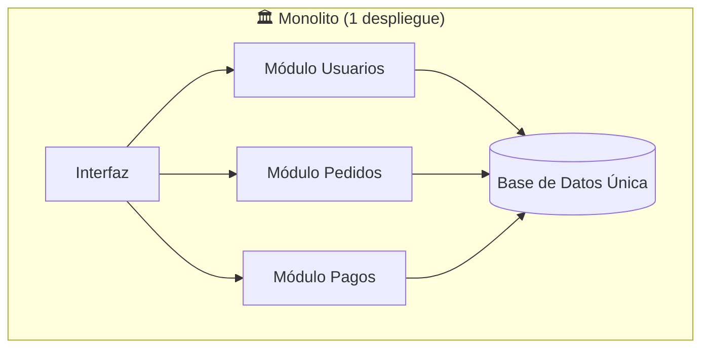

### ¿Por qué existe?
Es la forma **más simple y rápida** de empezar. Un solo repositorio, un solo despliegue, una sola base de datos. **No subestimes el monolito**: es la elección correcta para la mayoría de proyectos nuevos.

### Ventajas
- ✅ Desarrollo inicial rápido y simple.
- ✅ Fácil de testear de punta a punta.
- ✅ Sin latencia de red entre módulos (llamadas en memoria).
- ✅ Transacciones ACID triviales (una sola DB).
- ✅ Despliegue y debugging sencillos.

### Desventajas (los problemas del monolito)
- ❌ **Acoplamiento**: un cambio pequeño obliga a desplegar TODO.
- ❌ **Escalado ineficiente**: si solo "Pagos" tiene carga, igual debes escalar toda la app.
- ❌ **Barrera tecnológica**: todo el equipo atado al mismo lenguaje/framework.
- ❌ **Despliegues lentos y arriesgados**: un bug tumba toda la aplicación.
- ❌ **Bola de barro** (*Big Ball of Mud*): con el tiempo los límites internos se erosionan.

---

## 1.3 Nacimiento de los Microservicios

### Definición
Estilo arquitectónico que estructura una aplicación como una colección de **servicios pequeños, autónomos y desplegables de forma independiente**, organizados en torno a **capacidades de negocio** y propietarios de sus propios datos.

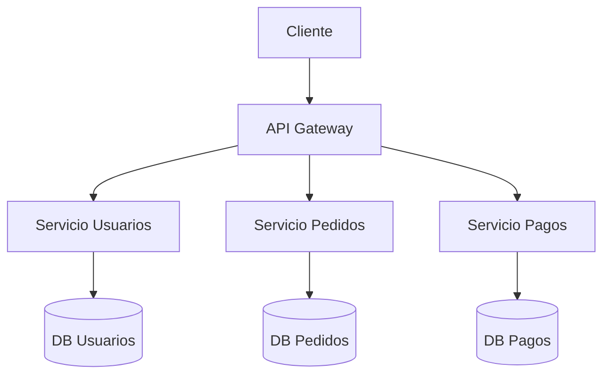

**Explicación del diagrama:**
- **Componentes**: cada servicio tiene su lógica y su **propia base de datos**.
- **Flujo**: el cliente nunca habla directo con los servicios; pasa por el Gateway.
- **Posibles fallos**: si `Servicio Pagos` cae, ¿se cae todo? No debería (ver Módulo 6: Resiliencia).
- **Soluciones**: Circuit Breaker, fallback y comunicación asíncrona desacoplan los fallos.

### Características principales
| Característica | Significado |
|---|---|
| **Autonomía de despliegue** | Despliegas un servicio sin tocar los demás. |
| **Database per Service** | Cada servicio es dueño exclusivo de sus datos. |
| **Descentralización** | Cada equipo elige su stack ("polyglot"). |
| **Organizados por negocio** | No por capa técnica, sino por capacidad (Pagos, Envíos). |
| **Resiliencia por diseño** | Asumen que la red y las dependencias fallan. |
| **Comunicación por red** | APIs (REST/gRPC) o mensajería (eventos). |

### Desafíos (lo que el monolito no tenía)
- 🔥 **Complejidad operativa**: ahora gestionas N servicios, N despliegues, N bases de datos.
- 🔥 **Consistencia distribuida**: ya no hay transacciones ACID globales.
- 🔥 **Latencia y fallos de red**: las llamadas en memoria ahora viajan por la red.
- 🔥 **Observabilidad difícil**: una petición cruza muchos servicios (necesitas tracing).
- 🔥 **Testing complejo**: probar interacciones distribuidas es duro.

> ⚠️ **Ley de Conway**: "Las organizaciones diseñan sistemas que copian su estructura de comunicación." Si tu empresa tiene equipos por capacidad de negocio, los microservicios encajan. Si tienes un solo equipo de 4 personas, probablemente un monolito modular es mejor.

---

## 1.4 Comparativas

### Monolito vs Microservicios

| Criterio | Monolito | Microservicios |
|---|---|---|
| Despliegue | Único | Independiente por servicio |
| Escalado | Toda la app | Por servicio |
| Base de datos | Compartida | Una por servicio |
| Stack tecnológico | Único | Poliglota |
| Complejidad inicial | Baja | Alta |
| Complejidad operativa | Baja | Muy alta |
| Resiliencia ante fallos | Todo o nada | Aislamiento de fallos |
| Ideal para | Equipos pequeños, MVPs | Org. grandes, alta escala |

### SOA vs Microservicios

| Aspecto | SOA | Microservicios |
|---|---|---|
| Comunicación | ESB (bus central pesado) | APIs ligeras / mensajería |
| Tamaño | Servicios grandes | Servicios finos |
| Datos | Frecuentemente compartidos | Privados por servicio |
| Gobernanza | Centralizada | Descentralizada |
| Acoplamiento | El ESB es punto único | Smart endpoints, dumb pipes |

> 💡 Frase clave: **"Smart endpoints, dumb pipes"**. En microservicios la lógica vive en los servicios, no en el bus. SOA cometió el error de poner inteligencia en el ESB.

### Modular vs Microservicios
Un **monolito modular** tiene límites lógicos fuertes pero **un solo despliegue**. Es el punto intermedio ideal: te da disciplina de DDD sin el costo operativo distribuido. **Empieza aquí casi siempre.**

### 1.5 Resumen del Módulo
- El monolito **no es el enemigo**; es un punto de partida válido.
- Los microservicios resuelven problemas de **escala organizacional y técnica**, no de "código bonito".
- Cada beneficio (autonomía) trae un costo (complejidad distribuida).
- **Monolito Modular First**: migra a microservicios cuando el dolor lo justifique.

---

# Módulo 2 · Diseño de Microservicios

> El error #1 en microservicios es **dibujar los límites equivocados**. Aquí es donde DDD se vuelve imprescindible.

## 2.1 Domain Driven Design (DDD)

### Definición
Enfoque de diseño que pone el **modelo del dominio de negocio** en el centro, usando un lenguaje compartido entre desarrolladores y expertos del negocio.

### ¿Por qué existe?
Porque dividir un sistema por **capas técnicas** (controladores, servicios, repositorios) genera servicios acoplados. DDD divide por **significado de negocio**, que es donde los cambios realmente ocurren juntos.

### Conceptos clave

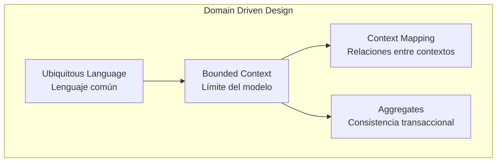

| Concepto | Qué es | Ejemplo |
|---|---|---|
| **Ubiquitous Language** | Vocabulario único negocio↔código | "Pedido", "Reserva", "Tarifa" significan lo mismo para todos. |
| **Bounded Context** | Frontera donde un modelo es válido y consistente | "Cliente" en *Ventas* ≠ "Cliente" en *Soporte*. |
| **Context Map** | Cómo se relacionan los contextos | Upstream/Downstream, ACL, Shared Kernel. |
| **Aggregate** | Grupo de objetos con una raíz que garantiza invariantes | `Pedido` (raíz) + sus `LíneasDePedido`. |

> 🎯 **Regla práctica de oro**: **Un Bounded Context ≈ un microservicio** (o un puñado de ellos). NUNCA un microservicio por entidad de base de datos.

### Problema común
Crear un servicio por tabla → `UserService`, `AddressService`, `EmailService`. Esto genera **nanoservicios** chismosos (ver anti-patrones).

### Mejor práctica
Identifica **subdominios** y modela contextos:
- **Core domain**: tu ventaja competitiva (ej. el algoritmo de matching de Uber). Invierte aquí.
- **Supporting**: necesario pero no diferenciador.
- **Generic**: cómpralo (auth, pagos con Stripe, emails).

---

## 2.2 Principios de diseño de servicios

| Principio | Aplicado a microservicios |
|---|---|
| **Single Responsibility** | Un servicio = una capacidad de negocio cohesiva. |
| **High Cohesion** | Lo que cambia junto, vive junto. |
| **Low Coupling** | Cambiar un servicio no debe forzar cambios en otros. |
| **Service Boundaries** | Definidos por Bounded Context, no por entidades. |

### Test de buen límite
> Si para implementar **una** funcionalidad de negocio tienes que modificar **3 servicios** a la vez → los límites están mal. Lo que cambia junto debe vivir junto.

---

## 2.3 Database per Service vs Shared Database

### Database per Service (recomendado)

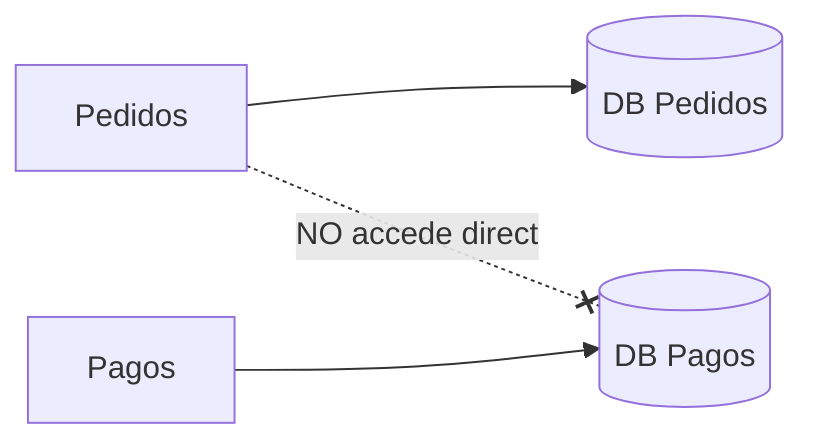

- ✅ Acoplamiento bajo, despliegue independiente, polyglot persistence.
- ❌ No hay JOINs entre servicios → necesitas API Composition o eventos.
- ❌ Consistencia eventual y transacciones distribuidas (Sagas).

### Shared Database (anti-patrón en general)
- ❌ Cualquier cambio de esquema rompe a varios servicios.
- ❌ Acoplamiento oculto a nivel de datos → "monolito distribuido".
- ⚠️ A veces es un mal necesario temporal durante migraciones.

### 2.4 Estrategias de Descomposición

| Estrategia | Cómo divide | Cuándo |
|---|---|---|
| **Por capacidad de negocio** | Pagos, Inventario, Envíos | El más recomendado y estable. |
| **Por subdominio (DDD)** | Core / Supporting / Generic | Cuando el dominio es complejo. |
| **Por verbo/caso de uso** | "Procesar pago", "Generar factura" | Riesgo de nanoservicios. |
| **Por evento** | Siguiendo el flujo de eventos del negocio | Event Storming. |

> 🛠️ **Técnica recomendada: Event Storming.** Reúne negocio + devs, mapea los *eventos de dominio* en orden ("PedidoCreado" → "PagoAprobado" → "PedidoEnviado"). Los clústeres de eventos revelan los Bounded Contexts naturales.

### Resumen del Módulo
- Diseña por **negocio**, no por tablas.
- **Bounded Context** es la unidad fundamental de un microservicio.
- **Database per Service** es la regla; compartir DB es deuda.
- Usa **Event Storming** para descubrir límites con el negocio.

---

# Módulo 3 · Comunicación entre Servicios

> Si los servicios deben hablarse, la **forma** en que lo hacen define la resiliencia y el acoplamiento del sistema.

## 3.1 Síncrona vs Asíncrona — el gran trade-off

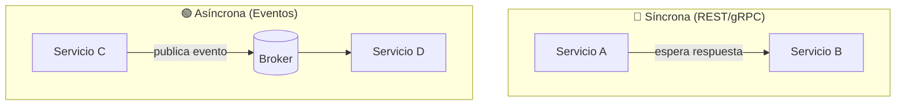

| | Síncrona | Asíncrona |
|---|---|---|
| Acoplamiento temporal | Alto (B debe estar vivo) | Bajo (B puede consumir después) |
| Latencia percibida | Inmediata | Diferida |
| Resiliencia | Frágil (cascadas de fallos) | Robusta (buffer en broker) |
| Complejidad | Menor | Mayor (consistencia eventual) |
| Ideal para | Queries, lecturas | Eventos, comandos, desacoplo |

> ⚠️ **Trampa mortal**: encadenar llamadas síncronas A→B→C→D crea un **monolito distribuido**: si D cae, todo falla, y la latencia se suma. Prefiere asíncrono para flujos de negocio.

## 3.2 Comunicación Síncrona

### REST / HTTP
- ✅ Universal, simple, cacheable, gran tooling.
- ❌ Verboso, sin contrato estricto, overfetching.
- **Uso**: APIs públicas, CRUD, BFF.

### gRPC
- ✅ Binario (Protobuf), rápido, contrato fuerte (`.proto`), streaming bidireccional.
- ❌ No nativo en navegadores, menos legible.
- **Uso**: comunicación **interna** servicio-a-servicio de alto rendimiento.

### GraphQL
- ✅ El cliente pide exactamente los campos que necesita, un solo endpoint.
- ❌ Caché compleja, riesgo de queries costosas (N+1).
- **Uso**: BFF, agregación para frontends con necesidades variadas.

| Protocolo | Formato | Velocidad | Mejor uso |
|---|---|---|---|
| REST | JSON/texto | Media | APIs públicas, CRUD |
| gRPC | Protobuf/binario | Alta | Interno, baja latencia |
| GraphQL | JSON flexible | Media | Agregación frontend (BFF) |

## 3.3 Comunicación Asíncrona y Brokers

### Eventos vs Mensajes (Comando)
- **Evento**: "algo pasó" (`PedidoCreado`). El emisor no espera nada. Varios consumidores.
- **Comando**: "haz algo" (`CobrarPago`). Dirigido a un destinatario.

### Pub/Sub
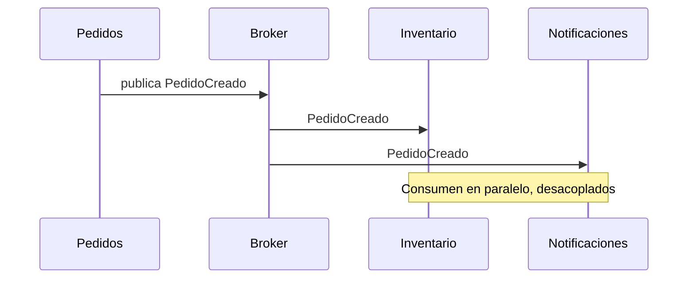

### Brokers: Kafka vs RabbitMQ vs ActiveMQ

| | Kafka | RabbitMQ | ActiveMQ |
|---|---|---|---|
| Modelo | Log distribuido | Cola/Broker (AMQP) | Cola (JMS/AMQP) |
| Throughput | Altísimo (millones/s) | Alto | Medio |
| Retención | Persistente, reproducible | Hasta consumo (ack) | Hasta consumo |
| Orden | Por partición | Por cola | Por cola |
| Ideal para | Event streaming, Event Sourcing, analytics | Colas de trabajo, routing complejo, RPC | Integración Java legacy |

> 💡 Regla rápida: **¿necesitas reproducir el historial de eventos?** → Kafka. **¿necesitas colas de tareas con routing flexible?** → RabbitMQ.

## 3.4 Patrones de comunicación

### Event-Driven Architecture: Coreografía vs Orquestación

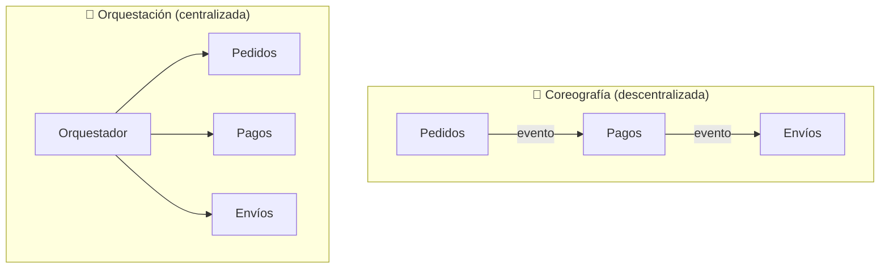

| | Coreografía | Orquestación |
|---|---|---|
| Control | Distribuido (cada uno reacciona) | Central (un coordinador) |
| Acoplamiento | Bajo | Mayor (al orquestador) |
| Visibilidad del flujo | Difícil de seguir | Clara y centralizada |
| Mejor para | Flujos simples, máximo desacoplo | Flujos complejos con muchos pasos |

### Resumen del Módulo
- Síncrono para **consultas**, asíncrono para **flujos de negocio**.
- gRPC interno, REST/GraphQL en el borde.
- Kafka para streaming, RabbitMQ para colas.
- Coreografía para simple; Orquestación (Saga) para complejo.

---

# Módulo 4 · Gestión de Datos

> El reto central de los microservicios **no es el código, son los datos**. Sin transacciones globales, ¿cómo mantienes la consistencia?

## 4.1 ACID vs BASE

| | ACID (SQL clásico) | BASE (distribuido) |
|---|---|---|
| Significado | Atomicity, Consistency, Isolation, Durability | Basically Available, Soft state, Eventual consistency |
| Consistencia | Fuerte e inmediata | Eventual |
| Disponibilidad | Puede sacrificarse | Prioritaria |
| Ejemplo | Una transacción bancaria local | Carrito que se sincroniza en segundos |

> 🧩 **Teorema CAP**: en una partición de red (P), debes elegir entre Consistencia (C) o Disponibilidad (A). Los microservicios suelen elegir **AP + consistencia eventual**.

## 4.2 Eventual Consistency
Los datos **convergen** al estado correcto tras un breve lapso. Ejemplo: publicas una foto y tus seguidores la ven segundos después. El negocio casi siempre lo tolera — **pregunta al negocio cuánta latencia de consistencia acepta**.

## 4.3 Transacciones Distribuidas

### Two-Phase Commit (2PC) — generalmente a evitar
Un coordinador pregunta a todos "¿listos?" (prepare) y luego "¡confirmen!" (commit).
- ❌ Bloqueante, lento, el coordinador es punto único de fallo. **No escala.** Rara vez usado en microservicios.

### Saga Pattern (el estándar) ⭐

#### Definición
Una transacción distribuida = **secuencia de transacciones locales**. Si una falla, se ejecutan **transacciones de compensación** que deshacen las anteriores.

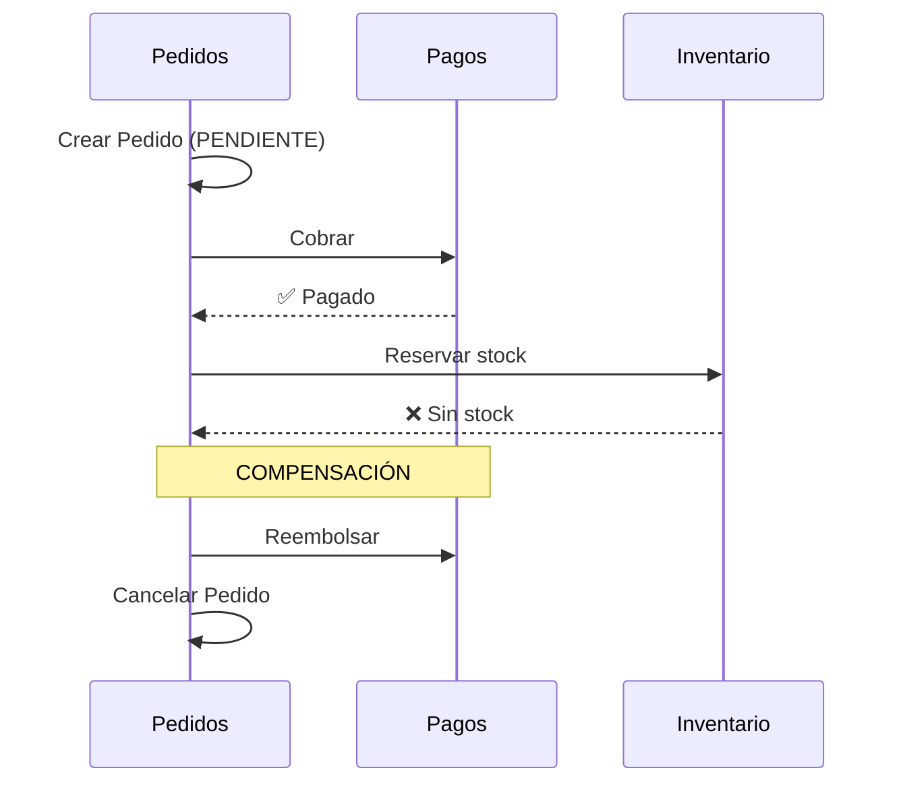

**Explicación:**
- **Componentes**: cada servicio ejecuta su paso local y publica el resultado.
- **Flujo**: avanza paso a paso; si uno falla, retrocede con compensaciones.
- **Posibles fallos**: una compensación también puede fallar → necesitas reintentos + idempotencia.
- **Soluciones**: compensaciones idempotentes, *dead-letter queue*, alertas.

| Tipo de Saga | Cómo coordina | Trade-off |
|---|---|---|
| **Coreografía** | Por eventos, sin coordinador | Simple pero difícil de rastrear |
| **Orquestación** | Un orquestador dirige los pasos | Claro pero centraliza lógica |

## 4.4 Patrones de fiabilidad de datos

### Outbox Pattern ⭐ (resuelve el problema de la "doble escritura")

**Problema**: necesitas (1) guardar en tu DB y (2) publicar un evento. Si guardas y luego el broker falla → inconsistencia.

**Solución**: en la **misma transacción local** guardas el dato Y un registro en una tabla `outbox`. Un proceso aparte lee la outbox y publica al broker.

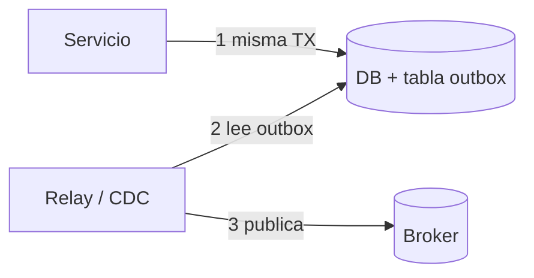

- ✅ Garantiza "guardar y publicar" atómicamente (at-least-once).
- **Inbox Pattern**: el espejo en el consumidor → deduplica eventos ya procesados (idempotencia).

### Change Data Capture (CDC)
Herramientas como **Debezium** leen el *log de transacciones* de la DB y emiten eventos por cada cambio. Es la forma más robusta de implementar el relay del Outbox sin tocar el código de negocio.

### Polyglot Persistence
Cada servicio elige la DB que mejor le sirve: PostgreSQL (pedidos), Redis (sesiones), Elasticsearch (búsqueda), Cassandra (escritura masiva), Neo4j (grafos sociales).

### Resumen del Módulo
- Olvida ACID global; abraza **consistencia eventual**.
- **Saga** reemplaza al 2PC para transacciones de negocio.
- **Outbox + Inbox** garantizan entrega fiable de eventos.
- **CDC (Debezium)** automatiza la publicación de cambios.

---

# Módulo 5 · Patrones de Arquitectura

Para cada patrón: **Problema → Funcionamiento → Ventajas → Desventajas → Casos de uso → Ejemplo**.

## 5.1 CQRS (Command Query Responsibility Segregation)
- **Problema**: el mismo modelo para leer y escribir se vuelve un cuello de botella; lecturas y escrituras tienen necesidades opuestas.
- **Funcionamiento**: separa el modelo de **escritura** (comandos) del de **lectura** (queries), a menudo con bases de datos distintas sincronizadas por eventos.
- **Ventajas**: escalas lecturas y escrituras por separado; modelos de lectura optimizados.
- **Desventajas**: complejidad, consistencia eventual entre ambos lados.
- **Casos**: feeds sociales, dashboards, e-commerce con muchas más lecturas que escrituras.

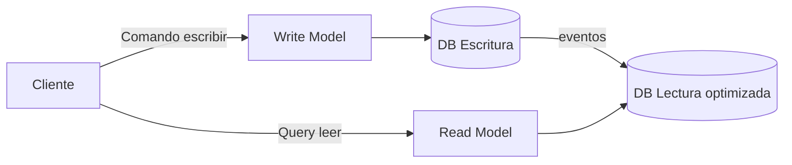

## 5.2 Event Sourcing
- **Problema**: guardar solo el estado actual pierde el *historial* y el *por qué* de los cambios.
- **Funcionamiento**: en vez de guardar el estado, guardas la **secuencia de eventos** que lo produjeron. El estado se reconstruye reproduciéndolos.
- **Ventajas**: auditoría total, *time travel*, reconstrucción de modelos, encaja con CQRS.
- **Desventajas**: curva de aprendizaje alta, versionado de eventos, queries complejas.
- **Casos**: banca, contabilidad, sistemas que exigen auditoría inmutable.

## 5.3 API Composition
- **Problema**: una vista necesita datos de varios servicios pero no puedes hacer JOIN entre sus DBs.
- **Funcionamiento**: un *composer* (a menudo el Gateway o BFF) llama a varios servicios y une los resultados.
- **Ventajas**: simple, sin duplicar datos.
- **Desventajas**: latencia (suma de llamadas), riesgo de N+1. Alternativa: CQRS con vista materializada.

## 5.4 Backend For Frontend (BFF)
- **Problema**: una API genérica sirve mal a clientes distintos (web vs móvil vs TV).
- **Funcionamiento**: un backend **por tipo de cliente**, que agrega y adapta datos a sus necesidades.
- **Ventajas**: payloads optimizados, frontends desacoplados.
- **Desventajas**: más código que mantener, posible duplicación.
- **Casos**: Netflix tiene BFFs distintos para web, iOS, Android y smart TVs.

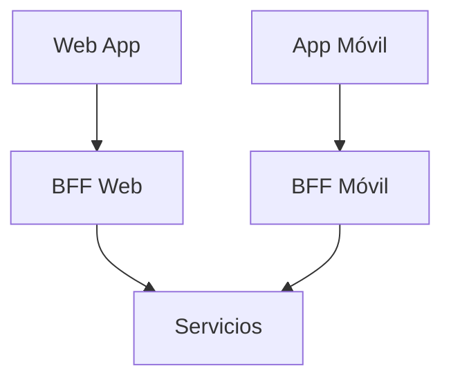

## 5.5 Strangler Fig Pattern ⭐ (migración de monolitos)
- **Problema**: reescribir un monolito de golpe ("big bang") es altísimo riesgo.
- **Funcionamiento**: pones un proxy delante; vas extrayendo funcionalidades a microservicios una por una y rediriges el tráfico, hasta "estrangular" el monolito.
- **Ventajas**: migración incremental, reversible, sin downtime masivo.
- **Casos**: la forma estándar y segura de migrar legacy.

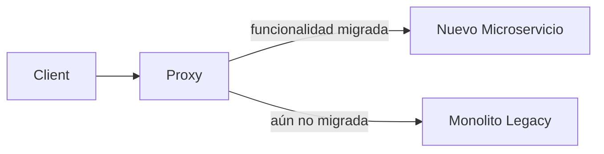

## 5.6 Sidecar Pattern
- **Problema**: cada servicio necesita capacidades comunes (logs, TLS, métricas) sin reescribirlas en cada lenguaje.
- **Funcionamiento**: un contenedor "sidecar" corre junto al servicio y gestiona esas tareas transversales. Base de los Service Mesh.

## 5.7 Ambassador Pattern
- Un proxy que maneja la comunicación de red saliente (reintentos, circuit breaking) en nombre del servicio. Variante del sidecar para llamadas externas.

## 5.8 Anti-Corruption Layer (ACL)
- **Problema**: integrar un sistema legacy o externo "contamina" tu modelo de dominio limpio.
- **Funcionamiento**: una capa traductora aísla y convierte el modelo externo al tuyo. Protege tu Bounded Context.

| Patrón | Resuelve | Una línea |
|---|---|---|
| CQRS | Lecturas vs escrituras | Separa modelos read/write |
| Event Sourcing | Historial | Guarda eventos, no estado |
| API Composition | Vistas multi-servicio | Une resultados en el borde |
| BFF | Múltiples clientes | Un backend por frontend |
| Strangler Fig | Migrar legacy | Reemplazo incremental |
| Sidecar | Cross-cutting | Contenedor ayudante |
| ACL | Integración sucia | Capa traductora |

---

# Módulo 6 · Resiliencia

> En sistemas distribuidos **la pregunta no es SI fallará, sino CUÁNDO**. Diseña para el fallo.

## 6.1 Las falacias de la computación distribuida
Asumir esto te hará fallar: ① la red es fiable ② la latencia es cero ③ el ancho de banda es infinito ④ la red es segura ⑤ la topología no cambia ⑥ hay un solo administrador ⑦ el transporte es gratis ⑧ la red es homogénea. **Todas son falsas.**

## 6.2 Patrones de Resiliencia

### Circuit Breaker ⭐
- **Problema**: si un servicio cae, los que lo llaman se quedan esperando timeouts y agotan sus hilos → fallo en cascada.
- **Funcionamiento**: como un fusible eléctrico. Tras N fallos, "abre" el circuito y falla rápido sin llamar al servicio caído.

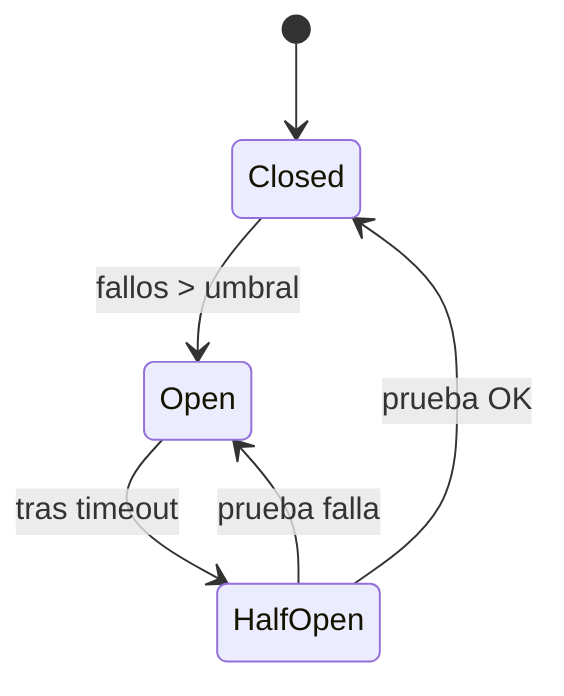

| Estado | Comportamiento |
|---|---|
| **Closed** | Todo pasa normal; cuenta fallos. |
| **Open** | Falla inmediato (no llama); protege al sistema. |
| **Half-Open** | Deja pasar 1 prueba para ver si se recuperó. |

### Retry
- Reintenta operaciones fallidas. **SIEMPRE** con *exponential backoff + jitter* para no provocar una "tormenta de reintentos".
- ⚠️ Solo reintenta operaciones **idempotentes**.

### Timeout
- Nunca esperes indefinidamente. Un timeout liberará recursos. Sin timeouts, un servicio lento tumba a todos.

### Bulkhead (mamparo)
- **Problema**: una dependencia lenta consume todos los hilos y tumba el servicio entero.
- **Funcionamiento**: aísla recursos en compartimentos (como los mamparos de un barco). Si uno se "inunda", los demás siguen a flote.

### Fallback
- Respuesta degradada cuando algo falla. Ej: si el servicio de recomendaciones cae, muestra "los más vendidos" en vez de error.

### Rate Limiting / Throttling
- Limita peticiones por cliente/ventana de tiempo para proteger el sistema de sobrecarga o abuso.

| Patrón | Protege contra | Analogía |
|---|---|---|
| Circuit Breaker | Cascadas de fallos | Fusible |
| Retry + Backoff | Fallos transitorios | Volver a intentar con calma |
| Timeout | Esperas eternas | Cronómetro |
| Bulkhead | Agotamiento de recursos | Mamparos de barco |
| Fallback | Mala experiencia | Plan B |
| Rate Limiting | Sobrecarga/abuso | Portero del local |

## 6.3 Idempotencia ⭐

### ¿Qué es?
Una operación es **idempotente** si ejecutarla N veces produce el **mismo resultado** que ejecutarla una vez.

### ¿Por qué es crítica?
En sistemas distribuidos los mensajes se **reentregan** (at-least-once). Si "CobrarPago" no es idempotente, ¡cobras 3 veces al cliente!

### ¿Cómo implementarla?
- **Idempotency Key**: el cliente envía un ID único; el servidor guarda qué IDs ya procesó y descarta duplicados.
- **Operaciones naturalmente idempotentes**: `estado = ENVIADO` (asignación) es idempotente; `saldo += 100` (incremento) NO lo es.

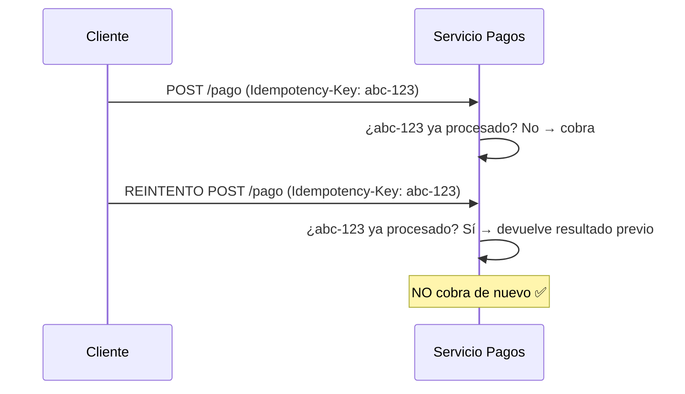

### Errores frecuentes
- ❌ Usar incrementos (`+=`) en operaciones reintentables.
- ❌ No deduplicar eventos del broker.
- ❌ Generar la idempotency key en el servidor (debe venir del cliente).

### Resumen del Módulo
- Diseña asumiendo que **todo falla**.
- Combina **Circuit Breaker + Timeout + Retry(backoff) + Bulkhead + Fallback**.
- **Idempotencia** no es opcional: es la base de la entrega fiable.

---

# Módulo 7 · API Gateway

### Definición
Punto de entrada **único** entre los clientes y los microservicios. Como el portero de un edificio: enruta, autentica y protege.

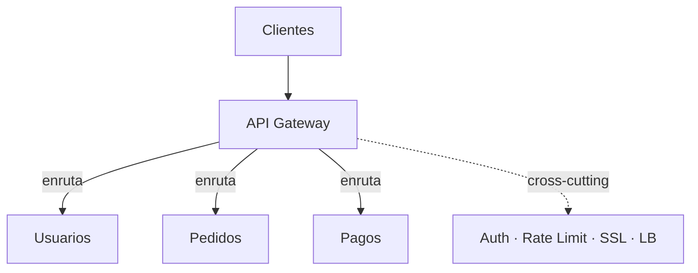

### ¿Por qué existe?
Sin gateway, cada cliente tendría que conocer la ubicación de **todos** los servicios y reimplementar auth, rate limiting, etc. El gateway **centraliza lo transversal**.

### Responsabilidades
| Función | Qué hace |
|---|---|
| **Routing** | Dirige cada petición al servicio correcto. |
| **Authentication** | Valida quién eres (JWT, OAuth). |
| **Authorization** | Valida qué puedes hacer. |
| **Rate Limiting** | Limita peticiones por cliente. |
| **SSL Termination** | Descifra HTTPS en el borde. |
| **Load Balancing** | Reparte carga entre instancias. |
| **Request Aggregation** | Combina respuestas de varios servicios. |

### Desventajas / Problemas comunes
- ❌ Puede volverse un **cuello de botella** o punto único de fallo → despliega en HA (varias instancias).
- ❌ Si metes lógica de negocio dentro → se vuelve un mini-monolito. **Mantenlo "tonto"**.

### Herramientas
| Herramienta | Notas |
|---|---|
| **Kong** | Sobre NGINX, rico en plugins, muy popular. |
| **NGINX** | Ligero, rapidísimo, configuración manual. |
| **Traefik** | Cloud-native, auto-descubrimiento, ideal con K8s/Docker. |
| **Spring Cloud Gateway** | Para ecosistemas Java/Spring. |
| **AWS API Gateway** | Gestionado, serverless-friendly. |

> 💡 **Gateway vs BFF**: el Gateway es genérico (uno para todos). El BFF es específico por cliente. Suelen coexistir: Gateway en el borde, BFFs detrás.

---

# Módulo 8 · Seguridad

> Principio rector: **Zero Trust** — "nunca confíes, siempre verifica", ni siquiera dentro de tu propia red.

## 8.1 Autenticación

### OAuth 2.0 + OpenID Connect (OIDC)
- **OAuth 2.0**: framework de **autorización** (delegar acceso a recursos).
- **OIDC**: capa de **autenticación** sobre OAuth 2.0 (saber *quién* eres).
- Un **Identity Provider (IdP)** central (Keycloak, Auth0, Cognito) emite tokens.

### JWT (JSON Web Token)
- Token autocontenido y firmado: `header.payload.signature`.
- ✅ Stateless: el servicio valida la firma sin consultar una DB de sesiones.
- ⚠️ No metas datos sensibles (es legible en base64), usa expiraciones cortas + refresh tokens, y planifica la **revocación** (su talón de Aquiles).

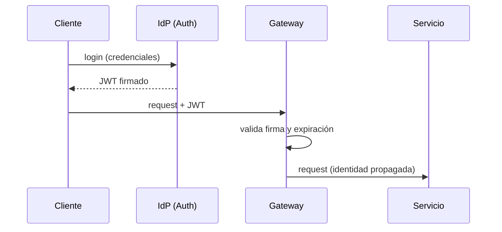

## 8.2 Autorización

| Modelo | Basado en | Ejemplo |
|---|---|---|
| **RBAC** | Roles | "admin", "editor", "viewer" |
| **ABAC** | Atributos/políticas | "puede editar SI región=EU Y horario=laboral" |

ABAC es más granular y flexible; RBAC es más simple. Herramientas: **OPA (Open Policy Agent)** para políticas como código.

## 8.3 Seguridad servicio-a-servicio
- **mTLS (mutual TLS)**: ambos lados presentan certificado → identidad criptográfica mutua. Lo provee un **Service Mesh** automáticamente.
- **Secret Management**: nunca hardcodees credenciales. Usa **HashiCorp Vault**, **AWS Secrets Manager** o **Sealed Secrets** en K8s.

### Resumen del Módulo
- **Zero Trust** + autenticación en el borde (Gateway).
- **OAuth2/OIDC + JWT** para usuarios; **mTLS** entre servicios.
- Centraliza secretos en **Vault/Secrets Manager**.
- Autoriza con **RBAC/ABAC** (OPA para políticas).

---

# Módulo 9 · Observabilidad

> Sin observabilidad, los microservicios son una **caja negra distribuida**. Cuando algo falla a las 3am, necesitas responder *qué, dónde y por qué* — rápido.

## 9.1 Los 3 pilares

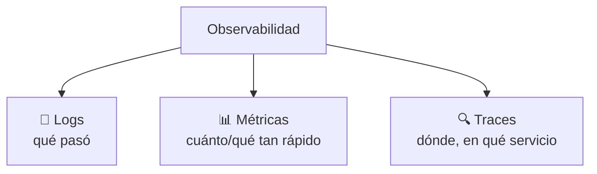

### Logging
- **Structured Logging**: logs en JSON con campos (no texto plano) → consultables.
- **Centralized Logging**: agrégalos en un solo lugar (**ELK/EFK**, Loki).
- **Correlation ID**: un ID que viaja por toda la petición para enlazar logs entre servicios.

### Métricas (Prometheus + Grafana)
- **Prometheus** recolecta métricas; **Grafana** las visualiza.
- Vigila los **4 Golden Signals** de Google SRE:

| Señal | Mide |
|---|---|
| **Latency** | Tiempo de respuesta |
| **Traffic** | Demanda (req/s) |
| **Errors** | Tasa de fallos |
| **Saturation** | Qué tan lleno está el sistema |

### Tracing distribuido (OpenTelemetry → Jaeger/Zipkin)
- **Problema**: una petición cruza 8 servicios y es lenta. ¿Cuál es el culpable?
- **Solución**: el **trace** sigue la petición completa; cada servicio añade un **span** con su tiempo.
- **OpenTelemetry (OTel)** es el estándar abierto para instrumentar; Jaeger/Zipkin lo visualizan.

```mermaid
gantt
    title Trace distribuido de una petición (ms)
    dateFormat X
    axisFormat %s
    section Petición
    Gateway       :0, 1
    Pedidos       :1, 4
    Pagos (lento)  :2, 7
    Inventario    :4, 5
```
El span "Pagos (lento)" revela el cuello de botella.

## 9.2 Monitoring & Alerting
- **Dashboards** (Grafana) para visión en tiempo real.
- **Alerting**: alerta sobre **síntomas** que afectan al usuario (latencia/errores), no sobre causas ruidosas. Define **SLI/SLO** (objetivos de nivel de servicio).

### Resumen del Módulo
- **Logs + Métricas + Traces** = observabilidad.
- **Correlation ID** une todo; **OpenTelemetry** es el estándar.
- Vigila los **4 Golden Signals**; alerta sobre síntomas.

---

# Módulo 10 · DevOps & Cloud Native

> Microservicios **sin automatización** son inmanejables. Si tienes 50 servicios, no puedes desplegar a mano.

## 10.1 Docker (Contenedores)
- **Imagen**: plantilla inmutable (app + dependencias). **Contenedor**: instancia en ejecución.
- Resuelve el "*en mi máquina funciona*": el contenedor lleva su entorno consigo.

```dockerfile
# Ejemplo: microservicio Python (multi-stage, ligero y seguro)
FROM python:3.12-slim AS base
WORKDIR /app
COPY requirements.txt .
RUN pip install --no-cache-dir -r requirements.txt
COPY . .
EXPOSE 8000
# No corras como root
RUN useradd -m appuser
USER appuser
CMD ["uvicorn", "main:app", "--host", "0.0.0.0", "--port", "8000"]
```

- **Docker Compose**: orquesta varios contenedores en local para desarrollo.

## 10.2 Kubernetes (Orquestación)
Cuando tienes muchos contenedores en producción, K8s los gestiona: despliegue, escalado, auto-recuperación.

| Objeto | Qué es |
|---|---|
| **Pod** | Unidad mínima; 1+ contenedores juntos. |
| **Deployment** | Gestiona réplicas y rolling updates. |
| **Service** | IP/DNS estable para acceder a pods efímeros. |
| **ConfigMap** | Configuración no sensible. |
| **Secret** | Configuración sensible (credenciales). |
| **Ingress** | Enrutamiento HTTP externo → servicios. |
| **HPA** | Autoescalado horizontal por CPU/métricas. |

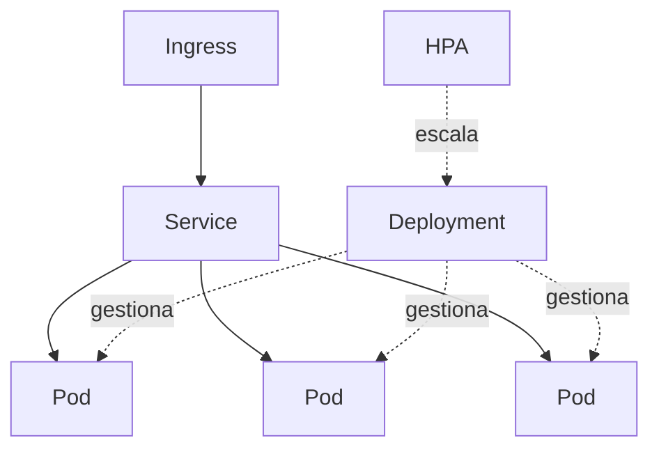

## 10.3 CI/CD
- **CI**: build + test automáticos en cada push (GitHub Actions, GitLab CI, Jenkins).
- **CD**: despliegue automático tras pasar las pruebas.
- Estrategias seguras: **Blue-Green**, **Canary** (libera al 5% primero), **Rolling**.

## 10.4 GitOps (ArgoCD / FluxCD)
- **Idea**: Git es la **única fuente de verdad**. Declaras el estado deseado del cluster en Git; un agente (ArgoCD) reconcilia el cluster real para que coincida.
- ✅ Auditable, reversible (`git revert`), sin `kubectl apply` manual.

### Resumen del Módulo
- **Docker** empaqueta; **Kubernetes** orquesta.
- **CI/CD** automatiza build→test→deploy con Canary/Blue-Green.
- **GitOps** hace de Git la fuente de verdad del despliegue.

---

# Módulo 11 · Service Mesh

### Definición
Capa de infraestructura dedicada que gestiona la **comunicación servicio-a-servicio** (seguridad, observabilidad, tráfico) **sin tocar el código** de la aplicación.

### ¿Por qué existe?
Implementar mTLS, reintentos, circuit breaking y tracing en **cada servicio y cada lenguaje** es repetitivo y propenso a errores. El mesh lo extrae a la infraestructura vía **sidecars**.

```mermaid
graph TD
    subgraph Plano["Service Mesh"]
        CP[Control Plane<br/>config y políticas]
        subgraph SvcA["Servicio A"]
            A[App] --- PA[Proxy Sidecar]
        end
        subgraph SvcB["Servicio B"]
            B[App] --- PB[Proxy Sidecar]
        end
        PA <-->|mTLS| PB
        CP -.configura.-> PA
        CP -.configura.-> PB
    end
```

| Componente | Rol |
|---|---|
| **Data Plane** | Los sidecars (proxies) que interceptan TODO el tráfico. |
| **Control Plane** | El cerebro: distribuye configuración y políticas a los proxies. |
| **Sidecar Proxy** | Envoy junto a cada servicio; aplica mTLS, retries, métricas. |

### Herramientas
- **Istio**: potente y completo, más complejo.
- **Linkerd**: ligero, simple, enfocado en lo esencial.

### Casos de uso
- 🔒 **Seguridad**: mTLS automático entre todos los servicios.
- 📊 **Observabilidad**: métricas y traces sin instrumentar código.
- 🚦 **Gestión de tráfico**: canary, A/B testing, fault injection.

### Desventaja
- ❌ Añade latencia (extra hop) y complejidad operativa. **No lo necesitas con 5 servicios**; sí cuando tienes decenas.

---

# Módulo 12 · Escalabilidad

## 12.1 Vertical vs Horizontal

```mermaid
graph LR
    subgraph V["⬆️ Vertical"]
        V1[Servidor más grande<br/>+CPU +RAM]
    end
    subgraph H["➡️ Horizontal"]
        H1[Instancia] & H2[Instancia] & H3[Instancia]
    end
```

| | Vertical (scale up) | Horizontal (scale out) |
|---|---|---|
| Cómo | Máquina más potente | Más instancias |
| Límite | Físico (hardware) | Casi ilimitado |
| Coste | Crece exponencial | Lineal |
| Microservicios | — | ✅ Preferido |

## 12.2 Distribución de carga y datos

| Técnica | Qué hace |
|---|---|
| **Load Balancing** | Reparte peticiones entre instancias (round-robin, least-conn). |
| **Replicación** | Copias de datos para disponibilidad y lecturas. |
| **Sharding / Partitioning** | Divide los datos por clave (ej. por user_id) entre nodos. |

> ⚠️ El sharding mal hecho crea *hotspots* (un shard recibe el 90% del tráfico). Elige bien la *shard key*.

## 12.3 Rendimiento: Caché y CDN

```mermaid
flowchart LR
    Client --> CDN
    CDN -->|miss| LB[Load Balancer] --> Svc[Servicio]
    Svc -->|consulta| Cache[(Redis)]
    Cache -->|miss| DB[(DB)]
```

| Capa | Herramienta | Acelera |
|---|---|---|
| **CDN** | Cloudflare, CloudFront | Contenido estático cerca del usuario. |
| **Caché distribuida** | **Redis**, Memcached | Datos calientes, sesiones, rate limiting. |

> 🧠 Estrategias de caché: **Cache-Aside** (la app gestiona), **Write-Through**, **Write-Behind**. Cuidado con la **invalidación** ("una de las 2 cosas difíciles en informática").

### Resumen del Módulo
- Prefiere **escalado horizontal** (es la razón de ser de los microservicios).
- **Sharding** para datos masivos; cuidado con hotspots.
- **Redis + CDN** son tus mejores aliados de rendimiento.

---

# Módulo 13 · Anti-Patrones

> Conocer los anti-patrones evita que tu migración a microservicios **empeore** las cosas.

| Anti-patrón | Cómo se ve | Cómo evitarlo |
|---|---|---|
| **Distributed Monolith** ⭐ | Servicios separados pero que deben desplegarse juntos. Lo peor de ambos mundos. | Límites por Bounded Context; comunicación asíncrona; sin DB compartida. |
| **Shared Database** | Varios servicios escriben en la misma DB. | Database per Service; integración por API/eventos. |
| **Chatty Services** | Muchísimas llamadas de red finas para una operación. | Granularidad correcta; API Composition; agregados. |
| **God Service** | Un servicio gigante que lo sabe/hace todo. | Re-descomponer por capacidad de negocio. |
| **Nano Services** | Servicios tan finos que el overhead supera el beneficio. | Agrupar por cohesión; no un servicio por función. |
| **Shared Libraries incorrectas** | Una librería común que acopla y obliga a redesplegar a todos. | Compartir solo lo genérico/estable; versionar; preferir duplicar a acoplar. |

### Cómo identificarlos
- ¿Necesitas desplegar varios servicios juntos? → Distributed Monolith.
- ¿Un cambio de esquema rompe a otros? → Shared Database.
- ¿Una sola acción de usuario hace 30 llamadas internas? → Chatty.

```mermaid
graph TD
    A[Síntoma: despliegues acoplados] --> B{¿Comparten DB o se llaman síncrono en cadena?}
    B -->|Sí| C[🚨 Monolito Distribuido]
    B -->|No| D[✅ Microservicios sanos]
```

---

# Módulo 14 · Casos Reales

> Para cada caso: **Problema inicial → Solución → Patrones → Beneficios**.

## 14.1 Netflix
- **Problema**: monolito que no escalaba; una corrupción de DB causó un outage masivo (2008).
- **Solución**: migración a cientos de microservicios en AWS.
- **Patrones**: API Gateway (Zuul), Circuit Breaker (Hystrix), BFF por dispositivo, Chaos Engineering (Chaos Monkey), Eureka (service discovery).
- **Beneficios**: escala global, resiliencia (un servicio cae sin tumbar Netflix), despliegues miles/día.

## 14.2 Amazon
- **Problema**: monolito de tienda imposible de evolucionar por miles de devs.
- **Solución**: "two-pizza teams" + arquitectura orientada a servicios (mandato de Bezos: *todo es una API*).
- **Patrones**: ownership de extremo a extremo, Database per Service, API-first.
- **Beneficios**: autonomía de equipos, base que originó **AWS**.

## 14.3 Uber
- **Problema**: monolito que no soportaba expansión global ni nuevas líneas de negocio.
- **Solución**: más de 2200 microservicios; luego consolidación a "macroservicios"/Domain-Oriented Architecture (DOMA) al sufrir nanoservicios.
- **Patrones**: Event-Driven (Kafka), geo-sharding, Saga para viajes/pagos, DOMA.
- **Beneficios**: escala global; lección clave: **demasiados microservicios también duele**.

## 14.4 Spotify
- **Problema**: escalar organización y producto manteniendo autonomía.
- **Solución**: modelo organizacional **Squads, Tribes, Chapters, Guilds** + microservicios.
- **Patrones**: Event-Driven, autonomía de squad, ownership total.
- **Beneficios**: equipos independientes; demostró que **la arquitectura sigue a la organización** (Ley de Conway aplicada a propósito).

> 🧭 **Lección transversal**: ninguno empezó con microservicios. **Todos** partieron de un monolito y migraron cuando el dolor (escala/organización) lo justificó. Uber incluso **revirtió** parcialmente la fragmentación excesiva.

---

# Módulo 15 · Testing en Microservicios

> Probar un monolito es fácil (todo junto). Probar un sistema distribuido requiere una **estrategia por capas**.

## 15.1 Pirámide de testing distribuida

```mermaid
graph TD
    E2E[🔺 E2E / pocos] --> Contract[Contract Tests]
    Contract --> Integration[Integration / Component]
    Integration --> Unit[🟩 Unit / muchos]
```

| Nivel | Qué prueba | Herramientas |
|---|---|---|
| **Unit** | Lógica de un servicio aislado | pytest, JUnit |
| **Integration** | Servicio + sus dependencias (DB, broker) | Testcontainers |
| **Contract** ⭐ | Que el contrato entre productor/consumidor no se rompe | **Pact** (Consumer-Driven Contracts) |
| **Component** | Un servicio entero con dependencias *mockeadas* | WireMock |
| **End-to-End** | Flujo completo real (pocos, frágiles, caros) | Playwright, k6 |

## 15.2 Contract Testing (la joya distribuida)
- **Problema**: si el equipo de Pagos cambia su API, ¿cómo sabe que rompió a Pedidos sin desplegar todo?
- **Solución**: **Pact** verifica que el productor cumple las expectativas del consumidor en CI, **antes** del deploy. Evita el "integration hell".

## 15.3 Testing de resiliencia — Chaos Engineering
- Inyecta fallos en producción de forma controlada (Chaos Monkey, Litmus) para validar que tu sistema **realmente** es resiliente. "Rompe cosas a propósito en horario laboral, no esperes a las 3am."

### Resumen
- Muchas pruebas unitarias, **pocas** E2E.
- **Contract Testing (Pact)** es la pieza distintiva de microservicios.
- **Chaos Engineering** valida la resiliencia de verdad.

---

# Módulo 16 · Costos y FinOps

> Los microservicios tienen un costo económico real que pocos cursos mencionan. Cada servicio es una inversión recurrente.

| Costo oculto | Causa | Mitigación |
|---|---|---|
| **Infraestructura** | N servicios = N veces el overhead | Right-sizing, autoescalado a 0 (serverless), bin-packing en K8s. |
| **Tráfico de red** | Las llamadas internas se cobran (inter-AZ/región) | Reducir chattiness, colocar servicios cercanos. |
| **Operación** | Más equipos, herramientas, on-call | Platform Engineering, golden paths, plantillas. |
| **Cognitivo** | Carga mental del equipo | Internal Developer Platform (IDP), Backstage. |

> 💰 Regla: cada microservicio nuevo es una **suscripción mensual** (infra + mantenimiento + on-call). Justifica cada uno. **Si dudas, no lo separes.**

---

# 🌟 Mejores Prácticas Transversales

## Diseño
- ✅ **Bajo acoplamiento, alta cohesión** — el mantra eterno.
- ✅ Límites por **Bounded Context**, no por entidad.
- ✅ Comunicación **asíncrona** por defecto en flujos de negocio.
- ✅ **Database per Service** sin excepciones (salvo migración temporal).
- ✅ Diseña APIs con **versionado** desde el día 1.

## Seguridad (Zero Trust)
- ✅ Autenticación en el borde (Gateway) con **OAuth2/OIDC + JWT**.
- ✅ **mTLS** entre servicios (vía Service Mesh).
- ✅ Secretos en **Vault/Secrets Manager**, jamás en código.
- ✅ Principio de **mínimo privilegio** (RBAC/ABAC).

## Observabilidad
- ✅ **Logs estructurados + Correlation ID** en cada petición.
- ✅ Métricas con los **4 Golden Signals**.
- ✅ **Tracing distribuido** con OpenTelemetry.
- ✅ Alertas sobre **síntomas** (SLO), no sobre ruido.

## DevOps
- ✅ **CI/CD** automatizado con despliegues Canary/Blue-Green.
- ✅ **GitOps** (ArgoCD) como fuente de verdad.
- ✅ Infraestructura como código (Terraform).
- ✅ **Un pipeline independiente por servicio**.

## Resiliencia
- ✅ Circuit Breaker + Timeout + Retry(backoff+jitter) + Bulkhead.
- ✅ **Idempotencia** en toda operación que pueda reintentarse.
- ✅ **Graceful degradation** con fallbacks.

---

# 🗺️ Roadmap de Aprendizaje

```mermaid
graph LR
    P[🟢 Principiante] --> I[🟡 Intermedio] --> A[🟠 Avanzado] --> E[🔴 Experto]
```

## 🟢 Nivel Principiante
- Monolito vs Microservicios y sus trade-offs.
- REST, HTTP, JSON.
- Docker básico (imágenes, contenedores, Compose).
- Construir 2-3 servicios que se comuniquen por REST.
- Conceptos de DB per Service.

## 🟡 Nivel Intermedio
- DDD básico: Bounded Context.
- Comunicación asíncrona: RabbitMQ/Kafka, Pub/Sub.
- API Gateway.
- Patrones de resiliencia (Circuit Breaker, Retry).
- Kubernetes fundamentos.
- Observabilidad básica (logs centralizados, métricas).

## 🟠 Nivel Avanzado
- Saga, Outbox, CQRS, Event Sourcing.
- Consistencia eventual y transacciones distribuidas.
- Tracing distribuido (OpenTelemetry).
- CI/CD + GitOps.
- Seguridad: OAuth2/OIDC, mTLS.
- Contract Testing.

## 🔴 Nivel Experto
- Service Mesh (Istio/Linkerd).
- Diseño de plataformas (Platform Engineering, IDP).
- Chaos Engineering.
- Estrategias de migración (Strangler Fig) a gran escala.
- Multi-región, sharding global, FinOps.
- Liderar decisiones arquitectónicas (ADRs, trade-offs organizacionales).

---

# 📅 Planes de Estudio

## Plan de 30 días — *Bases sólidas*
| Semana | Foco |
|---|---|
| 1 | Fundamentos: monolito vs micro, trade-offs, Ley de Conway. |
| 2 | Docker + Compose; construir 2 servicios REST. |
| 3 | DB per Service; comunicación síncrona; API Gateway. |
| 4 | Intro a mensajería (RabbitMQ); Circuit Breaker básico. **Proyecto 1 (CRUD).** |

## Plan de 60 días — *Patrones y herramientas*
| Semana | Foco |
|---|---|
| 1-2 | Repaso 30 días + DDD (Bounded Context, Event Storming). |
| 3-4 | Async profundo: Kafka, Pub/Sub, coreografía vs orquestación. |
| 5 | Saga + Outbox + Idempotencia. |
| 6 | Kubernetes (Pods, Deployments, Services, Ingress). |
| 7 | Observabilidad (Prometheus, Grafana, OpenTelemetry). |
| 8 | CI/CD + seguridad básica (JWT/OAuth2). **Proyecto 2 (E-commerce).** |

## Plan de 90 días — *Hacia Arquitecto*
| Semana | Foco |
|---|---|
| 1-4 | Todo lo del plan de 60 días, consolidado. |
| 5-6 | CQRS + Event Sourcing; consistencia eventual avanzada. |
| 7 | Contract Testing (Pact) + estrategia de testing distribuido. |
| 8 | GitOps (ArgoCD) + despliegues Canary. |
| 9 | Service Mesh (Istio/Linkerd) + mTLS. |
| 10 | Escalabilidad: sharding, caché distribuida, CDN. |
| 11 | Chaos Engineering + resiliencia avanzada + FinOps. |
| 12 | Diseño de plataforma + ADRs. **Proyecto 4/5 (Reservas/Uber).** |

---

# 🛠️ Proyectos Prácticos Progresivos

> Cada proyecto añade **una capa nueva de complejidad**. No saltes pasos.

## Proyecto 1 · CRUD con Microservicios 🟢
- **Objetivo**: aprender comunicación básica y despliegue.
- **Arquitectura**: 2 servicios (Usuarios, Productos) + Gateway, REST, DB por servicio.
- **Tecnologías**: FastAPI/Spring Boot, PostgreSQL, Docker Compose.
- **Retos**: definir límites, manejar errores entre servicios.
- **Buenas prácticas**: DB per Service, healthchecks, logs estructurados.

```mermaid
graph TD
    C[Cliente] --> GW[Gateway]
    GW --> U[Usuarios] --> UD[(DB)]
    GW --> P[Productos] --> PD[(DB)]
```

## Proyecto 2 · E-commerce 🟡
- **Objetivo**: introducir asincronía y consistencia.
- **Arquitectura**: Usuarios, Catálogo, Carrito, Pedidos, Pagos, Notificaciones + RabbitMQ/Kafka.
- **Tecnologías**: + broker, Redis (carrito), API Gateway.
- **Retos**: flujo de pedido async, eventos `PedidoCreado`/`PagoAprobado`.
- **Buenas prácticas**: Event-Driven, Circuit Breaker, idempotencia en pagos.

## Proyecto 3 · Sistema Bancario 🟠
- **Objetivo**: consistencia fuerte donde importa + auditoría.
- **Arquitectura**: Cuentas, Transacciones, Notificaciones; **Saga** para transferencias.
- **Tecnologías**: Event Sourcing, Outbox, PostgreSQL, Kafka.
- **Retos**: NUNCA perder/duplicar dinero, compensaciones, idempotencia estricta.
- **Buenas prácticas**: Saga + Outbox, auditoría inmutable, transacciones idempotentes.

```mermaid
sequenceDiagram
    participant A as Cuenta Origen
    participant S as Saga
    participant B as Cuenta Destino
    S->>A: Debitar
    A-->>S: OK
    S->>B: Acreditar
    B-->>S: ❌ Falla
    S->>A: Compensar (revertir débito)
```

## Proyecto 4 · Sistema de Reservas 🟠
- **Objetivo**: concurrencia y disponibilidad limitada.
- **Arquitectura**: Inventario (asientos/habitaciones), Reservas, Pagos, Saga.
- **Retos**: evitar doble reserva (concurrencia), reservas temporales con expiración.
- **Buenas prácticas**: locks optimistas, Saga con timeout, CQRS para disponibilidad.

## Proyecto 5 · Aplicación tipo Uber 🔴
- **Objetivo**: geolocalización, tiempo real, alta escala.
- **Arquitectura**: Pasajeros, Conductores, Matching, Tracking (geo), Viajes, Pagos, Notificaciones (WebSockets).
- **Tecnologías**: Kafka, Redis geoespacial, gRPC interno, geo-sharding.
- **Retos**: matching en tiempo real, ubicación en streaming, escala por ciudad.
- **Buenas prácticas**: Event-Driven, geo-sharding, BFF móvil, Saga para viaje+pago.

```mermaid
graph TD
    Rider[App Pasajero] --> BFF[BFF Móvil]
    BFF --> Match[Matching]
    Match --> Geo[(Redis Geo)]
    Match --> Drv[Conductores]
    Match -->|evento| Trip[Viajes] --> Pay[Pagos]
```

## Proyecto 6 · Plataforma tipo Netflix 🔴
- **Objetivo**: streaming, recomendaciones y escala global.
- **Arquitectura**: Catálogo, Perfiles, Reproducción, Recomendaciones, Facturación, BFFs por dispositivo, CDN.
- **Tecnologías**: Cassandra, Kafka, CDN, Service Mesh, ML para recomendaciones.
- **Retos**: streaming a escala, fallback de recomendaciones, multi-dispositivo.
- **Buenas prácticas**: BFF por dispositivo, CDN, Chaos Engineering, graceful degradation.

---

# 📖 Glosario

| Término | Definición breve |
|---|---|
| **Bounded Context** | Frontera donde un modelo de dominio es consistente. |
| **Saga** | Transacción distribuida vía pasos locales + compensaciones. |
| **Idempotencia** | Ejecutar N veces = ejecutar 1 vez. |
| **Circuit Breaker** | Fusible que corta llamadas a un servicio caído. |
| **CQRS** | Separar modelo de lectura y escritura. |
| **Event Sourcing** | Guardar eventos en vez de estado. |
| **Outbox** | Tabla para publicar eventos de forma atómica con la DB. |
| **CDC** | Capturar cambios de la DB como eventos (Debezium). |
| **Service Mesh** | Infra que gestiona comunicación entre servicios (sidecars). |
| **Sidecar** | Contenedor ayudante junto al servicio. |
| **mTLS** | TLS mutuo: ambos lados se autentican. |
| **BFF** | Backend específico por tipo de cliente. |
| **Strangler Fig** | Migrar un monolito de forma incremental. |
| **Distributed Monolith** | Anti-patrón: micros acoplados al desplegar. |
| **Consistencia eventual** | Los datos convergen tras un breve lapso. |
| **Golden Signals** | Latency, Traffic, Errors, Saturation. |
| **GitOps** | Git como fuente de verdad del despliegue. |

---

> 📌 **Mensaje final del arquitecto**: Los microservicios son una **solución organizacional disfrazada de solución técnica**. No los adoptes por moda. Empieza simple (monolito modular), mide el dolor real, y distribuye solo cuando el beneficio supere claramente el enorme costo de la complejidad distribuida. **La mejor arquitectura es la más simple que resuelve tu problema actual.**
