# Curso Completo de Python — De Fundamentos a Algoritmia Avanzada

---

## Tabla de contenidos

1. [Introducción a Python](#1-introducción-a-python)
2. [Fundamentos del lenguaje](#2-fundamentos-del-lenguaje)
3. [Estructuras de datos](#3-estructuras-de-datos)
4. [Programación orientada a objetos](#4-programación-orientada-a-objetos)
5. [Python avanzado](#5-python-avanzado)
6. [Manejo de archivos](#6-manejo-de-archivos)
7. [Librerías importantes](#7-librerías-importantes)
8. [Algoritmia y lógica de programación](#8-algoritmia-y-lógica-de-programación)
9. [Temas de algoritmia](#9-temas-de-algoritmia)
10. [Ejercicios prácticos](#10-ejercicios-prácticos)
11. [Buenas prácticas](#11-buenas-prácticas)
12. [Proyecto final](#12-proyecto-final)

---

## 1. Introducción a Python

### 1.1 Historia

Python fue creado por **Guido van Rossum** en 1989 en el Centro de Matemáticas e Informática (CWI) de los Países Bajos. La primera versión pública (0.9.0) se publicó en 1991. El nombre proviene del grupo de comedia británico **Monty Python**.

| Versión | Año | Hito principal |
|---------|-----|----------------|
| 0.9.0 | 1991 | Primera release pública |
| 1.0 | 1994 | `lambda`, `map`, `filter`, `reduce` |
| 2.0 | 2000 | List comprehensions, garbage collector |
| 3.0 | 2008 | Rediseño del lenguaje, `print()` como función |
| 3.6 | 2016 | f-strings, type hints mejorados |
| 3.10 | 2021 | Pattern matching (`match/case`) |
| 3.12 | 2023 | Mejoras en mensajes de error, `type` statement |
| 3.13 | 2024 | JIT experimental, free-threaded mode |

### 1.2 Filosofía del lenguaje

Python sigue principios claros expresados en el **Zen de Python** (PEP 20). Se accede ejecutando:

```python
import this
```

Principios fundamentales:

- **Legibilidad importa**: el código se lee más veces de las que se escribe
- **Explícito es mejor que implícito**: evitar la magia oculta
- **Simple es mejor que complejo**: preferir soluciones directas
- **La practicidad le gana a la pureza**: resolver problemas reales

### 1.3 Casos de uso

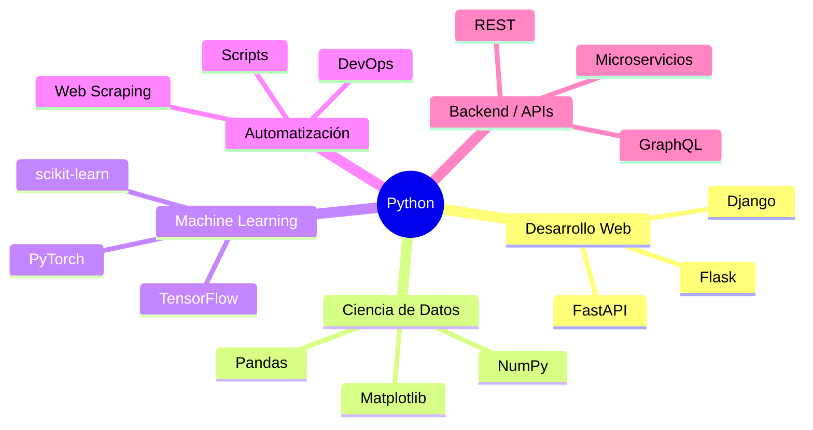

### 1.4 Ventajas y desventajas

| Ventajas | Desventajas |
|----------|-------------|
| Sintaxis clara y legible | Más lento que C/C++/Rust |
| Ecosistema masivo de librerías | GIL limita concurrencia real con threads |
| Multiparadigma | Tipado dinámico puede ocultar errores |
| Gran comunidad | Alto consumo de memoria |
| Rápida prototipación | No ideal para mobile nativo |

### 1.5 Instalación y entorno

**Instalación en macOS:**

```bash
brew install python@3.12
```

**Instalación en Ubuntu/Debian:**

```bash
sudo apt update
sudo apt install python3.12 python3.12-venv
```

**Entorno virtual (recomendado siempre):**

```bash
# Crear entorno virtual
python3 -m venv .venv

# Activar
source .venv/bin/activate   # Linux/macOS
.venv\Scripts\activate      # Windows

# Verificar
python --version
pip --version

# Desactivar
deactivate
```

> **Buena práctica**: nunca instalar paquetes en el Python global del sistema. Siempre utilizar entornos virtuales.

**Resumen del capítulo**: Python es un lenguaje interpretado, multiparadigma, con una filosofía centrada en la legibilidad. Su ecosistema lo hace versátil para web, datos, IA y automatización.

---

## 2. Fundamentos del lenguaje

### 2.1 Variables

En Python, las variables son **referencias** a objetos en memoria. No se declara el tipo explícitamente (tipado dinámico).

```python
# Asignación simple
nombre = "Ada Lovelace"
edad = 36
activo = True

# Asignación múltiple
x, y, z = 1, 2, 3

# Intercambio de valores (sin variable temporal)
a, b = 10, 20
a, b = b, a  # a=20, b=10

# Constantes (convención, no se fuerza)
PI = 3.14159
MAX_CONNECTIONS = 100
```

**Convenciones de nombres (PEP 8):**

| Tipo | Convención | Ejemplo |
|------|-----------|---------|
| Variable | snake_case | `user_name` |
| Constante | UPPER_SNAKE_CASE | `MAX_RETRIES` |
| Clase | PascalCase | `UserProfile` |
| Función | snake_case | `calculate_total` |
| Privado | _prefijo | `_internal_value` |
| Name mangling | __prefijo | `__secret` |

### 2.2 Tipos de datos

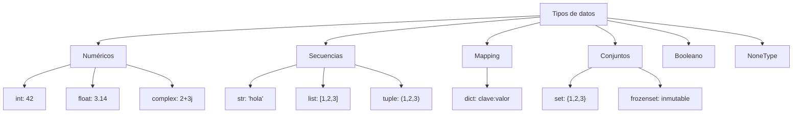

```python
# Numéricos
entero = 42
decimal = 3.14
complejo = 2 + 3j
grande = 1_000_000  # separador visual

# Cadenas
texto = "Hola mundo"
multilinea = """
Este es un texto
de varias líneas
"""
f_string = f"Nombre: {nombre}, Edad: {edad}"
raw = r"C:\nueva\ruta"  # sin escapar

# Booleanos
verdadero = True   # internamente es int(1)
falso = False      # internamente es int(0)

# None
resultado = None

# Verificar tipo
print(type(entero))   # <class 'int'>
print(isinstance(texto, str))  # True
```

**Mutabilidad:**

| Tipo | ¿Mutable? |
|------|-----------|
| `int`, `float`, `str`, `tuple`, `frozenset` | No (inmutable) |
| `list`, `dict`, `set`, `bytearray` | Sí (mutable) |

### 2.3 Operadores

```python
# Aritméticos
print(10 + 3)   # 13
print(10 - 3)   # 7
print(10 * 3)   # 30
print(10 / 3)   # 3.3333 (float)
print(10 // 3)  # 3 (división entera)
print(10 % 3)   # 1 (módulo)
print(10 ** 3)  # 1000 (potencia)

# Comparación
print(5 == 5)   # True
print(5 != 3)   # True
print(5 > 3)    # True
print(5 >= 5)   # True

# Lógicos
print(True and False)  # False
print(True or False)   # True
print(not True)        # False

# Identidad (compara referencias, no valores)
a = [1, 2]
b = [1, 2]
c = a
print(a == b)   # True (mismo valor)
print(a is b)   # False (diferente objeto)
print(a is c)   # True (misma referencia)

# Pertenencia
print(3 in [1, 2, 3])      # True
print("x" not in "hola")   # True

# Walrus operator (Python 3.8+)
# Asigna y evalúa en la misma expresión
if (n := len("hola")) > 3:
    print(f"Longitud {n} es mayor a 3")
```

### 2.4 Condicionales

```python
# if / elif / else
temperatura = 35

if temperatura > 30:
    print("Hace mucho calor")
elif temperatura > 20:
    print("Clima agradable")
elif temperatura > 10:
    print("Hace frío")
else:
    print("Hace mucho frío")

# Operador ternario
estado = "mayor" if edad >= 18 else "menor"

# Match / case (Python 3.10+)
comando = "salir"

match comando:
    case "iniciar":
        print("Iniciando sistema...")
    case "pausar":
        print("Sistema en pausa")
    case "salir" | "exit":
        print("Cerrando sistema...")
    case _:
        print("Comando no reconocido")

# Match con desestructuración
punto = (3, 5)

match punto:
    case (0, 0):
        print("Origen")
    case (x, 0):
        print(f"En eje X: {x}")
    case (0, y):
        print(f"En eje Y: {y}")
    case (x, y):
        print(f"Punto ({x}, {y})")
```

### 2.5 Bucles

```python
# for — iterar sobre secuencias
frutas = ["manzana", "banana", "cereza"]
for fruta in frutas:
    print(fruta)

# for con range
for i in range(5):         # 0, 1, 2, 3, 4
    print(i)

for i in range(2, 10, 3):  # 2, 5, 8
    print(i)

# for con enumerate (índice + valor)
for i, fruta in enumerate(frutas):
    print(f"{i}: {fruta}")

# for con zip (iterar en paralelo)
nombres = ["Ana", "Luis", "María"]
edades = [25, 30, 28]
for nombre, edad in zip(nombres, edades):
    print(f"{nombre} tiene {edad} años")

# while
contador = 0
while contador < 5:
    print(contador)
    contador += 1

# break y continue
for i in range(10):
    if i == 3:
        continue  # salta al siguiente
    if i == 7:
        break     # sale del bucle
    print(i)       # imprime 0, 1, 2, 4, 5, 6

# else en bucles (se ejecuta si NO hubo break)
for n in range(2, 10):
    for d in range(2, n):
        if n % d == 0:
            break
    else:
        print(f"{n} es primo")
```

### 2.6 Funciones

```python
# Función básica
def saludar(nombre: str) -> str:
    """Retorna un saludo personalizado."""
    return f"Hola, {nombre}!"

# Parámetros con valor por defecto
def conectar(host: str, puerto: int = 5432, timeout: int = 30) -> str:
    return f"Conectando a {host}:{puerto} (timeout: {timeout}s)"

# *args — argumentos posicionales variables
def sumar(*numeros: int) -> int:
    """Suma una cantidad variable de números."""
    return sum(numeros)

print(sumar(1, 2, 3, 4))  # 10

# **kwargs — argumentos con nombre variables
def crear_perfil(**datos: str) -> dict:
    """Crea un diccionario con los datos proporcionados."""
    return datos

perfil = crear_perfil(nombre="Ana", rol="dev", nivel="senior")

# Funciones como objetos de primera clase
def aplicar(func, valor):
    return func(valor)

resultado = aplicar(lambda x: x ** 2, 5)  # 25

# Funciones lambda
ordenar_por_edad = sorted(
    [("Ana", 30), ("Luis", 25), ("María", 28)],
    key=lambda persona: persona[1]
)

# Desempaquetado en llamadas
def punto(x, y, z):
    return f"({x}, {y}, {z})"

coords = [1, 2, 3]
print(punto(*coords))  # (1, 2, 3)

config = {"x": 10, "y": 20, "z": 30}
print(punto(**config))  # (10, 20, 30)
```

### 2.7 Scope (ámbito de variables)

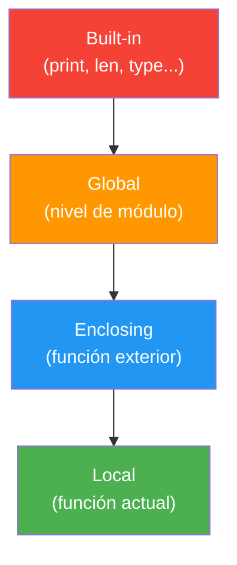

Python busca variables en orden **LEGB**: Local → Enclosing → Global → Built-in.

```python
x = "global"

def exterior():
    x = "enclosing"

    def interior():
        x = "local"
        print(x)  # "local"

    interior()
    print(x)  # "enclosing"

exterior()
print(x)  # "global"

# Modificar variable global
contador = 0

def incrementar():
    global contador
    contador += 1

# Modificar variable enclosing
def crear_contador():
    cuenta = 0

    def incrementar():
        nonlocal cuenta
        cuenta += 1
        return cuenta

    return incrementar

mi_contador = crear_contador()
print(mi_contador())  # 1
print(mi_contador())  # 2
```

### 2.8 Manejo de errores

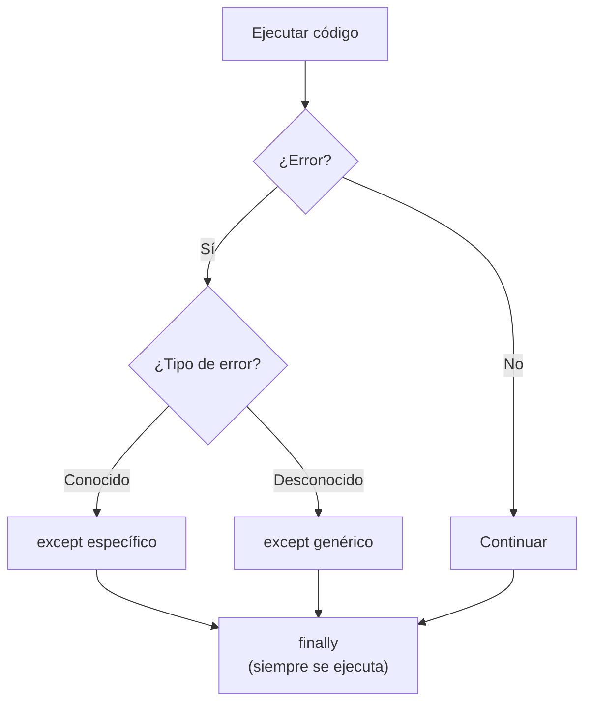

```python
# try / except / else / finally
def dividir(a: float, b: float) -> float:
    try:
        resultado = a / b
    except ZeroDivisionError:
        print("Error: división por cero")
        return 0.0
    except TypeError as e:
        print(f"Error de tipo: {e}")
        return 0.0
    else:
        # Se ejecuta solo si NO hubo error
        print(f"Resultado: {resultado}")
        return resultado
    finally:
        # Se ejecuta SIEMPRE
        print("Operación finalizada")

# Excepciones personalizadas
class SaldoInsuficienteError(Exception):
    """Se lanza cuando el saldo es insuficiente para la operación."""

    def __init__(self, saldo: float, monto: float):
        self.saldo = saldo
        self.monto = monto
        super().__init__(
            f"Saldo insuficiente: tiene {saldo}, necesita {monto}"
        )

def retirar(saldo: float, monto: float) -> float:
    if monto > saldo:
        raise SaldoInsuficienteError(saldo, monto)
    return saldo - monto

# Encadenar excepciones
try:
    resultado = retirar(100, 200)
except SaldoInsuficienteError as e:
    raise RuntimeError("Transacción fallida") from e
```

**Jerarquía de excepciones comunes:**

```
BaseException
├── SystemExit
├── KeyboardInterrupt
└── Exception
    ├── ValueError
    ├── TypeError
    ├── KeyError
    ├── IndexError
    ├── FileNotFoundError
    ├── IOError
    ├── AttributeError
    ├── ZeroDivisionError
    ├── StopIteration
    └── RuntimeError
```

> **Buena práctica**: capturar excepciones específicas, nunca usar `except Exception` sin motivo justificado.

**Resumen del capítulo**: los fundamentos de Python incluyen variables como referencias, tipado dinámico, operadores completos, control de flujo con `if/match`, bucles con `for/while`, funciones de primera clase, scope LEGB y manejo estructurado de errores.

---

## 3. Estructuras de datos

### 3.1 Listas

Colecciones **ordenadas** y **mutables**. Son la estructura más versátil de Python.

```python
# Creación
numeros = [1, 2, 3, 4, 5]
mixta = [1, "hola", True, 3.14]
vacia = []

# Acceso por índice
print(numeros[0])    # 1 (primer elemento)
print(numeros[-1])   # 5 (último elemento)

# Slicing [inicio:fin:paso]
print(numeros[1:4])    # [2, 3, 4]
print(numeros[::2])    # [1, 3, 5]
print(numeros[::-1])   # [5, 4, 3, 2, 1] (invertir)

# Métodos principales
numeros.append(6)          # Agregar al final
numeros.insert(0, 0)       # Insertar en posición
numeros.extend([7, 8])     # Agregar múltiples
numeros.pop()              # Eliminar y retornar último
numeros.pop(0)             # Eliminar y retornar en índice
numeros.remove(3)          # Eliminar primera ocurrencia
numeros.sort()             # Ordenar in-place
numeros.sort(reverse=True) # Ordenar descendente
numeros.reverse()          # Invertir in-place
numeros.index(4)           # Índice de primera ocurrencia
numeros.count(2)           # Contar ocurrencias

# List comprehensions
cuadrados = [x ** 2 for x in range(10)]
pares = [x for x in range(20) if x % 2 == 0]

# Comprehension con condicional
clasificados = [
    f"{n} es par" if n % 2 == 0 else f"{n} es impar"
    for n in range(5)
]

# Comprehension anidada (aplanar matriz)
matriz = [[1, 2, 3], [4, 5, 6], [7, 8, 9]]
plana = [num for fila in matriz for num in fila]
# [1, 2, 3, 4, 5, 6, 7, 8, 9]
```

### 3.2 Tuplas

Colecciones **ordenadas** e **inmutables**. Ideales para datos que no deben cambiar.

```python
# Creación
coordenada = (10, 20)
rgb = (255, 128, 0)
singleton = (42,)  # la coma es necesaria para un solo elemento

# Desempaquetado
x, y = coordenada
r, g, b = rgb

# Desempaquetado con *
primero, *resto = [1, 2, 3, 4, 5]
# primero = 1, resto = [2, 3, 4, 5]

cabeza, *medio, cola = [1, 2, 3, 4, 5]
# cabeza = 1, medio = [2, 3, 4], cola = 5

# Named tuples (tuplas con nombre)
from collections import namedtuple

Punto = namedtuple("Punto", ["x", "y"])
p = Punto(3, 5)
print(p.x, p.y)  # 3 5

# Cuándo usar tupla vs lista
# - Tupla: datos fijos (coordenadas, configuraciones, claves de dict)
# - Lista: colecciones dinámicas (resultados, items del carrito)
```

### 3.3 Sets (conjuntos)

Colecciones **no ordenadas** de elementos **únicos**. Optimizados para operaciones de pertenencia.

```python
# Creación
frutas = {"manzana", "banana", "cereza"}
numeros = set([1, 2, 2, 3, 3, 3])  # {1, 2, 3}

# Métodos principales
frutas.add("durazno")
frutas.discard("banana")  # no lanza error si no existe
frutas.remove("cereza")   # lanza KeyError si no existe

# Operaciones de conjuntos
a = {1, 2, 3, 4}
b = {3, 4, 5, 6}

print(a | b)   # Unión:        {1, 2, 3, 4, 5, 6}
print(a & b)   # Intersección: {3, 4}
print(a - b)   # Diferencia:   {1, 2}
print(a ^ b)   # Simétrica:    {1, 2, 5, 6}

# Verificar subconjunto
print({1, 2} <= {1, 2, 3})  # True (es subconjunto)

# Eliminar duplicados de una lista preservando orden
def eliminar_duplicados(lista: list) -> list:
    vistos = set()
    resultado = []
    for item in lista:
        if item not in vistos:
            vistos.add(item)
            resultado.append(item)
    return resultado

# Set comprehension
pares = {x for x in range(20) if x % 2 == 0}
```

### 3.4 Diccionarios

Colecciones de pares **clave-valor**. Mantienen el orden de inserción desde Python 3.7+.

```python
# Creación
usuario = {
    "nombre": "Ana",
    "edad": 30,
    "activo": True,
    "roles": ["admin", "editor"]
}

# Acceso
print(usuario["nombre"])           # "Ana" (KeyError si no existe)
print(usuario.get("email", "N/A")) # "N/A" (valor por defecto)

# Modificación
usuario["email"] = "ana@mail.com"  # agregar/modificar
del usuario["activo"]              # eliminar
edad = usuario.pop("edad")        # eliminar y retornar

# Métodos principales
print(usuario.keys())     # dict_keys
print(usuario.values())   # dict_values
print(usuario.items())    # dict_items (pares clave-valor)

# Iterar
for clave, valor in usuario.items():
    print(f"{clave}: {valor}")

# Combinar diccionarios
defaults = {"tema": "oscuro", "idioma": "es", "fuente": 14}
custom = {"tema": "claro", "fuente": 16}

# Método 1: operador | (Python 3.9+)
config = defaults | custom

# Método 2: desempaquetado
config = {**defaults, **custom}

# Dict comprehension
cuadrados = {x: x ** 2 for x in range(6)}
# {0: 0, 1: 1, 2: 4, 3: 9, 4: 16, 5: 25}

# setdefault — obtener o establecer valor por defecto
conteo = {}
palabras = ["hola", "mundo", "hola", "python", "mundo", "hola"]
for palabra in palabras:
    conteo[palabra] = conteo.get(palabra, 0) + 1
# {'hola': 3, 'mundo': 2, 'python': 1}

# defaultdict (más elegante para conteos y agrupaciones)
from collections import defaultdict

conteo = defaultdict(int)
for palabra in palabras:
    conteo[palabra] += 1

agrupado = defaultdict(list)
estudiantes = [("A", "Ana"), ("B", "Luis"), ("A", "María")]
for grupo, nombre in estudiantes:
    agrupado[grupo].append(nombre)
# {'A': ['Ana', 'María'], 'B': ['Luis']}
```

### 3.5 Pilas (Stack)

Estructura **LIFO** (Last In, First Out). Se implementa fácilmente con listas.

```python
# Implementación con lista
pila = []
pila.append("A")  # push
pila.append("B")
pila.append("C")
print(pila.pop())  # "C" — pop (último en entrar, primero en salir)
print(pila.pop())  # "B"

# Implementación con deque (más eficiente)
from collections import deque

pila = deque()
pila.append("A")
pila.append("B")
pila.append("C")
pila.pop()  # "C"

# Caso de uso: verificar paréntesis balanceados
def parentesis_balanceados(expresion: str) -> bool:
    pila = []
    pares = {")": "(", "]": "[", "}": "{"}

    for char in expresion:
        if char in "([{":
            pila.append(char)
        elif char in ")]}":
            if not pila or pila[-1] != pares[char]:
                return False
            pila.pop()

    return len(pila) == 0

print(parentesis_balanceados("({[]})"))   # True
print(parentesis_balanceados("([)]"))     # False
```

### 3.6 Colas (Queue)

Estructura **FIFO** (First In, First Out).

```python
from collections import deque

# Cola básica
cola = deque()
cola.append("cliente_1")     # encolar
cola.append("cliente_2")
cola.append("cliente_3")
print(cola.popleft())        # "cliente_1" — desencolar

# Cola con prioridad
import heapq

class ColaPrioridad:
    def __init__(self):
        self._cola = []
        self._indice = 0

    def encolar(self, item, prioridad: int):
        # heapq es min-heap, negamos para max-priority
        heapq.heappush(self._cola, (-prioridad, self._indice, item))
        self._indice += 1

    def desencolar(self):
        return heapq.heappop(self._cola)[-1]

cola = ColaPrioridad()
cola.encolar("tarea normal", prioridad=1)
cola.encolar("tarea urgente", prioridad=10)
cola.encolar("tarea media", prioridad=5)
print(cola.desencolar())  # "tarea urgente"
print(cola.desencolar())  # "tarea media"
```

### 3.7 Complejidad temporal

| Operación | list | dict | set | deque |
|-----------|------|------|-----|-------|
| Acceso por índice | O(1) | — | — | O(n) |
| Buscar elemento | O(n) | O(1) | O(1) | O(n) |
| Insertar al final | O(1)* | O(1)* | O(1)* | O(1) |
| Insertar al inicio | O(n) | — | — | O(1) |
| Eliminar por valor | O(n) | O(1) | O(1) | O(n) |
| Verificar pertenencia (`in`) | O(n) | O(1) | O(1) | O(n) |

> *O(1) amortizado — puede ser O(n) cuando se necesita redimensionar.

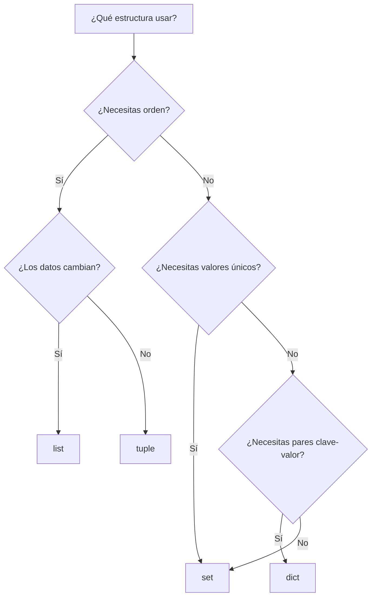

**Resumen del capítulo**: Python ofrece estructuras de datos integradas potentes. Elegir la correcta impacta directamente el rendimiento: `dict` y `set` para búsquedas O(1), `list` para acceso indexado, `deque` para operaciones en ambos extremos.

---

## 4. Programación orientada a objetos

### 4.1 Clases y objetos

Una **clase** es un plano que define la estructura y comportamiento de un tipo de dato. Un **objeto** es una instancia concreta de esa clase.

```python
class CuentaBancaria:
    """Representa una cuenta bancaria con operaciones básicas."""

    # Atributo de clase (compartido por todas las instancias)
    banco = "Banco Nacional"
    _total_cuentas = 0

    def __init__(self, titular: str, saldo: float = 0.0):
        """Inicializa una nueva cuenta bancaria."""
        # Atributos de instancia
        self.titular = titular
        self._saldo = saldo  # convención: protegido
        self._historial: list[str] = []
        CuentaBancaria._total_cuentas += 1

    def depositar(self, monto: float) -> None:
        if monto <= 0:
            raise ValueError("El monto debe ser positivo")
        self._saldo += monto
        self._historial.append(f"+{monto}")

    def retirar(self, monto: float) -> None:
        if monto > self._saldo:
            raise ValueError("Saldo insuficiente")
        self._saldo -= monto
        self._historial.append(f"-{monto}")

    @property
    def saldo(self) -> float:
        """Acceso controlado al saldo (solo lectura)."""
        return self._saldo

    @classmethod
    def obtener_total_cuentas(cls) -> int:
        """Retorna el número total de cuentas creadas."""
        return cls._total_cuentas

    @staticmethod
    def validar_monto(monto: float) -> bool:
        """Valida que un monto sea positivo."""
        return isinstance(monto, (int, float)) and monto > 0

    def __str__(self) -> str:
        return f"Cuenta de {self.titular} — Saldo: ${self._saldo:,.2f}"

    def __repr__(self) -> str:
        return f"CuentaBancaria(titular='{self.titular}', saldo={self._saldo})"

# Uso
cuenta = CuentaBancaria("Ana López", 1000)
cuenta.depositar(500)
cuenta.retirar(200)
print(cuenta)         # Cuenta de Ana López — Saldo: $1,300.00
print(cuenta.saldo)   # 1300.0 (acceso via property)
```

**Métodos especiales (dunder methods) más usados:**

| Método | Propósito |
|--------|-----------|
| `__init__` | Constructor |
| `__str__` | Representación legible (`print`) |
| `__repr__` | Representación técnica (`debug`) |
| `__len__` | Comportamiento de `len()` |
| `__eq__` | Comparación `==` |
| `__lt__`, `__gt__` | Comparaciones `<`, `>` |
| `__add__` | Operador `+` |
| `__contains__` | Operador `in` |
| `__getitem__` | Acceso con `[]` |
| `__iter__` | Hacer el objeto iterable |
| `__enter__`, `__exit__` | Context manager (`with`) |

### 4.2 Herencia

Permite crear clases basadas en otras, reutilizando y extendiendo funcionalidad.

```python
class Vehiculo:
    """Clase base para todos los vehículos."""

    def __init__(self, marca: str, modelo: str, año: int):
        self.marca = marca
        self.modelo = modelo
        self.año = año
        self._velocidad = 0

    def acelerar(self, incremento: int) -> None:
        self._velocidad += incremento

    def frenar(self) -> None:
        self._velocidad = max(0, self._velocidad - 10)

    def __str__(self) -> str:
        return f"{self.marca} {self.modelo} ({self.año})"


class Auto(Vehiculo):
    """Auto con número de puertas."""

    def __init__(self, marca: str, modelo: str, año: int, puertas: int = 4):
        super().__init__(marca, modelo, año)
        self.puertas = puertas

    def acelerar(self, incremento: int) -> None:
        """Limita la velocidad máxima a 200 km/h."""
        super().acelerar(incremento)
        self._velocidad = min(self._velocidad, 200)


class Electrico(Vehiculo):
    """Vehículo eléctrico con batería."""

    def __init__(self, marca: str, modelo: str, año: int, bateria: int = 100):
        super().__init__(marca, modelo, año)
        self.bateria = bateria

    def cargar(self) -> None:
        self.bateria = 100


# Herencia múltiple
class AutoElectrico(Auto, Electrico):
    """Auto eléctrico que hereda de Auto y Electrico."""

    def __init__(self, marca: str, modelo: str, año: int):
        super().__init__(marca, modelo, año)
        self.bateria = 100

# MRO (Method Resolution Order)
print(AutoElectrico.__mro__)
# AutoElectrico -> Auto -> Electrico -> Vehiculo -> object
```

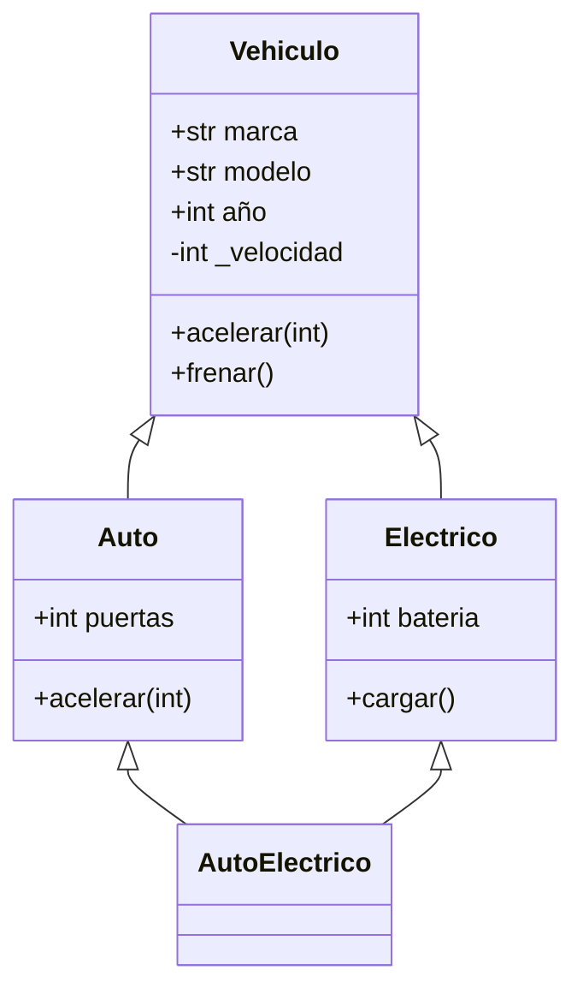

### 4.3 Polimorfismo

Capacidad de tratar objetos de diferentes clases a través de una interfaz común.

```python
from abc import ABC, abstractmethod

class Forma(ABC):
    """Clase abstracta para formas geométricas."""

    @abstractmethod
    def area(self) -> float:
        pass

    @abstractmethod
    def perimetro(self) -> float:
        pass

    def describir(self) -> str:
        return f"{self.__class__.__name__}: área={self.area():.2f}, perímetro={self.perimetro():.2f}"


class Circulo(Forma):
    def __init__(self, radio: float):
        self.radio = radio

    def area(self) -> float:
        return 3.14159 * self.radio ** 2

    def perimetro(self) -> float:
        return 2 * 3.14159 * self.radio


class Rectangulo(Forma):
    def __init__(self, ancho: float, alto: float):
        self.ancho = ancho
        self.alto = alto

    def area(self) -> float:
        return self.ancho * self.alto

    def perimetro(self) -> float:
        return 2 * (self.ancho + self.alto)


# Polimorfismo en acción
formas: list[Forma] = [
    Circulo(5),
    Rectangulo(4, 6),
    Circulo(3),
]

for forma in formas:
    print(forma.describir())

# Duck typing — si camina como pato y habla como pato...
class ArchivoFalso:
    """Simula un archivo sin serlo."""
    def read(self) -> str:
        return "datos simulados"

    def close(self) -> None:
        pass

def procesar(archivo):
    """Acepta cualquier objeto con método read()."""
    datos = archivo.read()
    return datos.upper()
```

### 4.4 Encapsulamiento

```python
class Empleado:
    def __init__(self, nombre: str, salario: float):
        self.nombre = nombre          # público
        self._departamento = "General"  # protegido (convención)
        self.__salario = salario       # name mangling → _Empleado__salario

    @property
    def salario(self) -> float:
        return self.__salario

    @salario.setter
    def salario(self, valor: float) -> None:
        if valor < 0:
            raise ValueError("El salario no puede ser negativo")
        self.__salario = valor

    @salario.deleter
    def salario(self) -> None:
        raise AttributeError("No se puede eliminar el salario")

emp = Empleado("Carlos", 50000)
print(emp.salario)     # 50000 (getter)
emp.salario = 55000    # setter con validación
# emp.salario = -100   # ValueError
```

### 4.5 Abstracción

```python
from abc import ABC, abstractmethod

class BaseDatos(ABC):
    """Interfaz abstracta para operaciones de base de datos."""

    @abstractmethod
    def conectar(self) -> None:
        pass

    @abstractmethod
    def ejecutar(self, query: str) -> list:
        pass

    @abstractmethod
    def desconectar(self) -> None:
        pass

    def ejecutar_seguro(self, query: str) -> list:
        """Template method — define el flujo general."""
        self.conectar()
        try:
            resultado = self.ejecutar(query)
            return resultado
        finally:
            self.desconectar()


class PostgreSQL(BaseDatos):
    def conectar(self) -> None:
        print("Conectando a PostgreSQL...")

    def ejecutar(self, query: str) -> list:
        print(f"Ejecutando en PostgreSQL: {query}")
        return []

    def desconectar(self) -> None:
        print("Desconectando de PostgreSQL")


class SQLite(BaseDatos):
    def conectar(self) -> None:
        print("Abriendo archivo SQLite...")

    def ejecutar(self, query: str) -> list:
        print(f"Ejecutando en SQLite: {query}")
        return []

    def desconectar(self) -> None:
        print("Cerrando archivo SQLite")
```

### 4.6 Dataclasses

Simplifican la creación de clases que almacenan datos, generando automáticamente `__init__`, `__repr__`, `__eq__` y más.

```python
from dataclasses import dataclass, field
from datetime import datetime

@dataclass
class Producto:
    nombre: str
    precio: float
    stock: int = 0
    categorias: list[str] = field(default_factory=list)
    creado: datetime = field(default_factory=datetime.now)

    @property
    def disponible(self) -> bool:
        return self.stock > 0

    def aplicar_descuento(self, porcentaje: float) -> float:
        return self.precio * (1 - porcentaje / 100)


# Dataclass inmutable
@dataclass(frozen=True)
class Coordenada:
    latitud: float
    longitud: float


# Dataclass con orden automático
@dataclass(order=True)
class Estudiante:
    sort_index: float = field(init=False, repr=False)
    nombre: str
    promedio: float

    def __post_init__(self):
        self.sort_index = self.promedio

# Se pueden ordenar automáticamente
estudiantes = [
    Estudiante("Ana", 9.5),
    Estudiante("Luis", 8.3),
    Estudiante("María", 9.8),
]
print(sorted(estudiantes))  # ordenados por promedio
```

**Resumen del capítulo**: la POO en Python se basa en clases como planos, herencia para reutilización, polimorfismo para interfaces comunes, encapsulamiento con properties y name mangling, abstracción con ABC, y dataclasses para simplificar clases de datos.

---

## 5. Python avanzado

### 5.1 Decoradores

Un decorador es una función que **envuelve** otra función para extender su comportamiento sin modificar su código.

```python
import functools
import time

# Decorador básico
def log_llamada(func):
    """Registra cada llamada a la función."""
    @functools.wraps(func)
    def wrapper(*args, **kwargs):
        print(f"→ Llamando a {func.__name__}({args}, {kwargs})")
        resultado = func(*args, **kwargs)
        print(f"← {func.__name__} retornó {resultado}")
        return resultado
    return wrapper

@log_llamada
def sumar(a: int, b: int) -> int:
    return a + b

sumar(3, 5)
# → Llamando a sumar((3, 5), {})
# ← sumar retornó 8

# Decorador con parámetros
def reintentar(max_intentos: int = 3, delay: float = 1.0):
    """Reintenta la función en caso de error."""
    def decorador(func):
        @functools.wraps(func)
        def wrapper(*args, **kwargs):
            for intento in range(1, max_intentos + 1):
                try:
                    return func(*args, **kwargs)
                except Exception as e:
                    print(f"Intento {intento}/{max_intentos} falló: {e}")
                    if intento == max_intentos:
                        raise
                    time.sleep(delay)
        return wrapper
    return decorador

@reintentar(max_intentos=3, delay=0.5)
def conectar_api():
    """Simula una conexión que puede fallar."""
    import random
    if random.random() < 0.7:
        raise ConnectionError("Servidor no disponible")
    return {"status": "ok"}

# Decorador para medir tiempo de ejecución
def medir_tiempo(func):
    @functools.wraps(func)
    def wrapper(*args, **kwargs):
        inicio = time.perf_counter()
        resultado = func(*args, **kwargs)
        fin = time.perf_counter()
        print(f"{func.__name__} ejecutada en {fin - inicio:.4f}s")
        return resultado
    return wrapper

# Decorador para cache (memoización)
@functools.lru_cache(maxsize=128)
def fibonacci(n: int) -> int:
    if n < 2:
        return n
    return fibonacci(n - 1) + fibonacci(n - 2)

# Apilar decoradores (se aplican de abajo hacia arriba)
@medir_tiempo
@log_llamada
def proceso_pesado(n: int) -> int:
    return sum(range(n))
```

### 5.2 Generadores

Funciones que producen valores **bajo demanda** usando `yield`, ahorrando memoria al no almacenar toda la secuencia.

```python
# Generador básico
def cuenta_regresiva(n: int):
    """Genera números en cuenta regresiva."""
    while n > 0:
        yield n
        n -= 1

for num in cuenta_regresiva(5):
    print(num)  # 5, 4, 3, 2, 1

# Generador infinito
def numeros_pares():
    """Genera números pares infinitamente."""
    n = 0
    while True:
        yield n
        n += 2

# Usar con islice para tomar solo los que necesitamos
from itertools import islice
primeros_10_pares = list(islice(numeros_pares(), 10))
# [0, 2, 4, 6, 8, 10, 12, 14, 16, 18]

# Generador para leer archivos grandes línea por línea
def leer_lineas(ruta: str):
    """Lee un archivo grande sin cargar todo en memoria."""
    with open(ruta) as f:
        for linea in f:
            yield linea.strip()

# Generator expressions (como list comprehension pero lazy)
cuadrados = (x ** 2 for x in range(1_000_000))  # no consume memoria
print(next(cuadrados))  # 0
print(next(cuadrados))  # 1

# yield from — delegar a otro generador
def aplanar(listas):
    for sublista in listas:
        yield from sublista

datos = [[1, 2], [3, 4], [5, 6]]
print(list(aplanar(datos)))  # [1, 2, 3, 4, 5, 6]

# send() — enviar datos al generador
def acumulador():
    total = 0
    while True:
        valor = yield total
        if valor is None:
            break
        total += valor

gen = acumulador()
next(gen)          # inicializar
gen.send(10)       # total = 10
gen.send(20)       # total = 30
gen.send(5)        # total = 35
```

### 5.3 Iteradores

Un iterador es cualquier objeto que implementa `__iter__()` y `__next__()`.

```python
class Rango:
    """Implementación simplificada de range()."""

    def __init__(self, inicio: int, fin: int, paso: int = 1):
        self.inicio = inicio
        self.fin = fin
        self.paso = paso

    def __iter__(self):
        self._actual = self.inicio
        return self

    def __next__(self):
        if self._actual >= self.fin:
            raise StopIteration
        valor = self._actual
        self._actual += self.paso
        return valor

for n in Rango(0, 10, 2):
    print(n)  # 0, 2, 4, 6, 8

# Protocolo de iteración manual
nums = iter([1, 2, 3])
print(next(nums))  # 1
print(next(nums))  # 2
print(next(nums))  # 3
# next(nums)       # StopIteration
```

### 5.4 Context managers

Gestionan recursos (archivos, conexiones, locks) asegurando su liberación correcta.

```python
# Con clase
class ConexionDB:
    def __init__(self, host: str):
        self.host = host
        self.conexion = None

    def __enter__(self):
        print(f"Conectando a {self.host}...")
        self.conexion = f"conexion_{self.host}"
        return self

    def __exit__(self, exc_type, exc_val, exc_tb):
        print(f"Cerrando conexión a {self.host}")
        self.conexion = None
        return False  # no suprime excepciones

    def ejecutar(self, query: str):
        print(f"Ejecutando: {query}")

with ConexionDB("localhost") as db:
    db.ejecutar("SELECT * FROM usuarios")
# Al salir del bloque with, __exit__ se llama automáticamente

# Con contextlib (más conciso)
from contextlib import contextmanager

@contextmanager
def temporizador(nombre: str):
    """Mide el tiempo de ejecución de un bloque."""
    inicio = time.perf_counter()
    print(f"⏱ Iniciando: {nombre}")
    try:
        yield
    finally:
        duracion = time.perf_counter() - inicio
        print(f"⏱ {nombre} completado en {duracion:.4f}s")

with temporizador("procesamiento"):
    sum(range(1_000_000))

# Suprimir excepciones
from contextlib import suppress

with suppress(FileNotFoundError):
    with open("archivo_inexistente.txt") as f:
        contenido = f.read()
# No se lanza error, simplemente se ignora
```

### 5.5 Typing (anotaciones de tipo)

```python
from typing import (
    Optional, Union, Literal, TypeAlias,
    TypeVar, Generic, Protocol, Callable
)

# Tipos básicos
def procesar(nombre: str, edad: int, activo: bool = True) -> dict:
    return {"nombre": nombre, "edad": edad, "activo": activo}

# Optional — puede ser None
def buscar_usuario(id: int) -> Optional[dict]:
    if id == 1:
        return {"nombre": "Ana"}
    return None

# Union — múltiples tipos (Python 3.10+: int | str)
def formatear(valor: Union[int, float, str]) -> str:
    return str(valor)

# Python 3.10+ syntax
def formatear_nuevo(valor: int | float | str) -> str:
    return str(valor)

# Literal — valores específicos
def configurar(modo: Literal["desarrollo", "produccion", "testing"]) -> None:
    print(f"Modo: {modo}")

# TypeAlias
Coordenada: TypeAlias = tuple[float, float]
Matriz: TypeAlias = list[list[float]]

def distancia(a: Coordenada, b: Coordenada) -> float:
    return ((a[0] - b[0]) ** 2 + (a[1] - b[1]) ** 2) ** 0.5

# Callable
def aplicar_operacion(
    datos: list[int],
    operacion: Callable[[int], int]
) -> list[int]:
    return [operacion(x) for x in datos]

# Generics
T = TypeVar("T")

class Pila(Generic[T]):
    def __init__(self) -> None:
        self._items: list[T] = []

    def push(self, item: T) -> None:
        self._items.append(item)

    def pop(self) -> T:
        return self._items.pop()

pila_int: Pila[int] = Pila()
pila_str: Pila[str] = Pila()

# Protocol — duck typing formal
class Leible(Protocol):
    def leer(self) -> str: ...

def procesar_leible(fuente: Leible) -> str:
    return fuente.leer().upper()
```

### 5.6 Async / Await

Programación asíncrona para operaciones de I/O no bloqueantes.

```python
import asyncio

# Función asíncrona básica
async def obtener_datos(url: str) -> dict:
    """Simula una petición HTTP asíncrona."""
    print(f"Solicitando {url}...")
    await asyncio.sleep(1)  # simula espera de red
    return {"url": url, "status": 200}

# Ejecutar múltiples tareas concurrentemente
async def main():
    urls = [
        "https://api.ejemplo.com/users",
        "https://api.ejemplo.com/products",
        "https://api.ejemplo.com/orders",
    ]

    # gather — ejecuta todas en paralelo
    resultados = await asyncio.gather(
        *[obtener_datos(url) for url in urls]
    )

    for r in resultados:
        print(r)

asyncio.run(main())

# Semáforo para limitar concurrencia
async def descargar_limitado(url: str, semaforo: asyncio.Semaphore):
    async with semaforo:
        return await obtener_datos(url)

async def main_limitado():
    semaforo = asyncio.Semaphore(5)  # máximo 5 simultáneas
    urls = [f"https://api.com/item/{i}" for i in range(20)]
    tareas = [descargar_limitado(url, semaforo) for url in urls]
    return await asyncio.gather(*tareas)

# Async generator
async def stream_datos():
    for i in range(5):
        await asyncio.sleep(0.5)
        yield f"dato_{i}"

async def consumir_stream():
    async for dato in stream_datos():
        print(dato)
```

### 5.7 Metaprogramación

```python
# type() como constructor de clases
MiClase = type("MiClase", (object,), {
    "saludo": lambda self: "Hola desde MiClase",
    "valor": 42
})

obj = MiClase()
print(obj.saludo())  # "Hola desde MiClase"

# Metaclases
class Singleton(type):
    """Metaclase que garantiza una sola instancia."""
    _instancias = {}

    def __call__(cls, *args, **kwargs):
        if cls not in cls._instancias:
            cls._instancias[cls] = super().__call__(*args, **kwargs)
        return cls._instancias[cls]

class Configuracion(metaclass=Singleton):
    def __init__(self):
        self.datos = {}

c1 = Configuracion()
c2 = Configuracion()
print(c1 is c2)  # True — misma instancia

# __init_subclass__ — hook cuando se crea una subclase
class PluginBase:
    _plugins = []

    def __init_subclass__(cls, **kwargs):
        super().__init_subclass__(**kwargs)
        cls._plugins.append(cls)

class PluginA(PluginBase):
    pass

class PluginB(PluginBase):
    pass

print(PluginBase._plugins)  # [PluginA, PluginB]

# __class_getitem__ — soporte para sintaxis Clase[tipo]
class Registro:
    def __class_getitem__(cls, tipo):
        return type(f"Registro_{tipo.__name__}", (cls,), {"tipo": tipo})

RegistroInt = Registro[int]
```

**Resumen del capítulo**: las características avanzadas de Python incluyen decoradores para extender funciones, generadores para procesamiento lazy, context managers para gestión de recursos, typing para código autodocumentado, async/await para I/O concurrente, y metaprogramación para personalizar el comportamiento de clases.

---

## 6. Manejo de archivos

### 6.1 Lectura de archivos

```python
from pathlib import Path

# Lectura completa
ruta = Path("datos.txt")
contenido = ruta.read_text(encoding="utf-8")

# Lectura con open (control granular)
with open("datos.txt", "r", encoding="utf-8") as f:
    # Leer todo
    contenido = f.read()

    # Leer línea por línea (eficiente en memoria)
    f.seek(0)
    for linea in f:
        print(linea.strip())

    # Leer todas las líneas como lista
    f.seek(0)
    lineas = f.readlines()
```

### 6.2 Escritura de archivos

```python
from pathlib import Path

# Escritura simple con pathlib
Path("salida.txt").write_text("Contenido del archivo\n", encoding="utf-8")

# Escritura con open
with open("salida.txt", "w", encoding="utf-8") as f:
    f.write("Primera línea\n")
    f.write("Segunda línea\n")

# Agregar contenido (append)
with open("salida.txt", "a", encoding="utf-8") as f:
    f.write("Línea adicional\n")

# Escribir múltiples líneas
lineas = ["línea 1\n", "línea 2\n", "línea 3\n"]
with open("salida.txt", "w", encoding="utf-8") as f:
    f.writelines(lineas)
```

### 6.3 JSON

```python
import json
from pathlib import Path

# Escribir JSON
datos = {
    "usuarios": [
        {"nombre": "Ana", "edad": 30, "roles": ["admin"]},
        {"nombre": "Luis", "edad": 25, "roles": ["editor"]},
    ],
    "total": 2
}

with open("datos.json", "w", encoding="utf-8") as f:
    json.dump(datos, f, indent=2, ensure_ascii=False)

# Leer JSON
with open("datos.json", "r", encoding="utf-8") as f:
    datos = json.load(f)

# Serializar/deserializar strings
json_str = json.dumps(datos, indent=2, ensure_ascii=False)
datos = json.loads(json_str)

# JSON con dataclasses
from dataclasses import dataclass, asdict

@dataclass
class Usuario:
    nombre: str
    edad: int
    roles: list[str]

usuario = Usuario("Ana", 30, ["admin"])
json_str = json.dumps(asdict(usuario), ensure_ascii=False)
```

### 6.4 CSV

```python
import csv

# Escribir CSV
encabezados = ["nombre", "edad", "ciudad"]
filas = [
    ["Ana", 30, "Guatemala"],
    ["Luis", 25, "México"],
    ["María", 28, "Madrid"],
]

with open("datos.csv", "w", newline="", encoding="utf-8") as f:
    writer = csv.writer(f)
    writer.writerow(encabezados)
    writer.writerows(filas)

# Leer CSV
with open("datos.csv", "r", encoding="utf-8") as f:
    reader = csv.reader(f)
    encabezados = next(reader)
    for fila in reader:
        print(dict(zip(encabezados, fila)))

# CSV con DictReader / DictWriter
with open("datos.csv", "r", encoding="utf-8") as f:
    reader = csv.DictReader(f)
    for fila in reader:
        print(fila["nombre"], fila["edad"])
```

### 6.5 Logging

```python
import logging

# Configuración básica
logging.basicConfig(
    level=logging.DEBUG,
    format="%(asctime)s [%(levelname)s] %(name)s: %(message)s",
    datefmt="%Y-%m-%d %H:%M:%S",
    handlers=[
        logging.FileHandler("app.log", encoding="utf-8"),
        logging.StreamHandler(),
    ]
)

logger = logging.getLogger(__name__)

# Niveles de log
logger.debug("Detalle para desarrollo")
logger.info("Operación completada correctamente")
logger.warning("Espacio en disco bajo")
logger.error("Error al conectar a la base de datos")
logger.critical("Sistema no disponible")

# Logger con contexto
def procesar_pedido(pedido_id: int):
    logger.info("Procesando pedido %d", pedido_id)
    try:
        # lógica de negocio
        logger.info("Pedido %d procesado exitosamente", pedido_id)
    except Exception:
        logger.exception("Error procesando pedido %d", pedido_id)

# Configuración avanzada con dictConfig
import logging.config

config = {
    "version": 1,
    "disable_existing_loggers": False,
    "formatters": {
        "detallado": {
            "format": "%(asctime)s [%(levelname)s] %(name)s: %(message)s"
        }
    },
    "handlers": {
        "archivo": {
            "class": "logging.handlers.RotatingFileHandler",
            "filename": "app.log",
            "maxBytes": 5_000_000,
            "backupCount": 3,
            "formatter": "detallado",
        }
    },
    "root": {
        "level": "INFO",
        "handlers": ["archivo"]
    }
}

logging.config.dictConfig(config)
```

**Resumen del capítulo**: Python ofrece herramientas robustas para manejo de archivos: `pathlib` para rutas modernas, `json` para serialización, `csv` para datos tabulares y `logging` para diagnóstico profesional.

---

## 7. Librerías importantes

### 7.1 requests — Peticiones HTTP

```python
import requests

# GET
response = requests.get(
    "https://jsonplaceholder.typicode.com/users",
    params={"_limit": 5},
    headers={"Accept": "application/json"},
    timeout=10
)

if response.status_code == 200:
    usuarios = response.json()
    for u in usuarios:
        print(f"{u['name']} — {u['email']}")

# POST
nuevo_usuario = {"name": "Ana", "email": "ana@mail.com"}
response = requests.post(
    "https://jsonplaceholder.typicode.com/users",
    json=nuevo_usuario,
    timeout=10
)
print(response.status_code)  # 201

# Sesiones (reutiliza conexión TCP)
with requests.Session() as session:
    session.headers.update({"Authorization": "Bearer token123"})
    r1 = session.get("https://api.ejemplo.com/perfil")
    r2 = session.get("https://api.ejemplo.com/pedidos")

# Manejo de errores
try:
    response = requests.get("https://api.ejemplo.com", timeout=5)
    response.raise_for_status()
except requests.ConnectionError:
    print("Error de conexión")
except requests.Timeout:
    print("Tiempo de espera agotado")
except requests.HTTPError as e:
    print(f"Error HTTP: {e}")
```

### 7.2 datetime — Fechas y tiempos

```python
from datetime import datetime, date, timedelta, timezone

# Fecha y hora actual
ahora = datetime.now()
utc = datetime.now(timezone.utc)

# Crear fecha específica
nacimiento = date(1995, 6, 15)
evento = datetime(2025, 12, 31, 23, 59, 59)

# Formatear (strftime)
print(ahora.strftime("%d/%m/%Y %H:%M:%S"))  # 07/05/2026 14:30:00
print(ahora.strftime("%A, %d de %B de %Y"))  # Tuesday, 07 de May de 2026

# Parsear string a fecha (strptime)
texto = "2025-12-31 23:59:59"
fecha = datetime.strptime(texto, "%Y-%m-%d %H:%M:%S")

# Aritmética de fechas
mañana = date.today() + timedelta(days=1)
hace_una_semana = datetime.now() - timedelta(weeks=1)
diferencia = datetime(2026, 1, 1) - datetime.now()
print(f"Faltan {diferencia.days} días")

# ISO format
iso = ahora.isoformat()
fecha = datetime.fromisoformat("2025-06-15T10:30:00")

# Comparaciones
if datetime.now() > evento:
    print("El evento ya pasó")
```

### 7.3 pathlib — Rutas modernas

```python
from pathlib import Path

# Crear rutas
ruta = Path("/Users/dev/proyecto")
archivo = ruta / "src" / "main.py"

# Propiedades
print(archivo.name)      # main.py
print(archivo.stem)      # main
print(archivo.suffix)    # .py
print(archivo.parent)    # /Users/dev/proyecto/src

# Verificaciones
print(archivo.exists())
print(archivo.is_file())
print(archivo.is_dir())

# Listar archivos
for py_file in Path(".").rglob("*.py"):
    print(py_file)

# Crear directorios
Path("output/reportes/2025").mkdir(parents=True, exist_ok=True)

# Leer/escribir
contenido = Path("config.txt").read_text(encoding="utf-8")
Path("output.txt").write_text("resultado", encoding="utf-8")

# Información del archivo
stat = archivo.stat()
print(f"Tamaño: {stat.st_size} bytes")
print(f"Modificado: {datetime.fromtimestamp(stat.st_mtime)}")

# Renombrar/mover
Path("viejo.txt").rename("nuevo.txt")
```

### 7.4 collections — Estructuras especializadas

```python
from collections import Counter, OrderedDict, ChainMap, deque

# Counter — contar elementos
palabras = ["python", "java", "python", "go", "python", "java"]
conteo = Counter(palabras)
print(conteo)                    # Counter({'python': 3, 'java': 2, 'go': 1})
print(conteo.most_common(2))     # [('python', 3), ('java', 2)]

# Operaciones entre Counters
c1 = Counter(a=3, b=1)
c2 = Counter(a=1, b=2)
print(c1 + c2)  # Counter({'a': 4, 'b': 3})
print(c1 - c2)  # Counter({'a': 2})

# ChainMap — buscar en múltiples diccionarios
defaults = {"tema": "oscuro", "idioma": "es"}
usuario = {"tema": "claro"}
config = ChainMap(usuario, defaults)
print(config["tema"])    # "claro" (prioriza el primero)
print(config["idioma"])  # "es" (busca en defaults)

# deque — cola de doble extremo
historial = deque(maxlen=5)
for i in range(10):
    historial.append(i)
print(historial)  # deque([5, 6, 7, 8, 9], maxlen=5)
```

### 7.5 functools — Herramientas funcionales

```python
from functools import reduce, partial, cached_property, total_ordering

# reduce — reducir secuencia a un valor
numeros = [1, 2, 3, 4, 5]
producto = reduce(lambda a, b: a * b, numeros)
print(producto)  # 120

# partial — crear función con argumentos predefinidos
def potencia(base, exponente):
    return base ** exponente

cuadrado = partial(potencia, exponente=2)
cubo = partial(potencia, exponente=3)
print(cuadrado(5))  # 25
print(cubo(3))      # 27

# total_ordering — generar comparaciones a partir de __eq__ y __lt__
@total_ordering
class Version:
    def __init__(self, major: int, minor: int, patch: int):
        self.major = major
        self.minor = minor
        self.patch = patch

    def __eq__(self, other):
        return (self.major, self.minor, self.patch) == (other.major, other.minor, other.patch)

    def __lt__(self, other):
        return (self.major, self.minor, self.patch) < (other.major, other.minor, other.patch)

v1 = Version(1, 2, 0)
v2 = Version(1, 3, 0)
print(v1 < v2)   # True
print(v1 >= v2)  # False (generado automáticamente)

# cached_property — calcular una vez, cachear el resultado
class Dataset:
    def __init__(self, datos: list[float]):
        self._datos = datos

    @cached_property
    def promedio(self) -> float:
        print("Calculando promedio...")
        return sum(self._datos) / len(self._datos)

ds = Dataset([1, 2, 3, 4, 5])
print(ds.promedio)  # Calculando promedio... 3.0
print(ds.promedio)  # 3.0 (sin recalcular)
```

### 7.6 itertools — Iteradores eficientes

```python
from itertools import (
    chain, product, permutations, combinations,
    groupby, accumulate, starmap, takewhile, dropwhile
)

# chain — concatenar iterables
letras = chain("ABC", "DEF", "GHI")
print(list(letras))  # ['A','B','C','D','E','F','G','H','I']

# product — producto cartesiano
for color, talla in product(["rojo", "azul"], ["S", "M", "L"]):
    print(f"{color}-{talla}")
# rojo-S, rojo-M, rojo-L, azul-S, azul-M, azul-L

# permutations — todas las permutaciones
print(list(permutations([1, 2, 3], 2)))
# [(1,2), (1,3), (2,1), (2,3), (3,1), (3,2)]

# combinations — combinaciones sin repetición
print(list(combinations([1, 2, 3, 4], 2)))
# [(1,2), (1,3), (1,4), (2,3), (2,4), (3,4)]

# groupby — agrupar elementos consecutivos
datos = [
    {"dept": "ventas", "nombre": "Ana"},
    {"dept": "ventas", "nombre": "Luis"},
    {"dept": "tech", "nombre": "María"},
    {"dept": "tech", "nombre": "Carlos"},
]
datos.sort(key=lambda x: x["dept"])

for dept, grupo in groupby(datos, key=lambda x: x["dept"]):
    print(f"{dept}: {[p['nombre'] for p in grupo]}")

# accumulate — sumas acumuladas
from operator import mul
print(list(accumulate([1, 2, 3, 4, 5])))         # [1, 3, 6, 10, 15]
print(list(accumulate([1, 2, 3, 4, 5], mul)))     # [1, 2, 6, 24, 120]

# takewhile / dropwhile
print(list(takewhile(lambda x: x < 5, [1, 3, 5, 2, 1])))  # [1, 3]
print(list(dropwhile(lambda x: x < 5, [1, 3, 5, 2, 1])))  # [5, 2, 1]
```

**Resumen del capítulo**: el ecosistema de Python incluye librerías poderosas: `requests` para HTTP, `datetime` para fechas, `pathlib` para rutas modernas, `collections` para estructuras especializadas, `functools` para programación funcional e `itertools` para procesamiento eficiente de secuencias.

---

## 8. Algoritmia y lógica de programación

### 8.1 Problemas de nivel básico

#### Problema 1: Dos Sum (Two Sum)

**Enunciado**: dado un arreglo de enteros y un valor objetivo (`target`), encontrar los índices de los dos números que suman el objetivo.

**Análisis**: se necesita encontrar un par `(i, j)` tal que `nums[i] + nums[j] == target`. La solución ingenua es O(n²) con dos bucles. La óptima usa un diccionario.

**Estrategia**: para cada número, calcular su **complemento** (`target - num`). Si el complemento ya fue visto, se encontró el par. Usar un diccionario para almacenar los números vistos.

```python
def two_sum(nums: list[int], target: int) -> list[int]:
    """
    Encuentra los índices de dos números que suman target.
    
    Args:
        nums: Lista de enteros.
        target: Suma objetivo.
    
    Returns:
        Lista con los dos índices.
    
    Complejidad temporal: O(n) — un solo recorrido.
    Complejidad espacial: O(n) — diccionario de complementos.
    """
    # Diccionario: número -> índice
    vistos: dict[int, int] = {}

    for i, num in enumerate(nums):
        complemento = target - num

        # Si el complemento ya fue visto, se encontró el par
        if complemento in vistos:
            return [vistos[complemento], i]

        # Registrar el número actual
        vistos[num] = i

    return []  # no se encontró solución

# Ejemplo
print(two_sum([2, 7, 11, 15], 9))  # [0, 1] → nums[0] + nums[1] = 2 + 7 = 9
print(two_sum([3, 2, 4], 6))       # [1, 2] → nums[1] + nums[2] = 2 + 4 = 6
```

**Optimizaciones posibles**: si los números están ordenados, se puede usar two pointers con O(1) de espacio extra.

---

#### Problema 2: Palíndromo

**Enunciado**: determinar si una cadena es palíndromo, considerando solo caracteres alfanuméricos e ignorando mayúsculas.

**Análisis**: un palíndromo se lee igual de izquierda a derecha que de derecha a izquierda. Se debe filtrar caracteres no alfanuméricos.

**Estrategia**: limpiar la cadena y comparar con su reverso, o usar two pointers desde los extremos.

```python
# Solución 1: Pythonic
def es_palindromo(texto: str) -> bool:
    """
    Complejidad temporal: O(n)
    Complejidad espacial: O(n) — se crea cadena limpia.
    """
    limpio = "".join(c.lower() for c in texto if c.isalnum())
    return limpio == limpio[::-1]

# Solución 2: Two pointers (O(1) espacio extra)
def es_palindromo_optimo(texto: str) -> bool:
    """
    Complejidad temporal: O(n)
    Complejidad espacial: O(1) — solo dos punteros.
    """
    izq, der = 0, len(texto) - 1

    while izq < der:
        # Avanzar hasta encontrar caracteres alfanuméricos
        while izq < der and not texto[izq].isalnum():
            izq += 1
        while izq < der and not texto[der].isalnum():
            der -= 1

        if texto[izq].lower() != texto[der].lower():
            return False

        izq += 1
        der -= 1

    return True

print(es_palindromo("A man, a plan, a canal: Panama"))  # True
print(es_palindromo("race a car"))                        # False
```

---

#### Problema 3: FizzBuzz

**Enunciado**: imprimir números del 1 al n. Para múltiplos de 3 imprimir "Fizz", para múltiplos de 5 imprimir "Buzz", para múltiplos de ambos imprimir "FizzBuzz".

```python
def fizzbuzz(n: int) -> list[str]:
    """
    Complejidad temporal: O(n)
    Complejidad espacial: O(n)
    """
    resultado = []
    for i in range(1, n + 1):
        if i % 15 == 0:
            resultado.append("FizzBuzz")
        elif i % 3 == 0:
            resultado.append("Fizz")
        elif i % 5 == 0:
            resultado.append("Buzz")
        else:
            resultado.append(str(i))
    return resultado

# Versión extensible (fácil de agregar nuevas reglas)
def fizzbuzz_extensible(n: int) -> list[str]:
    reglas = [(15, "FizzBuzz"), (3, "Fizz"), (5, "Buzz")]
    resultado = []
    for i in range(1, n + 1):
        salida = next((texto for div, texto in reglas if i % div == 0), str(i))
        resultado.append(salida)
    return resultado
```

---

### 8.2 Problemas de nivel intermedio

#### Problema 4: Anagramas

**Enunciado**: determinar si dos cadenas son anagramas (contienen exactamente los mismos caracteres).

**Análisis**: dos cadenas son anagramas si tienen la misma frecuencia de caracteres.

```python
from collections import Counter

def son_anagramas(s1: str, s2: str) -> bool:
    """
    Complejidad temporal: O(n)
    Complejidad espacial: O(k) — k = caracteres únicos.
    """
    return Counter(s1.lower()) == Counter(s2.lower())

# Sin usar Counter
def son_anagramas_manual(s1: str, s2: str) -> bool:
    if len(s1) != len(s2):
        return False

    conteo: dict[str, int] = {}
    for c in s1.lower():
        conteo[c] = conteo.get(c, 0) + 1

    for c in s2.lower():
        if c not in conteo:
            return False
        conteo[c] -= 1
        if conteo[c] < 0:
            return False

    return True

print(son_anagramas("listen", "silent"))  # True
print(son_anagramas("hello", "world"))    # False
```

---

#### Problema 5: Subcadena sin caracteres repetidos

**Enunciado**: encontrar la longitud de la subcadena más larga sin caracteres repetidos.

**Análisis**: se necesita una ventana deslizante que se expande mientras no haya duplicados.

**Estrategia**: sliding window con un set para rastrear caracteres en la ventana actual.

```python
def longitud_sin_repetidos(s: str) -> int:
    """
    Complejidad temporal: O(n) — cada carácter se visita máximo 2 veces.
    Complejidad espacial: O(min(n, m)) — m = tamaño del alfabeto.
    """
    vistos: set[str] = set()
    izq = 0
    max_longitud = 0

    for der in range(len(s)):
        # Si hay duplicado, contraer la ventana desde la izquierda
        while s[der] in vistos:
            vistos.remove(s[izq])
            izq += 1

        vistos.add(s[der])
        max_longitud = max(max_longitud, der - izq + 1)

    return max_longitud

# Versión optimizada con diccionario (salta directamente)
def longitud_sin_repetidos_optimo(s: str) -> int:
    ultimo_indice: dict[str, int] = {}
    izq = 0
    max_longitud = 0

    for der, char in enumerate(s):
        if char in ultimo_indice and ultimo_indice[char] >= izq:
            izq = ultimo_indice[char] + 1

        ultimo_indice[char] = der
        max_longitud = max(max_longitud, der - izq + 1)

    return max_longitud

print(longitud_sin_repetidos("abcabcbb"))  # 3 ("abc")
print(longitud_sin_repetidos("bbbbb"))     # 1 ("b")
print(longitud_sin_repetidos("pwwkew"))    # 3 ("wke")
```

---

#### Problema 6: Máximo beneficio de acciones

**Enunciado**: dado un arreglo donde `prices[i]` es el precio de una acción en el día `i`, encontrar el máximo beneficio comprando y vendiendo una vez.

```python
def max_beneficio(precios: list[int]) -> int:
    """
    Complejidad temporal: O(n)
    Complejidad espacial: O(1)
    """
    if not precios:
        return 0

    min_precio = precios[0]
    max_ganancia = 0

    for precio in precios[1:]:
        # Actualizar el precio mínimo visto hasta ahora
        min_precio = min(min_precio, precio)
        # Calcular ganancia si vendemos hoy
        ganancia = precio - min_precio
        max_ganancia = max(max_ganancia, ganancia)

    return max_ganancia

print(max_beneficio([7, 1, 5, 3, 6, 4]))  # 5 (comprar en 1, vender en 6)
print(max_beneficio([7, 6, 4, 3, 1]))     # 0 (precio siempre baja)
```

---

### 8.3 Problemas de nivel avanzado

#### Problema 7: Mediana de dos arreglos ordenados

**Enunciado**: dados dos arreglos ordenados, encontrar la mediana del arreglo combinado en O(log(m+n)).

**Análisis**: usar búsqueda binaria en el arreglo más pequeño para encontrar la partición correcta.

```python
def mediana_dos_arreglos(nums1: list[int], nums2: list[int]) -> float:
    """
    Complejidad temporal: O(log(min(m, n)))
    Complejidad espacial: O(1)
    """
    # Asegurar que nums1 sea el más corto
    if len(nums1) > len(nums2):
        nums1, nums2 = nums2, nums1

    m, n = len(nums1), len(nums2)
    izq, der = 0, m

    while izq <= der:
        # Partición en nums1
        part1 = (izq + der) // 2
        # Partición en nums2 (complementaria)
        part2 = (m + n + 1) // 2 - part1

        # Elementos en los bordes de la partición
        max_izq1 = float("-inf") if part1 == 0 else nums1[part1 - 1]
        min_der1 = float("inf") if part1 == m else nums1[part1]
        max_izq2 = float("-inf") if part2 == 0 else nums2[part2 - 1]
        min_der2 = float("inf") if part2 == n else nums2[part2]

        # Verificar partición correcta
        if max_izq1 <= min_der2 and max_izq2 <= min_der1:
            # Se encontró la partición correcta
            if (m + n) % 2 == 1:
                return float(max(max_izq1, max_izq2))
            else:
                return (max(max_izq1, max_izq2) + min(min_der1, min_der2)) / 2
        elif max_izq1 > min_der2:
            der = part1 - 1
        else:
            izq = part1 + 1

    return 0.0

print(mediana_dos_arreglos([1, 3], [2]))        # 2.0
print(mediana_dos_arreglos([1, 2], [3, 4]))     # 2.5
```

---

#### Problema 8: Subarray con suma máxima (Kadane's Algorithm)

**Enunciado**: encontrar el subarray contiguo con la suma máxima.

```python
def max_subarray(nums: list[int]) -> int:
    """
    Algoritmo de Kadane.
    
    Complejidad temporal: O(n)
    Complejidad espacial: O(1)
    """
    max_actual = max_global = nums[0]

    for num in nums[1:]:
        # Decidir: extender el subarray actual o empezar uno nuevo
        max_actual = max(num, max_actual + num)
        max_global = max(max_global, max_actual)

    return max_global

# Versión que también retorna los índices
def max_subarray_indices(nums: list[int]) -> tuple[int, int, int]:
    """Retorna (suma_max, indice_inicio, indice_fin)."""
    max_actual = max_global = nums[0]
    inicio = fin = inicio_temp = 0

    for i in range(1, len(nums)):
        if nums[i] > max_actual + nums[i]:
            max_actual = nums[i]
            inicio_temp = i
        else:
            max_actual += nums[i]

        if max_actual > max_global:
            max_global = max_actual
            inicio = inicio_temp
            fin = i

    return max_global, inicio, fin

print(max_subarray([-2, 1, -3, 4, -1, 2, 1, -5, 4]))  # 6 ([4,-1,2,1])
```

**Resumen del capítulo**: la algoritmia se domina con práctica progresiva. Técnicas clave: hash maps para búsquedas O(1), two pointers para recorridos eficientes, sliding window para subcadenas/subarrays, y búsqueda binaria para particiones óptimas.

---

## 9. Temas de algoritmia

### 9.1 Búsquedas

#### Búsqueda lineal — O(n)

```python
def busqueda_lineal(arr: list[int], objetivo: int) -> int:
    for i, val in enumerate(arr):
        if val == objetivo:
            return i
    return -1
```

#### Búsqueda binaria — O(log n)

Requiere que el arreglo esté **ordenado**.

```python
def busqueda_binaria(arr: list[int], objetivo: int) -> int:
    """
    Complejidad temporal: O(log n)
    Complejidad espacial: O(1)
    """
    izq, der = 0, len(arr) - 1

    while izq <= der:
        mid = izq + (der - izq) // 2  # evita overflow

        if arr[mid] == objetivo:
            return mid
        elif arr[mid] < objetivo:
            izq = mid + 1
        else:
            der = mid - 1

    return -1

# Variante: encontrar la primera ocurrencia
def primera_ocurrencia(arr: list[int], objetivo: int) -> int:
    izq, der = 0, len(arr) - 1
    resultado = -1

    while izq <= der:
        mid = izq + (der - izq) // 2
        if arr[mid] == objetivo:
            resultado = mid
            der = mid - 1  # seguir buscando a la izquierda
        elif arr[mid] < objetivo:
            izq = mid + 1
        else:
            der = mid - 1

    return resultado

# Usando bisect (librería estándar)
import bisect

arr = [1, 3, 5, 7, 9, 11]
pos = bisect.bisect_left(arr, 7)   # 3
bisect.insort(arr, 6)              # inserta manteniendo orden
```

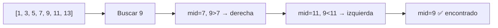

### 9.2 Ordenamientos

#### Comparación de algoritmos

| Algoritmo | Mejor | Promedio | Peor | Espacio | Estable |
|-----------|-------|----------|------|---------|---------|
| Bubble Sort | O(n) | O(n²) | O(n²) | O(1) | Sí |
| Selection Sort | O(n²) | O(n²) | O(n²) | O(1) | No |
| Insertion Sort | O(n) | O(n²) | O(n²) | O(1) | Sí |
| Merge Sort | O(n log n) | O(n log n) | O(n log n) | O(n) | Sí |
| Quick Sort | O(n log n) | O(n log n) | O(n²) | O(log n) | No |
| Timsort (Python) | O(n) | O(n log n) | O(n log n) | O(n) | Sí |

#### Merge Sort

```python
def merge_sort(arr: list[int]) -> list[int]:
    """
    Divide y conquista: divide el arreglo en mitades,
    ordena recursivamente y combina.
    
    Complejidad temporal: O(n log n)
    Complejidad espacial: O(n)
    """
    if len(arr) <= 1:
        return arr

    mid = len(arr) // 2
    izquierda = merge_sort(arr[:mid])
    derecha = merge_sort(arr[mid:])

    return _merge(izquierda, derecha)

def _merge(izq: list[int], der: list[int]) -> list[int]:
    """Combina dos listas ordenadas en una sola ordenada."""
    resultado = []
    i = j = 0

    while i < len(izq) and j < len(der):
        if izq[i] <= der[j]:
            resultado.append(izq[i])
            i += 1
        else:
            resultado.append(der[j])
            j += 1

    resultado.extend(izq[i:])
    resultado.extend(der[j:])
    return resultado
```

#### Quick Sort

```python
def quick_sort(arr: list[int]) -> list[int]:
    """
    Selecciona un pivote y particiona el arreglo.
    
    Complejidad temporal: O(n log n) promedio, O(n²) peor caso.
    Complejidad espacial: O(log n) por la recursión.
    """
    if len(arr) <= 1:
        return arr

    pivote = arr[len(arr) // 2]
    menores = [x for x in arr if x < pivote]
    iguales = [x for x in arr if x == pivote]
    mayores = [x for x in arr if x > pivote]

    return quick_sort(menores) + iguales + quick_sort(mayores)

# Quick sort in-place (más eficiente en memoria)
def quick_sort_inplace(arr: list[int], low: int = 0, high: int = None) -> None:
    if high is None:
        high = len(arr) - 1

    if low < high:
        pivot_idx = _partition(arr, low, high)
        quick_sort_inplace(arr, low, pivot_idx - 1)
        quick_sort_inplace(arr, pivot_idx + 1, high)

def _partition(arr: list[int], low: int, high: int) -> int:
    pivote = arr[high]
    i = low - 1

    for j in range(low, high):
        if arr[j] <= pivote:
            i += 1
            arr[i], arr[j] = arr[j], arr[i]

    arr[i + 1], arr[high] = arr[high], arr[i + 1]
    return i + 1
```

### 9.3 Recursividad

```python
# Factorial
def factorial(n: int) -> int:
    """
    Caso base: n <= 1 → retornar 1
    Caso recursivo: n * factorial(n-1)
    """
    if n <= 1:
        return 1
    return n * factorial(n - 1)

# Torres de Hanoi
def hanoi(n: int, origen: str, destino: str, auxiliar: str) -> None:
    if n == 1:
        print(f"Mover disco 1 de {origen} a {destino}")
        return
    hanoi(n - 1, origen, auxiliar, destino)
    print(f"Mover disco {n} de {origen} a {destino}")
    hanoi(n - 1, auxiliar, destino, origen)

hanoi(3, "A", "C", "B")

# Fibonacci con memoización manual
def fibonacci_memo(n: int, memo: dict = None) -> int:
    if memo is None:
        memo = {}
    if n in memo:
        return memo[n]
    if n < 2:
        return n
    memo[n] = fibonacci_memo(n - 1, memo) + fibonacci_memo(n - 2, memo)
    return memo[n]
```

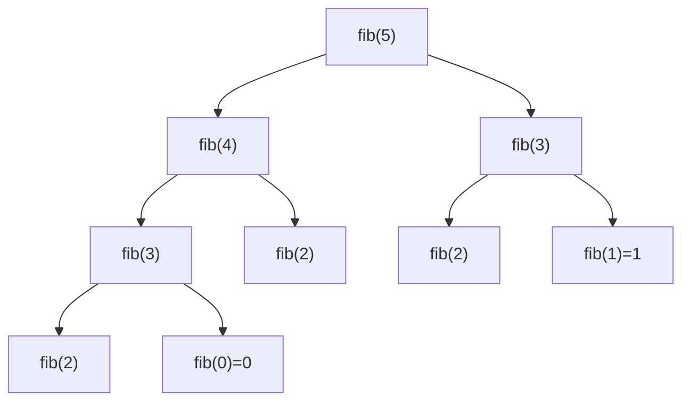

### 9.4 Backtracking

```python
# N-Reinas: colocar N reinas en un tablero NxN sin que se ataquen
def n_reinas(n: int) -> list[list[str]]:
    """
    Complejidad temporal: O(n!)
    Complejidad espacial: O(n²)
    """
    soluciones = []
    tablero = [["." for _ in range(n)] for _ in range(n)]

    def es_valida(fila: int, col: int) -> bool:
        # Verificar columna
        for i in range(fila):
            if tablero[i][col] == "Q":
                return False
        # Verificar diagonal superior izquierda
        i, j = fila - 1, col - 1
        while i >= 0 and j >= 0:
            if tablero[i][j] == "Q":
                return False
            i -= 1
            j -= 1
        # Verificar diagonal superior derecha
        i, j = fila - 1, col + 1
        while i >= 0 and j < n:
            if tablero[i][j] == "Q":
                return False
            i -= 1
            j += 1
        return True

    def resolver(fila: int) -> None:
        if fila == n:
            soluciones.append(["".join(row) for row in tablero])
            return

        for col in range(n):
            if es_valida(fila, col):
                tablero[fila][col] = "Q"
                resolver(fila + 1)
                tablero[fila][col] = "."  # backtrack

    resolver(0)
    return soluciones

# Generar todas las permutaciones con backtracking
def permutaciones(nums: list[int]) -> list[list[int]]:
    resultado = []

    def backtrack(camino: list[int], disponibles: list[int]):
        if not disponibles:
            resultado.append(camino[:])
            return

        for i in range(len(disponibles)):
            camino.append(disponibles[i])
            backtrack(camino, disponibles[:i] + disponibles[i+1:])
            camino.pop()

    backtrack([], nums)
    return resultado
```

### 9.5 Programación dinámica

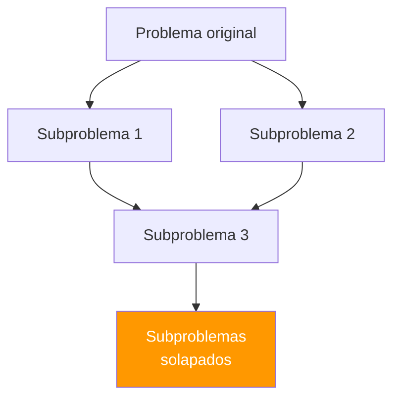

#### Problema del cambio de monedas

```python
# ¿Cuál es el mínimo número de monedas para dar un cambio?
def cambio_monedas(monedas: list[int], monto: int) -> int:
    """
    Bottom-up (tabulación).
    
    Complejidad temporal: O(monto * len(monedas))
    Complejidad espacial: O(monto)
    """
    # dp[i] = mínimo de monedas para el monto i
    dp = [float("inf")] * (monto + 1)
    dp[0] = 0  # caso base: 0 monedas para monto 0

    for i in range(1, monto + 1):
        for moneda in monedas:
            if moneda <= i and dp[i - moneda] + 1 < dp[i]:
                dp[i] = dp[i - moneda] + 1

    return dp[monto] if dp[monto] != float("inf") else -1

print(cambio_monedas([1, 5, 10, 25], 36))  # 3 (25 + 10 + 1)

# Longest Common Subsequence (LCS)
def lcs(text1: str, text2: str) -> int:
    """
    Complejidad temporal: O(m * n)
    Complejidad espacial: O(m * n)
    """
    m, n = len(text1), len(text2)
    dp = [[0] * (n + 1) for _ in range(m + 1)]

    for i in range(1, m + 1):
        for j in range(1, n + 1):
            if text1[i - 1] == text2[j - 1]:
                dp[i][j] = dp[i - 1][j - 1] + 1
            else:
                dp[i][j] = max(dp[i - 1][j], dp[i][j - 1])

    return dp[m][n]

print(lcs("abcde", "ace"))    # 3 ("ace")
```

#### Problema de la mochila (Knapsack)

```python
def mochila(pesos: list[int], valores: list[int], capacidad: int) -> int:
    """
    0/1 Knapsack Problem.
    
    Complejidad temporal: O(n * capacidad)
    Complejidad espacial: O(n * capacidad)
    """
    n = len(pesos)
    dp = [[0] * (capacidad + 1) for _ in range(n + 1)]

    for i in range(1, n + 1):
        for w in range(1, capacidad + 1):
            if pesos[i - 1] <= w:
                dp[i][w] = max(
                    dp[i - 1][w],                              # no tomar
                    dp[i - 1][w - pesos[i - 1]] + valores[i - 1]  # tomar
                )
            else:
                dp[i][w] = dp[i - 1][w]

    return dp[n][capacidad]

print(mochila([2, 3, 4, 5], [3, 4, 5, 6], 8))  # 10
```

### 9.6 Hashing

```python
# Encontrar el primer carácter no repetido
def primer_unico(s: str) -> str:
    """
    Complejidad temporal: O(n)
    Complejidad espacial: O(k) — k = caracteres únicos
    """
    from collections import Counter
    conteo = Counter(s)

    for char in s:
        if conteo[char] == 1:
            return char

    return ""

print(primer_unico("leetcode"))    # "l"
print(primer_unico("aabb"))        # ""

# Agrupar anagramas
def agrupar_anagramas(palabras: list[str]) -> list[list[str]]:
    from collections import defaultdict

    grupos = defaultdict(list)
    for palabra in palabras:
        clave = "".join(sorted(palabra))
        grupos[clave].append(palabra)

    return list(grupos.values())

print(agrupar_anagramas(["eat", "tea", "tan", "ate", "nat", "bat"]))
# [['eat', 'tea', 'ate'], ['tan', 'nat'], ['bat']]
```

### 9.7 Two pointers

```python
# Encontrar pares que suman un objetivo en arreglo ordenado
def dos_suma_ordenado(nums: list[int], target: int) -> list[int]:
    """
    Complejidad temporal: O(n)
    Complejidad espacial: O(1)
    """
    izq, der = 0, len(nums) - 1

    while izq < der:
        suma = nums[izq] + nums[der]
        if suma == target:
            return [izq, der]
        elif suma < target:
            izq += 1
        else:
            der -= 1

    return []

# Container with most water
def max_area(alturas: list[int]) -> int:
    """
    Complejidad temporal: O(n)
    Complejidad espacial: O(1)
    """
    izq, der = 0, len(alturas) - 1
    max_agua = 0

    while izq < der:
        ancho = der - izq
        alto = min(alturas[izq], alturas[der])
        max_agua = max(max_agua, ancho * alto)

        if alturas[izq] < alturas[der]:
            izq += 1
        else:
            der -= 1

    return max_agua
```

### 9.8 Sliding window

```python
# Suma máxima de subarray de tamaño k
def max_suma_ventana(nums: list[int], k: int) -> int:
    """
    Complejidad temporal: O(n)
    Complejidad espacial: O(1)
    """
    # Calcular suma de la primera ventana
    suma_ventana = sum(nums[:k])
    max_suma = suma_ventana

    # Deslizar la ventana
    for i in range(k, len(nums)):
        suma_ventana += nums[i] - nums[i - k]
        max_suma = max(max_suma, suma_ventana)

    return max_suma

print(max_suma_ventana([2, 1, 5, 1, 3, 2], 3))  # 9 (5+1+3)

# Subcadena más corta que contiene todos los caracteres
def ventana_minima(s: str, t: str) -> str:
    from collections import Counter

    if not t or not s:
        return ""

    necesarios = Counter(t)
    ventana = {}
    formados = 0
    requeridos = len(necesarios)
    resultado = (float("inf"), 0, 0)
    izq = 0

    for der in range(len(s)):
        char = s[der]
        ventana[char] = ventana.get(char, 0) + 1

        if char in necesarios and ventana[char] == necesarios[char]:
            formados += 1

        while izq <= der and formados == requeridos:
            if der - izq + 1 < resultado[0]:
                resultado = (der - izq + 1, izq, der)

            ventana[s[izq]] -= 1
            if s[izq] in necesarios and ventana[s[izq]] < necesarios[s[izq]]:
                formados -= 1
            izq += 1

    return "" if resultado[0] == float("inf") else s[resultado[1]:resultado[2] + 1]
```

### 9.9 Árboles

```python
from typing import Optional

class NodoArbol:
    def __init__(self, valor: int):
        self.valor = valor
        self.izquierdo: Optional[NodoArbol] = None
        self.derecho: Optional[NodoArbol] = None

# Recorridos
def inorden(nodo: Optional[NodoArbol]) -> list[int]:
    """Izquierdo → Raíz → Derecho (da orden ascendente en BST)."""
    if not nodo:
        return []
    return inorden(nodo.izquierdo) + [nodo.valor] + inorden(nodo.derecho)

def preorden(nodo: Optional[NodoArbol]) -> list[int]:
    """Raíz → Izquierdo → Derecho."""
    if not nodo:
        return []
    return [nodo.valor] + preorden(nodo.izquierdo) + preorden(nodo.derecho)

def postorden(nodo: Optional[NodoArbol]) -> list[int]:
    """Izquierdo → Derecho → Raíz."""
    if not nodo:
        return []
    return postorden(nodo.izquierdo) + postorden(nodo.derecho) + [nodo.valor]

# Altura del árbol
def altura(nodo: Optional[NodoArbol]) -> int:
    if not nodo:
        return 0
    return 1 + max(altura(nodo.izquierdo), altura(nodo.derecho))

# BST: buscar valor
def buscar_bst(nodo: Optional[NodoArbol], valor: int) -> bool:
    if not nodo:
        return False
    if valor == nodo.valor:
        return True
    elif valor < nodo.valor:
        return buscar_bst(nodo.izquierdo, valor)
    else:
        return buscar_bst(nodo.derecho, valor)

# BST: insertar valor
def insertar_bst(nodo: Optional[NodoArbol], valor: int) -> NodoArbol:
    if not nodo:
        return NodoArbol(valor)
    if valor < nodo.valor:
        nodo.izquierdo = insertar_bst(nodo.izquierdo, valor)
    elif valor > nodo.valor:
        nodo.derecho = insertar_bst(nodo.derecho, valor)
    return nodo

# Construir árbol de ejemplo
raiz = None
for v in [8, 3, 10, 1, 6, 14, 4, 7, 13]:
    raiz = insertar_bst(raiz, v)

print(inorden(raiz))  # [1, 3, 4, 6, 7, 8, 10, 13, 14]
```

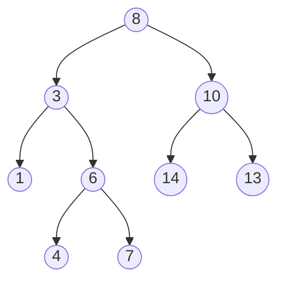

### 9.10 Grafos

```python
from collections import defaultdict, deque

class Grafo:
    """Grafo dirigido con lista de adyacencia."""

    def __init__(self):
        self.adyacencia: dict[str, list[str]] = defaultdict(list)

    def agregar_arista(self, origen: str, destino: str) -> None:
        self.adyacencia[origen].append(destino)

    def bfs(self, inicio: str) -> list[str]:
        """
        Búsqueda por amplitud (Breadth-First Search).
        Explora nivel por nivel.
        
        Complejidad temporal: O(V + E)
        Complejidad espacial: O(V)
        """
        visitados: set[str] = set()
        cola: deque[str] = deque([inicio])
        resultado: list[str] = []
        visitados.add(inicio)

        while cola:
            nodo = cola.popleft()
            resultado.append(nodo)

            for vecino in self.adyacencia[nodo]:
                if vecino not in visitados:
                    visitados.add(vecino)
                    cola.append(vecino)

        return resultado

    def dfs(self, inicio: str) -> list[str]:
        """
        Búsqueda por profundidad (Depth-First Search).
        Explora rama completa antes de retroceder.
        
        Complejidad temporal: O(V + E)
        Complejidad espacial: O(V)
        """
        visitados: set[str] = set()
        resultado: list[str] = []

        def _dfs(nodo: str) -> None:
            visitados.add(nodo)
            resultado.append(nodo)
            for vecino in self.adyacencia[nodo]:
                if vecino not in visitados:
                    _dfs(vecino)

        _dfs(inicio)
        return resultado

    def hay_camino(self, origen: str, destino: str) -> bool:
        """Verifica si existe un camino entre dos nodos."""
        visitados: set[str] = set()

        def _dfs(nodo: str) -> bool:
            if nodo == destino:
                return True
            visitados.add(nodo)
            for vecino in self.adyacencia[nodo]:
                if vecino not in visitados and _dfs(vecino):
                    return True
            return False

        return _dfs(origen)

# Ejemplo de uso
g = Grafo()
g.agregar_arista("A", "B")
g.agregar_arista("A", "C")
g.agregar_arista("B", "D")
g.agregar_arista("C", "D")
g.agregar_arista("D", "E")

print(g.bfs("A"))  # ['A', 'B', 'C', 'D', 'E']
print(g.dfs("A"))  # ['A', 'B', 'D', 'E', 'C']
print(g.hay_camino("A", "E"))  # True
```

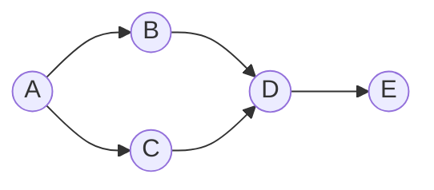

#### Dijkstra — camino más corto

```python
import heapq

def dijkstra(grafo: dict[str, list[tuple[str, int]]], inicio: str) -> dict[str, int]:
    """
    Encuentra el camino más corto desde inicio a todos los nodos.
    
    Complejidad temporal: O((V + E) log V)
    Complejidad espacial: O(V)
    """
    distancias: dict[str, float] = {nodo: float("inf") for nodo in grafo}
    distancias[inicio] = 0
    cola: list[tuple[int, str]] = [(0, inicio)]

    while cola:
        dist_actual, nodo_actual = heapq.heappop(cola)

        if dist_actual > distancias[nodo_actual]:
            continue

        for vecino, peso in grafo[nodo_actual]:
            distancia = dist_actual + peso
            if distancia < distancias[vecino]:
                distancias[vecino] = distancia
                heapq.heappush(cola, (distancia, vecino))

    return distancias

# Ejemplo
grafo_ponderado = {
    "A": [("B", 4), ("C", 2)],
    "B": [("D", 3), ("C", 1)],
    "C": [("B", 1), ("D", 5)],
    "D": [("E", 1)],
    "E": [],
}

print(dijkstra(grafo_ponderado, "A"))
# {'A': 0, 'B': 3, 'C': 2, 'D': 6, 'E': 7}
```

**Resumen del capítulo**: los temas fundamentales de algoritmia incluyen búsquedas (lineal y binaria), ordenamientos (merge sort, quick sort), recursividad, backtracking, programación dinámica (memoización y tabulación), hashing, two pointers, sliding window, árboles binarios (BST) y grafos (BFS, DFS, Dijkstra).

---

## 10. Ejercicios prácticos

### 10.1 Ejercicios resueltos

#### Ejercicio 1: Rotación de arreglo

**Enunciado**: rotar un arreglo `k` posiciones a la derecha.

```python
def rotar(nums: list[int], k: int) -> list[int]:
    """
    Estrategia: usar slicing con módulo para manejar k > len(nums).
    
    Complejidad temporal: O(n)
    Complejidad espacial: O(n)
    """
    k = k % len(nums)
    return nums[-k:] + nums[:-k]

# Versión in-place con inversiones
def rotar_inplace(nums: list[int], k: int) -> None:
    """
    Invertir todo → invertir primeros k → invertir restantes.
    
    Complejidad temporal: O(n)
    Complejidad espacial: O(1)
    """
    k = k % len(nums)

    def invertir(izq: int, der: int) -> None:
        while izq < der:
            nums[izq], nums[der] = nums[der], nums[izq]
            izq += 1
            der -= 1

    invertir(0, len(nums) - 1)
    invertir(0, k - 1)
    invertir(k, len(nums) - 1)

arr = [1, 2, 3, 4, 5, 6, 7]
print(rotar(arr, 3))  # [5, 6, 7, 1, 2, 3, 4]
```

---

#### Ejercicio 2: Validar sudoku

**Enunciado**: verificar si un tablero de Sudoku 9x9 parcialmente lleno es válido.

```python
def validar_sudoku(tablero: list[list[str]]) -> bool:
    """
    Verificar que no haya duplicados en filas, columnas ni cajas 3x3.
    
    Complejidad temporal: O(1) — tablero de tamaño fijo 9x9.
    Complejidad espacial: O(1)
    """
    filas = [set() for _ in range(9)]
    columnas = [set() for _ in range(9)]
    cajas = [set() for _ in range(9)]

    for i in range(9):
        for j in range(9):
            num = tablero[i][j]
            if num == ".":
                continue

            caja_idx = (i // 3) * 3 + (j // 3)

            if num in filas[i] or num in columnas[j] or num in cajas[caja_idx]:
                return False

            filas[i].add(num)
            columnas[j].add(num)
            cajas[caja_idx].add(num)

    return True
```

---

#### Ejercicio 3: Comprimir cadena

**Enunciado**: comprimir una cadena contando caracteres consecutivos repetidos. Ejemplo: `"aabcccccaaa"` → `"a2b1c5a3"`.

```python
def comprimir(s: str) -> str:
    """
    Complejidad temporal: O(n)
    Complejidad espacial: O(n)
    """
    if not s:
        return ""

    resultado = []
    contador = 1

    for i in range(1, len(s)):
        if s[i] == s[i - 1]:
            contador += 1
        else:
            resultado.append(f"{s[i-1]}{contador}")
            contador = 1

    resultado.append(f"{s[-1]}{contador}")
    comprimida = "".join(resultado)

    # Retornar la más corta
    return comprimida if len(comprimida) < len(s) else s

print(comprimir("aabcccccaaa"))  # "a2b1c5a3"
print(comprimir("abcdef"))       # "abcdef" (no se comprime)
```

---

### 10.2 Ejercicios propuestos

| # | Dificultad | Enunciado | Pista |
|---|-----------|-----------|-------|
| 1 | Básico | Invertir un entero (`123` → `321`, `-456` → `-654`) | Usar módulo y división entera |
| 2 | Básico | Verificar si un número es primo | Iterar hasta `√n` |
| 3 | Intermedio | Encontrar el elemento mayoritario (aparece más de n/2 veces) | Algoritmo de Boyer-Moore |
| 4 | Intermedio | Fusionar `k` listas ordenadas | Min-heap con heapq |
| 5 | Intermedio | Detectar ciclo en una lista enlazada | Two pointers (tortuga y liebre) |
| 6 | Avanzado | Encontrar todas las islas en una matriz binaria | DFS/BFS en matriz |
| 7 | Avanzado | Implementar LRU Cache | OrderedDict o dict + doubly linked list |
| 8 | Avanzado | Serializar y deserializar un árbol binario | Preorder traversal + separador |

---

## 11. Buenas prácticas

### 11.1 PEP 8 — Guía de estilo

```python
# ✅ Correcto
import os
import sys
from collections import defaultdict
from typing import Optional

MAX_RETRIES = 3
DEFAULT_TIMEOUT = 30


class UserService:
    """Servicio para gestión de usuarios."""

    def __init__(self, db_url: str) -> None:
        self._db_url = db_url
        self._connection: Optional[object] = None

    def find_by_id(self, user_id: int) -> Optional[dict]:
        """Busca un usuario por su ID."""
        if user_id <= 0:
            raise ValueError("El ID debe ser positivo")
        return self._query(f"SELECT * FROM users WHERE id = {user_id}")

    def _query(self, sql: str) -> Optional[dict]:
        """Método interno para ejecutar queries."""
        pass


# ❌ Incorrecto
import os, sys
from collections import *

class userService:
    def __init__(self,dbUrl):
        self.dbUrl=dbUrl
    def FindById(self,userId):
        if userId<=0: raise ValueError("bad id")
        return self._query(f"select * from users where id={userId}")
```

**Reglas esenciales de PEP 8:**

| Regla | Ejemplo |
|-------|---------|
| Indentación: 4 espacios | `if True:` + 4 espacios |
| Líneas: máximo 79 caracteres | Romper líneas largas |
| Imports: uno por línea, agrupados | stdlib → third party → local |
| Espacios alrededor de operadores | `x = 1 + 2` |
| Líneas en blanco: 2 entre funciones top-level | Separar clases y funciones |
| Docstrings para módulos, clases y funciones | Triple comillas dobles |

### 11.2 Clean Code

```python
# ❌ Código difícil de entender
def p(d, t):
    return d * (1 + t/100)

# ✅ Código limpio y autodocumentado
def calcular_precio_con_impuesto(
    precio_base: float,
    tasa_impuesto: float
) -> float:
    """Calcula el precio final aplicando la tasa de impuesto."""
    return precio_base * (1 + tasa_impuesto / 100)


# ❌ Función que hace demasiadas cosas
def procesar_pedido(pedido):
    # valida, calcula, guarda, envía email, genera factura...
    pass

# ✅ Responsabilidad única
def validar_pedido(pedido: dict) -> bool:
    """Valida que el pedido tenga todos los campos requeridos."""
    campos_requeridos = {"cliente", "items", "direccion"}
    return campos_requeridos.issubset(pedido.keys())

def calcular_total(items: list[dict]) -> float:
    """Calcula el total del pedido sumando precio * cantidad."""
    return sum(item["precio"] * item["cantidad"] for item in items)

def guardar_pedido(pedido: dict) -> int:
    """Persiste el pedido y retorna su ID."""
    pass

def notificar_cliente(email: str, pedido_id: int) -> None:
    """Envía notificación de confirmación al cliente."""
    pass
```

**Principios clave:**

- **Nombres descriptivos**: el código se lee más de lo que se escribe
- **Funciones pequeñas**: máximo 20 líneas, una sola responsabilidad
- **Sin números mágicos**: usar constantes con nombre
- **DRY** (Don't Repeat Yourself): extraer lógica común
- **KISS** (Keep It Simple, Stupid): preferir lo simple
- **YAGNI** (You Aren't Gonna Need It): no agregar funcionalidad que no se necesita

### 11.3 Refactorización

```python
# Antes: código repetitivo y frágil
def obtener_descuento(tipo_cliente, monto):
    if tipo_cliente == "gold":
        descuento = monto * 0.20
        if descuento > 100:
            descuento = 100
        return descuento
    elif tipo_cliente == "silver":
        descuento = monto * 0.10
        if descuento > 50:
            descuento = 50
        return descuento
    elif tipo_cliente == "bronze":
        descuento = monto * 0.05
        if descuento > 25:
            descuento = 25
        return descuento
    return 0

# Después: refactorizado con datos y lógica separados
from dataclasses import dataclass

@dataclass(frozen=True)
class PoliticaDescuento:
    porcentaje: float
    maximo: float

POLITICAS: dict[str, PoliticaDescuento] = {
    "gold":   PoliticaDescuento(0.20, 100),
    "silver": PoliticaDescuento(0.10, 50),
    "bronze": PoliticaDescuento(0.05, 25),
}

def obtener_descuento(tipo_cliente: str, monto: float) -> float:
    """Calcula el descuento según la política del tipo de cliente."""
    politica = POLITICAS.get(tipo_cliente)
    if not politica:
        return 0.0
    return min(monto * politica.porcentaje, politica.maximo)
```

### 11.4 Testing

```python
# tests/test_calculadora.py
import pytest

def sumar(a: float, b: float) -> float:
    return a + b

def dividir(a: float, b: float) -> float:
    if b == 0:
        raise ZeroDivisionError("No se puede dividir por cero")
    return a / b

# Tests básicos
class TestCalculadora:
    def test_sumar_positivos(self):
        assert sumar(2, 3) == 5

    def test_sumar_negativos(self):
        assert sumar(-1, -1) == -2

    def test_sumar_flotantes(self):
        assert sumar(0.1, 0.2) == pytest.approx(0.3)

    def test_dividir_normal(self):
        assert dividir(10, 2) == 5.0

    def test_dividir_por_cero(self):
        with pytest.raises(ZeroDivisionError):
            dividir(10, 0)

# Fixtures
@pytest.fixture
def lista_numeros():
    return [3, 1, 4, 1, 5, 9, 2, 6]

def test_ordenar(lista_numeros):
    assert sorted(lista_numeros) == [1, 1, 2, 3, 4, 5, 6, 9]

# Parametrize
@pytest.mark.parametrize("entrada,esperado", [
    ("racecar", True),
    ("hello", False),
    ("", True),
    ("a", True),
])
def test_es_palindromo(entrada, esperado):
    limpio = entrada.lower()
    assert (limpio == limpio[::-1]) == esperado
```

```bash
# Ejecutar tests
pytest tests/ -v
pytest tests/ -v --cov=src --cov-report=html
```

### 11.5 Estructura profesional de proyecto

```
mi_proyecto/
├── pyproject.toml          # configuración del proyecto
├── README.md
├── .gitignore
├── .env.example
├── src/
│   └── mi_proyecto/
│       ├── __init__.py
│       ├── main.py
│       ├── config.py       # configuración
│       ├── models/         # modelos de datos
│       │   ├── __init__.py
│       │   └── usuario.py
│       ├── services/       # lógica de negocio
│       │   ├── __init__.py
│       │   └── usuario_service.py
│       ├── repositories/   # acceso a datos
│       │   ├── __init__.py
│       │   └── usuario_repo.py
│       └── utils/          # utilidades
│           ├── __init__.py
│           └── helpers.py
├── tests/
│   ├── __init__.py
│   ├── conftest.py         # fixtures compartidos
│   ├── test_models/
│   └── test_services/
└── docs/
    └── architecture.md
```

**Resumen del capítulo**: las buenas prácticas incluyen seguir PEP 8, escribir código limpio con nombres descriptivos y funciones pequeñas, refactorizar para eliminar duplicación, implementar tests con pytest, y organizar proyectos con una estructura profesional.

---

## 12. Proyecto final — Sistema de gestión de tareas con CLI

### 12.1 Descripción

Sistema de gestión de tareas por línea de comandos que aplica los conceptos del curso:
- Estructuras de datos (diccionarios, listas, pilas)
- POO con dataclasses y ABC
- Manejo de archivos (JSON)
- Decoradores
- Typing
- Testing
- Buenas prácticas

### 12.2 Arquitectura

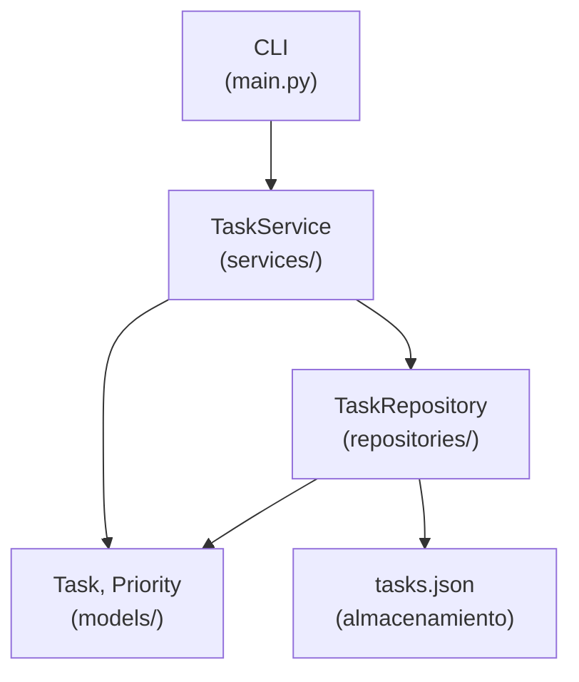

```
task_manager/
├── pyproject.toml
├── src/
│   └── task_manager/
│       ├── __init__.py
│       ├── main.py
│       ├── models/
│       │   ├── __init__.py
│       │   └── task.py
│       ├── services/
│       │   ├── __init__.py
│       │   └── task_service.py
│       ├── repositories/
│       │   ├── __init__.py
│       │   ├── base.py
│       │   └── json_repository.py
│       └── utils/
│           ├── __init__.py
│           └── validators.py
└── tests/
    ├── __init__.py
    ├── conftest.py
    ├── test_models.py
    └── test_service.py
```

### 12.3 Modelos

```python
# src/task_manager/models/task.py
from dataclasses import dataclass, field
from datetime import datetime
from enum import Enum
from typing import Optional
import uuid


class Priority(Enum):
    """Niveles de prioridad para tareas."""
    LOW = "low"
    MEDIUM = "medium"
    HIGH = "high"
    CRITICAL = "critical"

    def __lt__(self, other: "Priority") -> bool:
        order = [Priority.LOW, Priority.MEDIUM, Priority.HIGH, Priority.CRITICAL]
        return order.index(self) < order.index(other)


class Status(Enum):
    """Estados posibles de una tarea."""
    PENDING = "pending"
    IN_PROGRESS = "in_progress"
    COMPLETED = "completed"
    CANCELLED = "cancelled"


@dataclass
class Task:
    """Representa una tarea del sistema."""
    title: str
    description: str = ""
    priority: Priority = Priority.MEDIUM
    status: Status = Status.PENDING
    tags: list[str] = field(default_factory=list)
    id: str = field(default_factory=lambda: str(uuid.uuid4())[:8])
    created_at: datetime = field(default_factory=datetime.now)
    completed_at: Optional[datetime] = None

    def complete(self) -> None:
        """Marca la tarea como completada."""
        self.status = Status.COMPLETED
        self.completed_at = datetime.now()

    def cancel(self) -> None:
        """Cancela la tarea."""
        self.status = Status.CANCELLED

    def start(self) -> None:
        """Marca la tarea como en progreso."""
        self.status = Status.IN_PROGRESS

    @property
    def is_active(self) -> bool:
        """Indica si la tarea está activa (no completada ni cancelada)."""
        return self.status in (Status.PENDING, Status.IN_PROGRESS)

    def to_dict(self) -> dict:
        """Serializa la tarea a diccionario."""
        return {
            "id": self.id,
            "title": self.title,
            "description": self.description,
            "priority": self.priority.value,
            "status": self.status.value,
            "tags": self.tags,
            "created_at": self.created_at.isoformat(),
            "completed_at": self.completed_at.isoformat() if self.completed_at else None,
        }

    @classmethod
    def from_dict(cls, data: dict) -> "Task":
        """Deserializa un diccionario a una tarea."""
        return cls(
            id=data["id"],
            title=data["title"],
            description=data.get("description", ""),
            priority=Priority(data["priority"]),
            status=Status(data["status"]),
            tags=data.get("tags", []),
            created_at=datetime.fromisoformat(data["created_at"]),
            completed_at=(
                datetime.fromisoformat(data["completed_at"])
                if data.get("completed_at") else None
            ),
        )

    def __str__(self) -> str:
        icon = {
            Status.PENDING: "⏳",
            Status.IN_PROGRESS: "🔄",
            Status.COMPLETED: "✅",
            Status.CANCELLED: "❌",
        }
        pri = {
            Priority.LOW: "🟢",
            Priority.MEDIUM: "🟡",
            Priority.HIGH: "🟠",
            Priority.CRITICAL: "🔴",
        }
        return (
            f"{icon[self.status]} [{self.id}] {self.title} "
            f"{pri[self.priority]} {self.priority.value}"
        )
```

### 12.4 Repositorio

```python
# src/task_manager/repositories/base.py
from abc import ABC, abstractmethod
from typing import Optional
from task_manager.models.task import Task


class TaskRepositoryBase(ABC):
    """Interfaz abstracta para repositorios de tareas."""

    @abstractmethod
    def save(self, task: Task) -> None:
        """Guarda o actualiza una tarea."""
        pass

    @abstractmethod
    def find_by_id(self, task_id: str) -> Optional[Task]:
        """Busca una tarea por ID."""
        pass

    @abstractmethod
    def find_all(self) -> list[Task]:
        """Retorna todas las tareas."""
        pass

    @abstractmethod
    def delete(self, task_id: str) -> bool:
        """Elimina una tarea. Retorna True si se eliminó."""
        pass


# src/task_manager/repositories/json_repository.py
import json
from pathlib import Path
from typing import Optional
from task_manager.models.task import Task
from task_manager.repositories.base import TaskRepositoryBase


class JsonTaskRepository(TaskRepositoryBase):
    """Repositorio que persiste tareas en un archivo JSON."""

    def __init__(self, filepath: str = "tasks.json"):
        self._filepath = Path(filepath)
        self._tasks: dict[str, Task] = {}
        self._load()

    def _load(self) -> None:
        """Carga las tareas desde el archivo JSON."""
        if self._filepath.exists():
            data = json.loads(self._filepath.read_text(encoding="utf-8"))
            self._tasks = {
                t["id"]: Task.from_dict(t) for t in data
            }

    def _persist(self) -> None:
        """Guarda las tareas en el archivo JSON."""
        data = [task.to_dict() for task in self._tasks.values()]
        self._filepath.write_text(
            json.dumps(data, indent=2, ensure_ascii=False),
            encoding="utf-8"
        )

    def save(self, task: Task) -> None:
        self._tasks[task.id] = task
        self._persist()

    def find_by_id(self, task_id: str) -> Optional[Task]:
        return self._tasks.get(task_id)

    def find_all(self) -> list[Task]:
        return list(self._tasks.values())

    def delete(self, task_id: str) -> bool:
        if task_id in self._tasks:
            del self._tasks[task_id]
            self._persist()
            return True
        return False
```

### 12.5 Servicio

```python
# src/task_manager/services/task_service.py
import functools
import logging
from typing import Optional
from task_manager.models.task import Task, Priority, Status
from task_manager.repositories.base import TaskRepositoryBase

logger = logging.getLogger(__name__)


def log_operation(func):
    """Decorador para registrar operaciones del servicio."""
    @functools.wraps(func)
    def wrapper(*args, **kwargs):
        logger.info("Ejecutando %s", func.__name__)
        try:
            result = func(*args, **kwargs)
            logger.info("%s completado exitosamente", func.__name__)
            return result
        except Exception as e:
            logger.error("%s falló: %s", func.__name__, e)
            raise
    return wrapper


class TaskService:
    """Servicio de lógica de negocio para gestión de tareas."""

    def __init__(self, repository: TaskRepositoryBase):
        self._repo = repository

    @log_operation
    def create_task(
        self,
        title: str,
        description: str = "",
        priority: str = "medium",
        tags: Optional[list[str]] = None
    ) -> Task:
        """Crea una nueva tarea."""
        if not title.strip():
            raise ValueError("El título no puede estar vacío")

        task = Task(
            title=title.strip(),
            description=description.strip(),
            priority=Priority(priority),
            tags=tags or [],
        )
        self._repo.save(task)
        return task

    @log_operation
    def complete_task(self, task_id: str) -> Task:
        """Marca una tarea como completada."""
        task = self._get_task_or_raise(task_id)
        task.complete()
        self._repo.save(task)
        return task

    @log_operation
    def delete_task(self, task_id: str) -> bool:
        """Elimina una tarea."""
        return self._repo.delete(task_id)

    def list_tasks(
        self,
        status: Optional[str] = None,
        priority: Optional[str] = None,
        tag: Optional[str] = None,
    ) -> list[Task]:
        """Lista tareas con filtros opcionales."""
        tasks = self._repo.find_all()

        if status:
            tasks = [t for t in tasks if t.status == Status(status)]
        if priority:
            tasks = [t for t in tasks if t.priority == Priority(priority)]
        if tag:
            tasks = [t for t in tasks if tag in t.tags]

        return sorted(tasks, key=lambda t: t.priority, reverse=True)

    def get_stats(self) -> dict[str, int]:
        """Retorna estadísticas de las tareas."""
        tasks = self._repo.find_all()
        from collections import Counter
        status_count = Counter(t.status.value for t in tasks)
        return {
            "total": len(tasks),
            "pending": status_count.get("pending", 0),
            "in_progress": status_count.get("in_progress", 0),
            "completed": status_count.get("completed", 0),
            "cancelled": status_count.get("cancelled", 0),
        }

    def _get_task_or_raise(self, task_id: str) -> Task:
        """Busca una tarea o lanza ValueError."""
        task = self._repo.find_by_id(task_id)
        if not task:
            raise ValueError(f"Tarea '{task_id}' no encontrada")
        return task
```

### 12.6 CLI (punto de entrada)

```python
# src/task_manager/main.py
import argparse
import sys
from task_manager.services.task_service import TaskService
from task_manager.repositories.json_repository import JsonTaskRepository


def create_parser() -> argparse.ArgumentParser:
    parser = argparse.ArgumentParser(
        description="📋 Task Manager — Gestor de tareas por CLI"
    )
    subparsers = parser.add_subparsers(dest="command", help="Comandos disponibles")

    # add
    add_parser = subparsers.add_parser("add", help="Crear nueva tarea")
    add_parser.add_argument("title", help="Título de la tarea")
    add_parser.add_argument("-d", "--description", default="", help="Descripción")
    add_parser.add_argument(
        "-p", "--priority",
        choices=["low", "medium", "high", "critical"],
        default="medium",
        help="Prioridad"
    )
    add_parser.add_argument("-t", "--tags", nargs="*", default=[], help="Etiquetas")

    # list
    list_parser = subparsers.add_parser("list", help="Listar tareas")
    list_parser.add_argument("-s", "--status", help="Filtrar por estado")
    list_parser.add_argument("-p", "--priority", help="Filtrar por prioridad")

    # complete
    complete_parser = subparsers.add_parser("complete", help="Completar tarea")
    complete_parser.add_argument("id", help="ID de la tarea")

    # delete
    delete_parser = subparsers.add_parser("delete", help="Eliminar tarea")
    delete_parser.add_argument("id", help="ID de la tarea")

    # stats
    subparsers.add_parser("stats", help="Mostrar estadísticas")

    return parser


def main() -> None:
    parser = create_parser()
    args = parser.parse_args()

    if not args.command:
        parser.print_help()
        sys.exit(1)

    repo = JsonTaskRepository()
    service = TaskService(repo)

    match args.command:
        case "add":
            task = service.create_task(
                title=args.title,
                description=args.description,
                priority=args.priority,
                tags=args.tags,
            )
            print(f"✅ Tarea creada: {task}")

        case "list":
            tasks = service.list_tasks(
                status=args.status,
                priority=args.priority,
            )
            if not tasks:
                print("📭 No hay tareas")
            else:
                for task in tasks:
                    print(task)

        case "complete":
            task = service.complete_task(args.id)
            print(f"✅ Tarea completada: {task}")

        case "delete":
            if service.delete_task(args.id):
                print(f"🗑️  Tarea {args.id} eliminada")
            else:
                print(f"❌ Tarea {args.id} no encontrada")

        case "stats":
            stats = service.get_stats()
            print("📊 Estadísticas:")
            print(f"   Total:       {stats['total']}")
            print(f"   Pendientes:  {stats['pending']}")
            print(f"   En progreso: {stats['in_progress']}")
            print(f"   Completadas: {stats['completed']}")
            print(f"   Canceladas:  {stats['cancelled']}")


if __name__ == "__main__":
    main()
```

### 12.7 Tests

```python
# tests/conftest.py
import pytest
from task_manager.models.task import Task, Priority
from task_manager.repositories.json_repository import JsonTaskRepository
from task_manager.services.task_service import TaskService


@pytest.fixture
def tmp_repo(tmp_path):
    """Repositorio temporal para tests."""
    filepath = tmp_path / "test_tasks.json"
    return JsonTaskRepository(str(filepath))


@pytest.fixture
def service(tmp_repo):
    """Servicio con repositorio temporal."""
    return TaskService(tmp_repo)


@pytest.fixture
def sample_task(service):
    """Tarea de ejemplo."""
    return service.create_task(
        title="Tarea de prueba",
        description="Descripción de prueba",
        priority="high",
        tags=["test", "example"]
    )


# tests/test_models.py
from task_manager.models.task import Task, Priority, Status


class TestTask:
    def test_create_task(self):
        task = Task(title="Test")
        assert task.title == "Test"
        assert task.status == Status.PENDING
        assert task.priority == Priority.MEDIUM

    def test_complete_task(self):
        task = Task(title="Test")
        task.complete()
        assert task.status == Status.COMPLETED
        assert task.completed_at is not None

    def test_is_active(self):
        task = Task(title="Test")
        assert task.is_active is True
        task.complete()
        assert task.is_active is False

    def test_serialization(self):
        task = Task(title="Test", priority=Priority.HIGH)
        data = task.to_dict()
        restored = Task.from_dict(data)
        assert restored.title == task.title
        assert restored.priority == task.priority
        assert restored.id == task.id


# tests/test_service.py
import pytest


class TestTaskService:
    def test_create_task(self, service):
        task = service.create_task("Nueva tarea")
        assert task.title == "Nueva tarea"

    def test_create_task_empty_title(self, service):
        with pytest.raises(ValueError):
            service.create_task("")

    def test_complete_task(self, service, sample_task):
        completed = service.complete_task(sample_task.id)
        assert completed.status.value == "completed"

    def test_delete_task(self, service, sample_task):
        assert service.delete_task(sample_task.id) is True
        assert service.delete_task("nonexistent") is False

    def test_list_tasks_with_filter(self, service):
        service.create_task("Tarea alta", priority="high")
        service.create_task("Tarea baja", priority="low")
        high_tasks = service.list_tasks(priority="high")
        assert len(high_tasks) == 1
        assert high_tasks[0].title == "Tarea alta"

    def test_stats(self, service, sample_task):
        stats = service.get_stats()
        assert stats["total"] >= 1
        assert stats["pending"] >= 1
```

### 12.8 Uso del proyecto

```bash
# Crear tareas
python -m task_manager.main add "Estudiar algoritmos" -p high -t estudio python
python -m task_manager.main add "Revisar PRs" -p medium -t trabajo

# Listar tareas
python -m task_manager.main list
python -m task_manager.main list -s pending -p high

# Completar tarea
python -m task_manager.main complete abc12345

# Eliminar tarea
python -m task_manager.main delete abc12345

# Ver estadísticas
python -m task_manager.main stats

# Ejecutar tests
pytest tests/ -v --cov=src
```

**Resumen del capítulo**: el proyecto final integra modelos con dataclasses, repositorio abstracto con persistencia JSON, servicio con decoradores y logging, CLI con argparse y match/case, y tests con pytest. Demuestra una arquitectura profesional, limpia y escalable.

---

> **Fin del curso**. Este material cubre desde los fundamentos de Python hasta algoritmia avanzada, buenas prácticas y un proyecto integrador. La clave para dominar estos temas es la **práctica constante** y la **resolución progresiva** de problemas.


## Pendientes
- @dataclass
- ABC
- Abstractmethod
- Decoradores
- Typing
