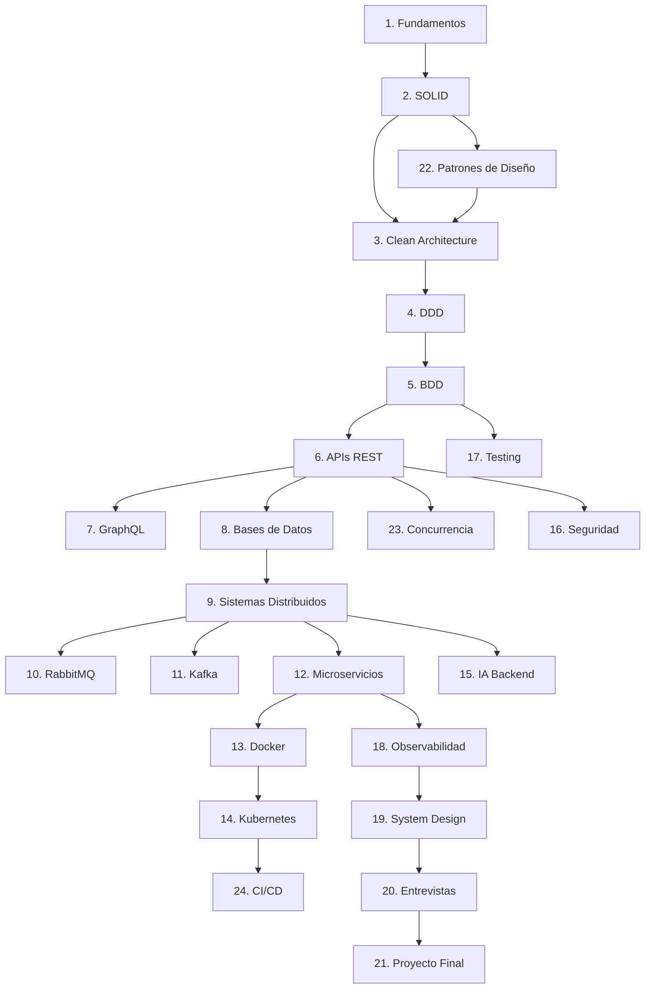

# Curso Completo de Backend Engineering

## Descripción

Material educativo completo y profesional para formar un **Backend Engineer moderno** capaz de diseñar sistemas escalables, trabajar con arquitecturas distribuidas, aprobar entrevistas técnicas, construir software empresarial y aplicar buenas prácticas reales de la industria.

**Nivel:** Intermedio a Avanzado  
**Prerrequisito:** Conocimientos sólidos de programación (preferentemente Python)  
**Enfoque:** Práctico, técnico y orientado a escenarios reales de backend

---

## Índice General

| # | Tema | Archivo |
|---|------|---------|
| 1 | [Fundamentos de Ingeniería de Software](01-fundamentos-ingenieria-software.md) | `01-fundamentos-ingenieria-software.md` |
| 2 | [Principios SOLID](02-principios-solid.md) | `02-principios-solid.md` |
| 3 | [Clean Architecture](03-clean-architecture.md) | `03-clean-architecture.md` |
| 4 | [Domain Driven Design (DDD)](04-domain-driven-design.md) | `04-domain-driven-design.md` |
| 5 | [Behavior Driven Development (BDD)](05-behavior-driven-development.md) | `05-behavior-driven-development.md` |
| 6 | [Diseño de APIs REST](06-diseno-apis-rest.md) | `06-diseno-apis-rest.md` |
| 7 | [GraphQL](07-graphql.md) | `07-graphql.md` |
| 8 | [Bases de Datos](08-bases-de-datos.md) | `08-bases-de-datos.md` |
| 9 | [Sistemas Distribuidos](09-sistemas-distribuidos.md) | `09-sistemas-distribuidos.md` |
| 10 | [RabbitMQ y Mensajería](10-rabbitmq-mensajeria.md) | `10-rabbitmq-mensajeria.md` |
| 11 | [Apache Kafka](11-apache-kafka.md) | `11-apache-kafka.md` |
| 12 | [Microservicios](12-microservicios.md) | `12-microservicios.md` |
| 13 | [Docker y Contenedores](13-docker-contenedores.md) | `13-docker-contenedores.md` |
| 14 | [Kubernetes](14-kubernetes.md) | `14-kubernetes.md` |
| 15 | [Conceptos de IA para Backend](15-ia-para-backend.md) | `15-ia-para-backend.md` |
| 16 | [Seguridad Backend](16-seguridad-backend.md) | `16-seguridad-backend.md` |
| 17 | [Testing Profesional](17-testing-profesional.md) | `17-testing-profesional.md` |
| 18 | [Observabilidad y Monitoreo](18-observabilidad-monitoreo.md) | `18-observabilidad-monitoreo.md` |
| 19 | [Diseño de Sistemas (System Design)](19-diseno-de-sistemas.md) | `19-diseno-de-sistemas.md` |
| 20 | [Preguntas de Entrevistas Backend](20-preguntas-entrevistas.md) | `20-preguntas-entrevistas.md` |
| 21 | [Proyecto Final Empresarial](21-proyecto-final.md) | `21-proyecto-final.md` |
| 22 | [Patrones de Diseño](22-patrones-diseno.md) | `22-patrones-diseno.md` |
| 23 | [Concurrencia y Paralelismo](23-concurrencia-paralelismo.md) | `23-concurrencia-paralelismo.md` |
| 24 | [CI/CD y DevOps](24-cicd-devops.md) | `24-cicd-devops.md` |

---

## Ruta de Aprendizaje Recomendada

---

## Convenciones Utilizadas

| Icono | Significado |
|-------|-------------|
| ⚠️ | Advertencia o error común |
| 💡 | Consejo o buena práctica |
| 🔧 | Ejemplo práctico |
| 📐 | Diagrama de arquitectura |
| 🏢 | Caso empresarial real |
| ❌ | Antipatrón o código incorrecto |
| ✅ | Patrón correcto o solución recomendada |
