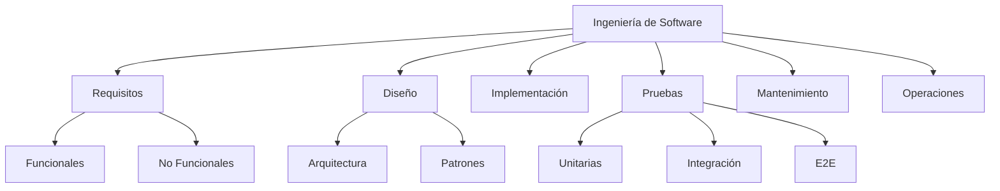
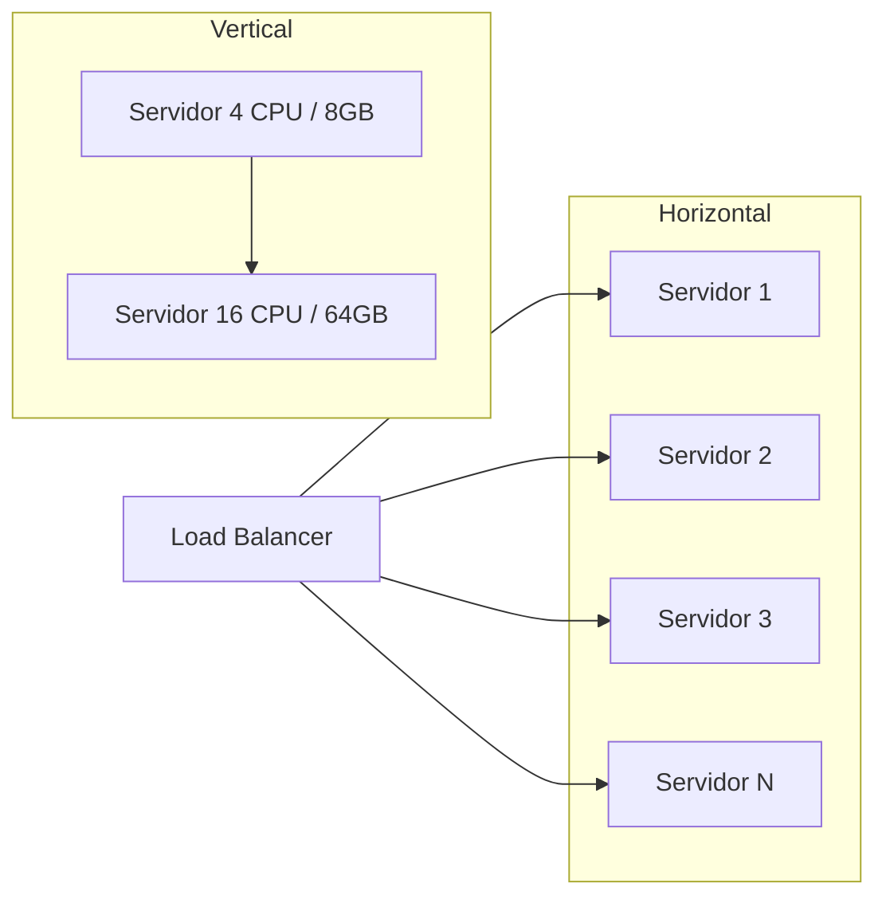
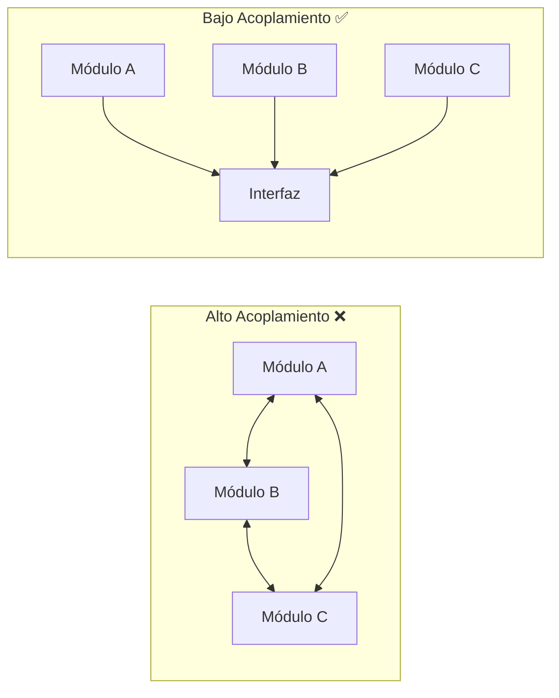
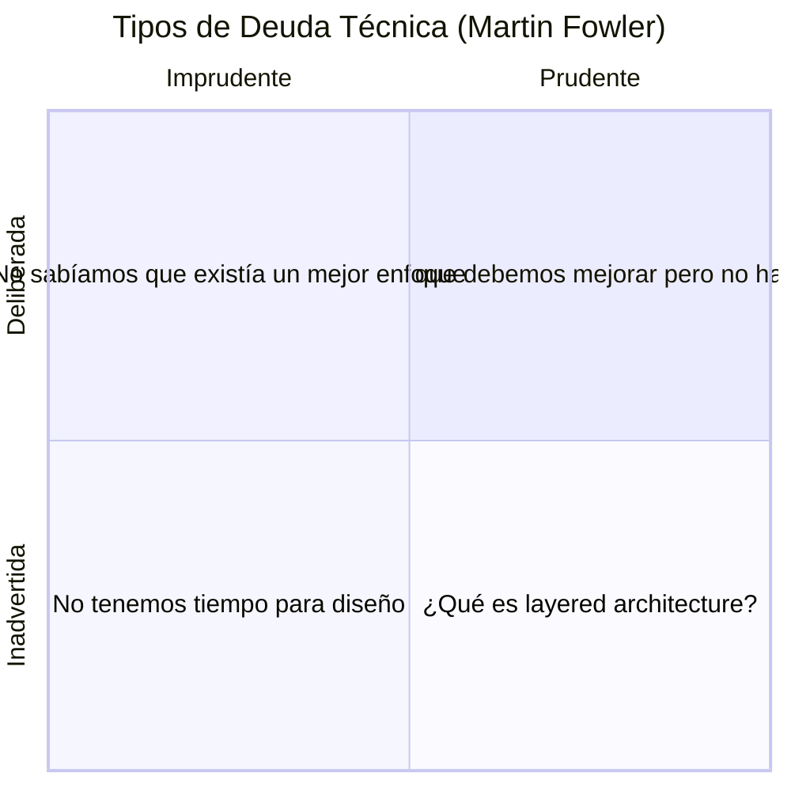

# 1. Fundamentos de Ingeniería de Software

## Tabla de Contenidos

- [1.1 Qué es la Ingeniería de Software](#11-qué-es-la-ingeniería-de-software)
- [1.2 Diferencia entre Programar y Diseñar Software](#12-diferencia-entre-programar-y-diseñar-software)
- [1.3 Escalabilidad](#13-escalabilidad)
- [1.4 Mantenibilidad](#14-mantenibilidad)
- [1.5 Acoplamiento y Cohesión](#15-acoplamiento-y-cohesión)
- [1.6 Modularidad](#16-modularidad)
- [1.7 Clean Code](#17-clean-code)
- [1.8 Technical Debt](#18-technical-debt)
- [1.9 Ejercicios Prácticos](#19-ejercicios-prácticos)
- [1.10 Resumen](#110-resumen)

---

## 1.1 Qué es la Ingeniería de Software

La ingeniería de software es la aplicación de principios de ingeniería al desarrollo de software. No se limita a escribir código; abarca el diseño, construcción, pruebas, despliegue y mantenimiento de sistemas que deben funcionar de forma confiable en entornos de producción.

### Pilares fundamentales



### Requisitos no funcionales clave en backend

| Requisito | Descripción | Ejemplo |
|-----------|-------------|---------|
| **Rendimiento** | Tiempo de respuesta aceptable | API responde en < 200ms p99 |
| **Disponibilidad** | Porcentaje de uptime | 99.99% (4 nueves) |
| **Escalabilidad** | Capacidad de crecer | De 1K a 1M usuarios |
| **Seguridad** | Protección de datos | Encriptación, autenticación |
| **Observabilidad** | Capacidad de monitoreo | Logs, métricas, traces |

### 🏢 Caso empresarial: Amazon

Amazon estima que cada 100ms adicionales de latencia reduce las ventas un 1%. Esto demuestra que la ingeniería de software no es solo "hacer que funcione", sino hacer que funcione **bien** bajo restricciones reales.

---

## 1.2 Diferencia entre Programar y Diseñar Software

### ❌ Programar sin diseño

```python
# Todo en un solo archivo, sin estructura
import sqlite3

def procesar_orden(datos):
    conn = sqlite3.connect("db.sqlite")
    cursor = conn.cursor()
    
    # Validación mezclada con lógica de negocio
    if datos["total"] < 0:
        return "Error"
    
    if datos["total"] > 10000:
        # Enviar email directamente aquí
        import smtplib
        server = smtplib.SMTP("smtp.gmail.com", 587)
        server.sendmail("admin@empresa.com", "gerente@empresa.com", "Orden grande")
    
    # SQL directo sin protección
    cursor.execute(f"INSERT INTO ordenes VALUES ('{datos['id']}', {datos['total']})")
    conn.commit()
    return "OK"
```

**Problemas:**
- SQL injection por interpolación directa.
- Lógica de negocio acoplada a infraestructura.
- Notificaciones mezcladas con persistencia.
- Sin manejo de errores.
- Imposible de testear unitariamente.

### ✅ Diseñar software

```python
# domain/entities.py
from dataclasses import dataclass
from decimal import Decimal

@dataclass(frozen=True)
class OrderId:
    value: str

@dataclass
class Order:
    id: OrderId
    total: Decimal

    def __post_init__(self):
        if self.total < 0:
            raise ValueError("El total de la orden no puede ser negativo")

    def requires_approval(self) -> bool:
        return self.total > Decimal("10000")


# domain/ports.py
from abc import ABC, abstractmethod

class OrderRepository(ABC):
    @abstractmethod
    def save(self, order: Order) -> None: ...

class NotificationService(ABC):
    @abstractmethod
    def notify_large_order(self, order: Order) -> None: ...


# application/use_cases.py
class ProcessOrderUseCase:
    def __init__(
        self,
        repository: OrderRepository,
        notification: NotificationService,
    ):
        self._repository = repository
        self._notification = notification

    def execute(self, order: Order) -> None:
        self._repository.save(order)
        if order.requires_approval():
            self._notification.notify_large_order(order)
```

**Ventajas:**
- Entidades con validación propia.
- Separación de responsabilidades.
- Dependencias invertidas (puertos abstractos).
- Testeable unitariamente sin base de datos ni SMTP.
- Extensible sin modificar código existente.

---

## 1.3 Escalabilidad

La escalabilidad es la capacidad de un sistema para manejar un aumento en la carga de trabajo sin degradación significativa del rendimiento.

### Tipos de escalabilidad



| Característica | Vertical (Scale Up) | Horizontal (Scale Out) |
|---------------|---------------------|----------------------|
| **Cómo** | Más recursos al mismo servidor | Más servidores |
| **Límite** | Hardware máximo disponible | Teóricamente ilimitado |
| **Costo** | Exponencial | Lineal |
| **Downtime** | Requiere reinicio | Sin interrupción |
| **Complejidad** | Baja | Alta (estado distribuido) |
| **Ejemplo** | Migrar de 8GB a 64GB RAM | Agregar 10 instancias detrás de un LB |

### 💡 Buenas prácticas para escalabilidad

1. **Diseñar stateless:** Los servidores no deben guardar estado en memoria. Usar almacenes externos (Redis, base de datos).
2. **Cachear estratégicamente:** Identificar datos calientes y cachearlos con TTL adecuado.
3. **Desacoplar con colas:** Procesos pesados deben ser asíncronos mediante colas de mensajes.
4. **Particionar datos:** Distribuir los datos entre múltiples nodos (sharding).

### 🏢 Caso empresarial: Twitter

Twitter migró de una arquitectura monolítica en Ruby on Rails a microservicios en Scala/Java cuando alcanzó los 200 millones de tweets diarios. La escalabilidad horizontal fue esencial: cada servicio escala de forma independiente según su carga.

---

## 1.4 Mantenibilidad

La mantenibilidad mide qué tan fácil es modificar, corregir y extender un sistema a lo largo del tiempo.

### Métricas de mantenibilidad

| Métrica | Descripción | Herramienta |
|---------|-------------|-------------|
| **Complejidad ciclomática** | Número de caminos independientes en el código | `radon`, `flake8` |
| **Cobertura de tests** | Porcentaje de código cubierto por pruebas | `pytest-cov` |
| **Deuda técnica** | Costo de atajos acumulados | SonarQube |
| **Churn rate** | Frecuencia de cambios en un archivo | Git analytics |
| **Coupling** | Grado de interdependencia | Análisis estático |

### ⚠️ Errores comunes que afectan la mantenibilidad

1. **Funciones gigantes:** Métodos de más de 50 líneas son señal de mal diseño.
2. **Nombres crípticos:** Variables como `x`, `tmp`, `data2` dificultan la comprensión.
3. **Comentarios en lugar de refactorización:** Si se necesita un comentario para explicar qué hace el código, probablemente el código debería ser más claro.
4. **Copy-paste:** Duplicar código en lugar de abstraer genera inconsistencias.
5. **Sin tests:** Código sin pruebas es código que nadie se atreve a modificar.

### 🔧 Ejemplo práctico: Mejorando mantenibilidad

```python
# ❌ Difícil de mantener
def proc(d):
    r = []
    for i in d:
        if i["t"] == "A" and i["s"] > 100 and i["a"] == True:
            r.append({"n": i["n"], "v": i["s"] * 0.9})
    return r


# ✅ Fácil de mantener
from dataclasses import dataclass
from decimal import Decimal
from typing import List

DISCOUNT_RATE = Decimal("0.10")

@dataclass(frozen=True)
class Product:
    name: str
    price: Decimal
    category: str
    is_active: bool

    @property
    def is_premium(self) -> bool:
        return self.category == "A" and self.price > Decimal("100")

    def apply_discount(self) -> Decimal:
        return self.price * (1 - DISCOUNT_RATE)


def get_discounted_premium_products(products: List[Product]) -> list[dict]:
    """Retorna los productos premium activos con su precio con descuento."""
    return [
        {"name": p.name, "discounted_price": p.apply_discount()}
        for p in products
        if p.is_premium and p.is_active
    ]
```

---

## 1.5 Acoplamiento y Cohesión

### Acoplamiento

El acoplamiento mide el grado de interdependencia entre módulos. **Menos acoplamiento = mejor diseño.**



#### ❌ Alto acoplamiento

```python
# El servicio de órdenes conoce los detalles internos del servicio de pagos
class OrderService:
    def create_order(self, order_data: dict) -> None:
        # Acceso directo a la implementación concreta de Stripe
        import stripe
        stripe.api_key = "sk_live_xxx"
        charge = stripe.Charge.create(
            amount=order_data["total"],
            currency="usd",
            source=order_data["token"],
        )
        if charge.status != "succeeded":
            raise Exception("Pago fallido")
        # Guardar orden...
```

#### ✅ Bajo acoplamiento

```python
# Puerto abstracto
from abc import ABC, abstractmethod

class PaymentGateway(ABC):
    @abstractmethod
    def charge(self, amount: int, currency: str, token: str) -> bool: ...


# El servicio de órdenes depende de una abstracción
class OrderService:
    def __init__(self, payment_gateway: PaymentGateway):
        self._payment = payment_gateway

    def create_order(self, order_data: dict) -> None:
        success = self._payment.charge(
            amount=order_data["total"],
            currency="usd",
            token=order_data["token"],
        )
        if not success:
            raise PaymentFailedError("El pago no pudo ser procesado")
```

### Cohesión

La cohesión mide qué tan relacionadas están las responsabilidades dentro de un módulo. **Más cohesión = mejor diseño.**

#### ❌ Baja cohesión

```python
# Una clase que hace de todo
class UserManager:
    def create_user(self, data): ...
    def send_email(self, to, subject, body): ...
    def generate_pdf_report(self, user_id): ...
    def compress_image(self, image_path): ...
    def calculate_taxes(self, amount): ...
```

#### ✅ Alta cohesión

```python
class UserService:
    def create(self, data: CreateUserDTO) -> User: ...
    def deactivate(self, user_id: UserId) -> None: ...
    def update_profile(self, user_id: UserId, profile: ProfileDTO) -> User: ...
    def find_by_email(self, email: str) -> User | None: ...
```

---

## 1.6 Modularidad

La modularidad es la práctica de dividir un sistema en módulos independientes con responsabilidades bien definidas, interfaces claras y dependencias mínimas.

### Estructura modular de un proyecto backend

```
proyecto/
├── src/
│   ├── modules/
│   │   ├── users/
│   │   │   ├── domain/
│   │   │   │   ├── entities.py
│   │   │   │   ├── value_objects.py
│   │   │   │   └── repositories.py      # Puertos
│   │   │   ├── application/
│   │   │   │   ├── use_cases.py
│   │   │   │   └── dtos.py
│   │   │   └── infrastructure/
│   │   │       ├── sqlalchemy_repository.py
│   │   │       └── routes.py
│   │   ├── orders/
│   │   │   ├── domain/
│   │   │   ├── application/
│   │   │   └── infrastructure/
│   │   └── payments/
│   │       ├── domain/
│   │       ├── application/
│   │       └── infrastructure/
│   ├── shared/
│   │   ├── domain/
│   │   │   ├── events.py
│   │   │   └── base_entity.py
│   │   └── infrastructure/
│   │       ├── database.py
│   │       └── message_bus.py
│   └── main.py
├── tests/
├── pyproject.toml
└── Dockerfile
```

### 💡 Principios de modularidad

1. **Encapsulamiento:** Cada módulo expone solo lo necesario a través de interfaces públicas.
2. **Independencia:** Un módulo no debe depender de los detalles internos de otro.
3. **Comunicación por contratos:** Los módulos interactúan mediante interfaces o eventos, no llamadas directas.
4. **Sustituibilidad:** Debe ser posible reemplazar la implementación de un módulo sin afectar al resto.

---

## 1.7 Clean Code

Clean Code es la práctica de escribir código que sea legible, comprensible y mantenible por cualquier desarrollador del equipo.

### Principios fundamentales

#### Nombres descriptivos

```python
# ❌ Nombres sin significado
def calc(a, b, c):
    return a * b * (1 - c)

# ✅ Nombres que comunican intención
def calculate_discounted_price(
    unit_price: Decimal,
    quantity: int,
    discount_rate: Decimal,
) -> Decimal:
    return unit_price * quantity * (1 - discount_rate)
```

#### Funciones pequeñas y con una sola responsabilidad

```python
# ❌ Función que hace demasiado
def register_user(data):
    # Validar
    if not data.get("email") or "@" not in data["email"]:
        raise ValueError("Email inválido")
    if len(data.get("password", "")) < 8:
        raise ValueError("Password muy corta")
    # Hashear password
    import hashlib
    hashed = hashlib.sha256(data["password"].encode()).hexdigest()
    # Guardar en DB
    import sqlite3
    conn = sqlite3.connect("app.db")
    conn.execute("INSERT INTO users ...", (data["email"], hashed))
    conn.commit()
    # Enviar email
    import smtplib
    # ... enviar email de bienvenida


# ✅ Funciones separadas por responsabilidad
class UserRegistrationUseCase:
    def __init__(
        self,
        validator: UserValidator,
        hasher: PasswordHasher,
        repository: UserRepository,
        mailer: WelcomeMailer,
    ):
        self._validator = validator
        self._hasher = hasher
        self._repository = repository
        self._mailer = mailer

    def execute(self, command: RegisterUserCommand) -> UserId:
        self._validator.validate(command)
        hashed_password = self._hasher.hash(command.password)
        user = User.create(email=command.email, password=hashed_password)
        self._repository.save(user)
        self._mailer.send_welcome(user)
        return user.id
```

#### Manejo de errores explícito

```python
# ❌ Errores silenciados
def get_user(user_id):
    try:
        return db.query(User).filter_by(id=user_id).first()
    except:
        return None

# ✅ Errores específicos y significativos
class UserNotFoundError(Exception):
    def __init__(self, user_id: str):
        super().__init__(f"No se encontró el usuario con ID: {user_id}")
        self.user_id = user_id

def get_user(user_id: str) -> User:
    user = db.query(User).filter_by(id=user_id).first()
    if user is None:
        raise UserNotFoundError(user_id)
    return user
```

### ⚠️ Code smells comunes

| Code Smell | Descripción | Solución |
|------------|-------------|----------|
| **Long Method** | Funciones de más de 20-30 líneas | Extraer en funciones más pequeñas |
| **God Class** | Clase con demasiadas responsabilidades | Dividir en clases cohesivas |
| **Feature Envy** | Método que usa más datos de otra clase | Mover el método a la clase correcta |
| **Primitive Obsession** | Uso excesivo de tipos primitivos | Crear Value Objects |
| **Shotgun Surgery** | Un cambio requiere modificar múltiples archivos | Mejorar cohesión |
| **Dead Code** | Código que nunca se ejecuta | Eliminar sin piedad |

---

## 1.8 Technical Debt

La deuda técnica es el costo implícito de retrabajos futuros causados por elegir soluciones rápidas en lugar de enfoques correctos.

### Tipos de deuda técnica



| Tipo | Ejemplo | Riesgo |
|------|---------|--------|
| **Deliberada prudente** | "Lanzamos con SQLite y migramos a PostgreSQL después" | Controlado |
| **Deliberada imprudente** | "No vamos a escribir tests porque es más rápido" | Alto |
| **Inadvertida prudente** | "Ahora que aprendimos DDD, vemos que esta parte debería refactorizarse" | Medio |
| **Inadvertida imprudente** | "No sabíamos que había mejores formas de hacerlo" | Muy alto |

### 💡 Cómo gestionar la deuda técnica

1. **Hacer visible la deuda:** Documentar cada decisión técnica que introduce deuda.
2. **Priorizar por impacto:** Atacar primero la deuda en componentes de alta rotación.
3. **Regla del Boy Scout:** Dejar el código mejor de como se encontró en cada commit.
4. **Asignar tiempo explícito:** Dedicar un porcentaje del sprint a reducir deuda (15-20%).
5. **Métricas:** Usar herramientas como SonarQube para cuantificar la deuda.

### 🏢 Caso empresarial: Deuda técnica en Spotify

Spotify introdujo el concepto de **"Golden Path"**: una ruta tecnológica recomendada con herramientas, frameworks y patrones aprobados. Esto reduce la deuda técnica al estandarizar decisiones tecnológicas y permitir que los equipos se enfoquen en la lógica de negocio en lugar de resolver los mismos problemas de infraestructura repetidamente.

---

## 1.9 Ejercicios Prácticos

### Ejercicio 1: Identificar code smells

Dado el siguiente código, identificar al menos 5 problemas y proponer una refactorización:

```python
class App:
    def do_stuff(self, t, d, u, send=True):
        import requests
        r = requests.post("http://api.pagos.com/charge", json={"amount": d["total"]})
        if r.status_code == 200:
            import sqlite3
            c = sqlite3.connect("db.sqlite")
            c.execute(f"INSERT INTO orders VALUES ('{d['id']}', {d['total']}, '{u}')")
            c.commit()
            if send:
                import smtplib
                s = smtplib.SMTP("smtp.gmail.com")
                s.sendmail("no-reply@app.com", u, f"Orden {d['id']} procesada")
            return True
        return False
```

### Ejercicio 2: Diseñar módulos

Diseñar la estructura de módulos para un sistema de e-commerce que incluya:
- Gestión de productos
- Carrito de compras
- Procesamiento de pagos
- Notificaciones
- Gestión de inventario

Definir las interfaces públicas de cada módulo y los eventos que emiten.

### Ejercicio 3: Evaluar escalabilidad

Se tiene un API monolítico que atiende 500 req/s con un tiempo de respuesta p95 de 800ms. Se espera que el tráfico crezca 10x en 6 meses. Proponer una estrategia de escalabilidad y justificar cada decisión.

---

## 1.10 Resumen

| Concepto | Punto clave |
|----------|-------------|
| **Ingeniería de Software** | Aplicación disciplinada de principios de ingeniería al desarrollo de software |
| **Diseño vs Programación** | Diseñar es pensar en estructura, dependencias y evolución del sistema |
| **Escalabilidad** | Preferir escalabilidad horizontal con servicios stateless |
| **Mantenibilidad** | Código legible, bien testeado y con baja complejidad ciclomática |
| **Acoplamiento** | Minimizar dependencias directas entre módulos |
| **Cohesión** | Cada módulo debe tener una responsabilidad clara y enfocada |
| **Modularidad** | Dividir el sistema en módulos independientes con interfaces claras |
| **Clean Code** | Nombres descriptivos, funciones pequeñas, errores explícitos |
| **Technical Debt** | Gestionarla activamente, hacerla visible y priorizarla |

---

[← Índice](00-indice.md) | [Siguiente: Principios SOLID →](02-principios-solid.md)
