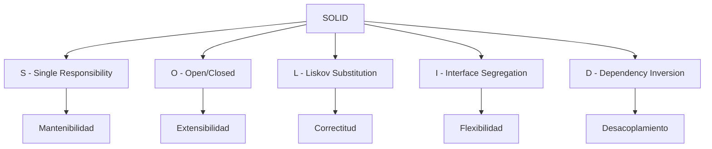
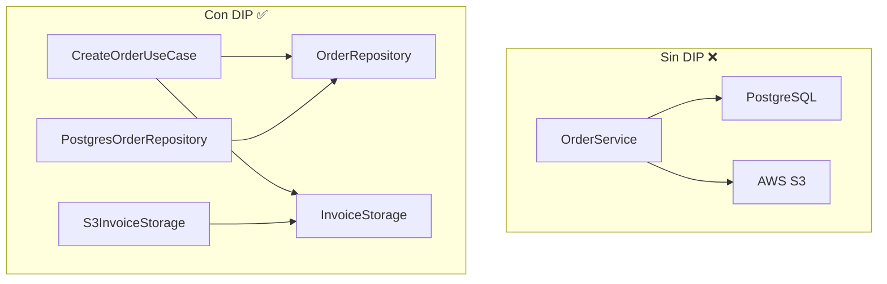

# 2. Principios SOLID

## Tabla de Contenidos

- [2.1 Introducción a SOLID](#21-introducción-a-solid)
- [2.2 Single Responsibility Principle (SRP)](#22-single-responsibility-principle-srp)
- [2.3 Open/Closed Principle (OCP)](#23-openclosed-principle-ocp)
- [2.4 Liskov Substitution Principle (LSP)](#24-liskov-substitution-principle-lsp)
- [2.5 Interface Segregation Principle (ISP)](#25-interface-segregation-principle-isp)
- [2.6 Dependency Inversion Principle (DIP)](#26-dependency-inversion-principle-dip)
- [2.7 Ejercicios Prácticos](#27-ejercicios-prácticos)
- [2.8 Resumen](#28-resumen)

---

## 2.1 Introducción a SOLID

SOLID es un acrónimo que representa cinco principios fundamentales de diseño orientado a objetos, introducidos por Robert C. Martin (Uncle Bob). Estos principios guían la creación de software que es fácil de mantener, extender y testear.



### ⚠️ Cuándo NO aplicar SOLID

- Prototipos o pruebas de concepto que se descartarán.
- Scripts de una sola ejecución.
- Código extremadamente simple donde la abstracción añade complejidad innecesaria.
- Cuando el equipo no tiene la madurez para mantener la abstracción.

**Regla general:** Aplicar SOLID cuando el código vivirá en producción y será mantenido por un equipo.

---

## 2.2 Single Responsibility Principle (SRP)

> *"Una clase debe tener una, y solo una, razón para cambiar."*

### Definición

El SRP establece que cada clase o módulo debe encapsular una sola responsabilidad. Si una clase tiene múltiples razones para cambiar, está violando este principio.

### Problema que resuelve

- Clases difíciles de entender por tener demasiadas responsabilidades.
- Cambios en una funcionalidad que rompen otras no relacionadas.
- Imposibilidad de reutilizar partes específicas del código.

### ❌ Ejemplo incorrecto

```python
class UserService:
    """Viola SRP: maneja usuarios, envía emails y genera reportes."""

    def __init__(self, db_connection):
        self.db = db_connection

    def create_user(self, name: str, email: str) -> dict:
        """Crea un usuario en la base de datos."""
        user = {"name": name, "email": email}
        self.db.execute(
            "INSERT INTO users (name, email) VALUES (?, ?)",
            (name, email),
        )
        self.db.commit()
        return user

    def send_welcome_email(self, email: str) -> None:
        """Envía un email de bienvenida."""
        import smtplib
        server = smtplib.SMTP("smtp.gmail.com", 587)
        server.starttls()
        server.login("admin@app.com", "password")
        server.sendmail("admin@app.com", email, "¡Bienvenido!")
        server.quit()

    def generate_user_report(self, user_id: int) -> str:
        """Genera un reporte PDF del usuario."""
        from reportlab.lib.pagesizes import letter
        from reportlab.pdfgen import canvas
        # ... generación de PDF
        return f"report_{user_id}.pdf"

    def validate_email(self, email: str) -> bool:
        """Valida el formato de un email."""
        import re
        return bool(re.match(r"[^@]+@[^@]+\.[^@]+", email))
```

**Razones para cambiar:** Cambios en la lógica de usuarios, cambios en el proveedor de email, cambios en el formato de reportes, cambios en las reglas de validación. **Cuatro razones = cuatro responsabilidades.**

### ✅ Refactorización correcta

```python
from abc import ABC, abstractmethod
from dataclasses import dataclass


# --- Dominio ---
@dataclass
class User:
    name: str
    email: str


class EmailValidator:
    """Responsabilidad: validar formatos de email."""

    _pattern = r"[^@]+@[^@]+\.[^@]+"

    def is_valid(self, email: str) -> bool:
        import re
        return bool(re.match(self._pattern, email))


# --- Puertos ---
class UserRepository(ABC):
    """Responsabilidad: persistencia de usuarios."""

    @abstractmethod
    def save(self, user: User) -> None: ...

    @abstractmethod
    def find_by_id(self, user_id: int) -> User | None: ...


class EmailSender(ABC):
    """Responsabilidad: envío de emails."""

    @abstractmethod
    def send(self, to: str, subject: str, body: str) -> None: ...


class ReportGenerator(ABC):
    """Responsabilidad: generación de reportes."""

    @abstractmethod
    def generate_user_report(self, user: User) -> str: ...


# --- Caso de uso ---
class CreateUserUseCase:
    """Responsabilidad: orquestar la creación de un usuario."""

    def __init__(
        self,
        validator: EmailValidator,
        repository: UserRepository,
        email_sender: EmailSender,
    ):
        self._validator = validator
        self._repository = repository
        self._email_sender = email_sender

    def execute(self, name: str, email: str) -> User:
        if not self._validator.is_valid(email):
            raise ValueError(f"Email inválido: {email}")

        user = User(name=name, email=email)
        self._repository.save(user)
        self._email_sender.send(
            to=email,
            subject="Bienvenido",
            body=f"Hola {name}, tu cuenta ha sido creada.",
        )
        return user
```

### Ventajas

- Cada clase tiene **una sola razón para cambiar**.
- Se pueden testear de forma independiente.
- Se pueden reutilizar en otros contextos.
- Los cambios están aislados y no producen efectos colaterales.

### Cuándo aplicarlo

- En cualquier clase que tenga más de una responsabilidad clara.
- Cuando un cambio en una funcionalidad requiere modificar partes no relacionadas de la misma clase.
- Cuando la descripción de una clase requiere la conjunción "y".

### Cuándo NO aplicarlo

- En clases muy simples donde la separación agregaría complejidad sin beneficio.
- En scripts de utilidad o herramientas internas de corta vida.

---

## 2.3 Open/Closed Principle (OCP)

> *"Las entidades de software deben estar abiertas para extensión, pero cerradas para modificación."*

### Definición

El código existente no debería modificarse para agregar nueva funcionalidad. En su lugar, se debe poder extender el comportamiento mediante herencia, composición o inyección de dependencias.

### Problema que resuelve

- Cadenas de `if/elif/else` que crecen con cada nuevo requerimiento.
- Riesgo de introducir bugs al modificar código probado.
- Necesidad de re-testear todo el módulo ante cualquier cambio.

### ❌ Ejemplo incorrecto

```python
class DiscountCalculator:
    """Cada nuevo tipo de cliente requiere modificar esta clase."""

    def calculate(self, customer_type: str, amount: float) -> float:
        if customer_type == "regular":
            return amount * 0.05
        elif customer_type == "premium":
            return amount * 0.10
        elif customer_type == "vip":
            return amount * 0.15
        elif customer_type == "employee":
            return amount * 0.25
        # Cada nuevo tipo = modificar esta clase
        else:
            return 0.0
```

### ✅ Refactorización correcta

```python
from abc import ABC, abstractmethod
from decimal import Decimal


class DiscountStrategy(ABC):
    """Interfaz abierta para extensión."""

    @abstractmethod
    def calculate(self, amount: Decimal) -> Decimal: ...


class RegularDiscount(DiscountStrategy):
    def calculate(self, amount: Decimal) -> Decimal:
        return amount * Decimal("0.05")


class PremiumDiscount(DiscountStrategy):
    def calculate(self, amount: Decimal) -> Decimal:
        return amount * Decimal("0.10")


class VIPDiscount(DiscountStrategy):
    def calculate(self, amount: Decimal) -> Decimal:
        return amount * Decimal("0.15")


class EmployeeDiscount(DiscountStrategy):
    def calculate(self, amount: Decimal) -> Decimal:
        return amount * Decimal("0.25")


# Para agregar un nuevo tipo, solo se crea una nueva clase.
# No se modifica NINGÚN código existente.
class StudentDiscount(DiscountStrategy):
    def calculate(self, amount: Decimal) -> Decimal:
        return amount * Decimal("0.20")


class DiscountCalculator:
    """Cerrada para modificación: no cambia al agregar nuevos descuentos."""

    def __init__(self, strategy: DiscountStrategy):
        self._strategy = strategy

    def apply_discount(self, amount: Decimal) -> Decimal:
        discount = self._strategy.calculate(amount)
        return amount - discount


# Uso
calculator = DiscountCalculator(VIPDiscount())
final_price = calculator.apply_discount(Decimal("1000"))  # 850.00
```

### Ventajas

- Agregar nueva funcionalidad no requiere modificar código existente.
- El código testeado permanece intacto.
- Facilita la colaboración: diferentes desarrolladores pueden agregar funcionalidades en paralelo.

### Cuándo aplicarlo

- Cuando se anticipan variaciones frecuentes en un comportamiento.
- En puntos de extensión del sistema (estrategias de pago, formatos de exportación, etc.).

### Cuándo NO aplicarlo

- Cuando solo existen 2-3 variantes que rara vez cambian.
- Cuando la abstracción prematura introduce complejidad innecesaria (YAGNI).

---

## 2.4 Liskov Substitution Principle (LSP)

> *"Los objetos de una clase derivada deben poder sustituir objetos de la clase base sin alterar el comportamiento correcto del programa."*

### Definición

Si `S` es un subtipo de `T`, entonces los objetos de tipo `T` pueden ser reemplazados por objetos de tipo `S` sin que el programa produzca resultados incorrectos.

### Problema que resuelve

- Herencia mal diseñada que rompe el contrato de la clase base.
- Excepciones inesperadas al usar subtipos.
- Comportamientos inconsistentes que dificultan el razonamiento sobre el código.

### ❌ Ejemplo incorrecto: El clásico problema Rectángulo-Cuadrado

```python
class Rectangle:
    def __init__(self, width: float, height: float):
        self._width = width
        self._height = height

    @property
    def width(self) -> float:
        return self._width

    @width.setter
    def width(self, value: float) -> None:
        self._width = value

    @property
    def height(self) -> float:
        return self._height

    @height.setter
    def height(self, value: float) -> None:
        self._height = value

    def area(self) -> float:
        return self._width * self._height


class Square(Rectangle):
    """Viola LSP: cambia el comportamiento de los setters."""

    def __init__(self, side: float):
        super().__init__(side, side)

    @Rectangle.width.setter
    def width(self, value: float) -> None:
        self._width = value
        self._height = value  # Efecto colateral inesperado

    @Rectangle.height.setter
    def height(self, value: float) -> None:
        self._width = value
        self._height = value


# El código cliente espera comportamiento de Rectangle
def resize_and_calculate(rect: Rectangle) -> float:
    rect.width = 5
    rect.height = 10
    # Con Rectangle: 5 * 10 = 50 ✅
    # Con Square: 10 * 10 = 100 ❌ (width fue sobreescrito)
    return rect.area()
```

### ✅ Refactorización correcta

```python
from abc import ABC, abstractmethod


class Shape(ABC):
    """Abstracción que no impone restricciones incompatibles."""

    @abstractmethod
    def area(self) -> float: ...


class Rectangle(Shape):
    def __init__(self, width: float, height: float):
        self._width = width
        self._height = height

    def area(self) -> float:
        return self._width * self._height


class Square(Shape):
    def __init__(self, side: float):
        self._side = side

    def area(self) -> float:
        return self._side ** 2


# Ahora ambos cumplen el contrato de Shape sin sorpresas
def print_area(shape: Shape) -> None:
    print(f"Área: {shape.area()}")

print_area(Rectangle(5, 10))  # Área: 50
print_area(Square(5))         # Área: 25
```

### Ventajas

- Garantiza que la herencia es semánticamente correcta.
- Previene bugs sutiles al sustituir implementaciones.
- Facilita el polimorfismo seguro.

### Cuándo aplicarlo

- Siempre que se use herencia.
- Al diseñar jerarquías de clases.
- Al implementar interfaces o protocolos.

### Cuándo NO aplicarlo

- No es una cuestión de "no aplicar", sino un principio que siempre debe respetarse. Si la herencia viola LSP, se debe usar composición en su lugar.

---

## 2.5 Interface Segregation Principle (ISP)

> *"Ningún cliente debería verse obligado a depender de métodos que no utiliza."*

### Definición

Las interfaces deben ser específicas y enfocadas. Es preferible tener muchas interfaces pequeñas que una interfaz grande y genérica.

### Problema que resuelve

- Clases que implementan métodos vacíos o que lanzan `NotImplementedError`.
- Acoplamiento a funcionalidades que no se necesitan.
- Interfaces que obligan a conocer detalles innecesarios.

### ❌ Ejemplo incorrecto

```python
from abc import ABC, abstractmethod


class Worker(ABC):
    """Interfaz demasiado grande que obliga a implementar todo."""

    @abstractmethod
    def work(self) -> None: ...

    @abstractmethod
    def eat(self) -> None: ...

    @abstractmethod
    def sleep(self) -> None: ...

    @abstractmethod
    def attend_meeting(self) -> None: ...

    @abstractmethod
    def write_report(self) -> None: ...


class Robot(Worker):
    """Un robot no come ni duerme, pero debe implementar esos métodos."""

    def work(self) -> None:
        print("Trabajando...")

    def eat(self) -> None:
        raise NotImplementedError("Los robots no comen")  # ❌

    def sleep(self) -> None:
        raise NotImplementedError("Los robots no duermen")  # ❌

    def attend_meeting(self) -> None:
        raise NotImplementedError("Los robots no asisten a reuniones")  # ❌

    def write_report(self) -> None:
        print("Generando reporte...")
```

### ✅ Refactorización correcta

```python
from abc import ABC, abstractmethod


class Workable(ABC):
    @abstractmethod
    def work(self) -> None: ...


class Feedable(ABC):
    @abstractmethod
    def eat(self) -> None: ...


class Sleepable(ABC):
    @abstractmethod
    def sleep(self) -> None: ...


class MeetingAttendable(ABC):
    @abstractmethod
    def attend_meeting(self) -> None: ...


class ReportWritable(ABC):
    @abstractmethod
    def write_report(self) -> None: ...


# Un humano implementa todas las interfaces relevantes
class HumanWorker(Workable, Feedable, Sleepable, MeetingAttendable, ReportWritable):
    def work(self) -> None:
        print("Trabajando...")

    def eat(self) -> None:
        print("Comiendo...")

    def sleep(self) -> None:
        print("Durmiendo...")

    def attend_meeting(self) -> None:
        print("En reunión...")

    def write_report(self) -> None:
        print("Escribiendo reporte...")


# Un robot solo implementa lo que necesita
class RobotWorker(Workable, ReportWritable):
    def work(self) -> None:
        print("Trabajando eficientemente...")

    def write_report(self) -> None:
        print("Generando reporte automático...")


# Las funciones solo piden lo que necesitan
def assign_task(worker: Workable) -> None:
    worker.work()

def schedule_lunch(worker: Feedable) -> None:
    worker.eat()
```

### Ventajas

- Las clases solo implementan lo que realmente necesitan.
- Las dependencias son mínimas y específicas.
- Facilita el testing con mocks precisos.

### Cuándo aplicarlo

- Cuando una interfaz tiene más de 3-5 métodos no relacionados.
- Cuando aparecen `NotImplementedError` en implementaciones.
- Cuando diferentes clientes usan diferentes subconjuntos de la interfaz.

### Cuándo NO aplicarlo

- Cuando la interfaz es naturalmente cohesiva (todos los métodos se usan juntos).
- Cuando la granularidad extrema dificulta la comprensión.

---

## 2.6 Dependency Inversion Principle (DIP)

> *"Los módulos de alto nivel no deben depender de módulos de bajo nivel. Ambos deben depender de abstracciones."*

### Definición

Las dependencias deben apuntar hacia abstracciones, no hacia implementaciones concretas. El módulo que define la política de negocio no debe conocer los detalles de infraestructura.

### Problema que resuelve

- Código de negocio acoplado a frameworks, bases de datos o servicios externos.
- Imposibilidad de testear sin infraestructura real.
- Dificultad para cambiar proveedores o tecnologías.

### ❌ Ejemplo incorrecto

```python
import psycopg2
import boto3


class OrderService:
    """Depende directamente de PostgreSQL y AWS S3."""

    def __init__(self):
        # Acoplamiento directo a infraestructura
        self.conn = psycopg2.connect(
            host="localhost", database="orders", user="admin", password="secret"
        )
        self.s3 = boto3.client("s3")

    def create_order(self, order_data: dict) -> None:
        cursor = self.conn.cursor()
        cursor.execute(
            "INSERT INTO orders (id, total) VALUES (%s, %s)",
            (order_data["id"], order_data["total"]),
        )
        self.conn.commit()

        # Guardar factura en S3
        self.s3.put_object(
            Bucket="invoices",
            Key=f"{order_data['id']}.pdf",
            Body=self._generate_invoice(order_data),
        )
```

### ✅ Refactorización correcta

```python
from abc import ABC, abstractmethod
from dataclasses import dataclass
from decimal import Decimal


# --- Dominio ---
@dataclass
class Order:
    id: str
    total: Decimal


# --- Puertos (abstracciones definidas por el dominio) ---
class OrderRepository(ABC):
    @abstractmethod
    def save(self, order: Order) -> None: ...


class InvoiceStorage(ABC):
    @abstractmethod
    def store(self, order_id: str, content: bytes) -> None: ...


class InvoiceGenerator(ABC):
    @abstractmethod
    def generate(self, order: Order) -> bytes: ...


# --- Caso de uso (alto nivel, depende solo de abstracciones) ---
class CreateOrderUseCase:
    def __init__(
        self,
        repository: OrderRepository,
        invoice_generator: InvoiceGenerator,
        invoice_storage: InvoiceStorage,
    ):
        self._repository = repository
        self._invoice_generator = invoice_generator
        self._invoice_storage = invoice_storage

    def execute(self, order: Order) -> None:
        self._repository.save(order)
        invoice = self._invoice_generator.generate(order)
        self._invoice_storage.store(order.id, invoice)


# --- Adaptadores (bajo nivel, implementan las abstracciones) ---
class PostgresOrderRepository(OrderRepository):
    def __init__(self, connection):
        self._conn = connection

    def save(self, order: Order) -> None:
        cursor = self._conn.cursor()
        cursor.execute(
            "INSERT INTO orders (id, total) VALUES (%s, %s)",
            (order.id, str(order.total)),
        )
        self._conn.commit()


class S3InvoiceStorage(InvoiceStorage):
    def __init__(self, s3_client, bucket: str):
        self._s3 = s3_client
        self._bucket = bucket

    def store(self, order_id: str, content: bytes) -> None:
        self._s3.put_object(
            Bucket=self._bucket,
            Key=f"{order_id}.pdf",
            Body=content,
        )


# --- Composición en el punto de entrada ---
# main.py o container de inyección de dependencias
import psycopg2
import boto3

conn = psycopg2.connect(host="localhost", database="orders")
s3 = boto3.client("s3")

use_case = CreateOrderUseCase(
    repository=PostgresOrderRepository(conn),
    invoice_generator=PDFInvoiceGenerator(),
    invoice_storage=S3InvoiceStorage(s3, "invoices"),
)
```

### 📐 Diagrama de dependencias



### Ventajas

- El código de negocio no cambia al cambiar de proveedor.
- Se puede testear con implementaciones en memoria.
- La arquitectura es flexible y adaptable.

### Cuándo aplicarlo

- **Siempre** que el código de negocio interactúe con infraestructura externa.
- Base de datos, APIs externas, sistemas de archivos, colas de mensajes.

### Cuándo NO aplicarlo

- En scripts simples de una sola ejecución.
- Cuando la abstracción solo tiene una implementación posible y nunca cambiará (raro en la práctica).

---

## 2.7 Ejercicios Prácticos

### Ejercicio 1: Identificar violaciones SOLID

Analizar el siguiente código e identificar qué principios SOLID viola:

```python
class ReportService:
    def __init__(self):
        self.db = sqlite3.connect("reports.db")

    def generate_sales_report(self, month: int) -> str:
        data = self.db.execute("SELECT * FROM sales WHERE month = ?", (month,))
        html = "<html><body>"
        for row in data:
            html += f"<tr><td>{row[0]}</td><td>{row[1]}</td></tr>"
        html += "</body></html>"
        
        with open(f"report_{month}.html", "w") as f:
            f.write(html)
        
        import smtplib
        server = smtplib.SMTP("smtp.empresa.com")
        server.sendmail("reports@empresa.com", "gerente@empresa.com", html)
        
        return html
```

### Ejercicio 2: Refactorizar aplicando SOLID

Tomar el código del Ejercicio 1 y refactorizarlo aplicando los 5 principios SOLID.

### Ejercicio 3: Diseñar con OCP

Diseñar un sistema de notificaciones que soporte Email, SMS, Push y Slack, donde agregar un nuevo canal no requiera modificar código existente.

---

## 2.8 Resumen

| Principio | Clave | Señal de violación |
|-----------|-------|-------------------|
| **SRP** | Una clase = una razón para cambiar | La clase tiene la conjunción "y" en su descripción |
| **OCP** | Extender sin modificar | Cadenas `if/elif` que crecen con cada requerimiento |
| **LSP** | Subtipos sustituibles | `NotImplementedError` o comportamientos inesperados en subclases |
| **ISP** | Interfaces específicas | Métodos vacíos o excepciones en implementaciones |
| **DIP** | Depender de abstracciones | Imports de librerías de infraestructura en código de negocio |

---

[← Anterior: Fundamentos](01-fundamentos-ingenieria-software.md) | [Índice](00-indice.md) | [Siguiente: Clean Architecture →](03-clean-architecture.md)
