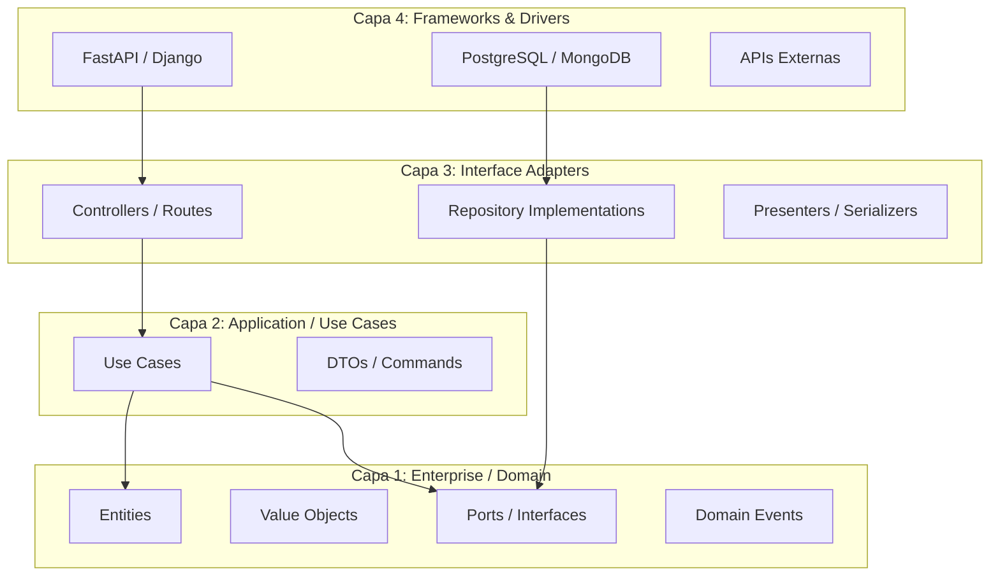
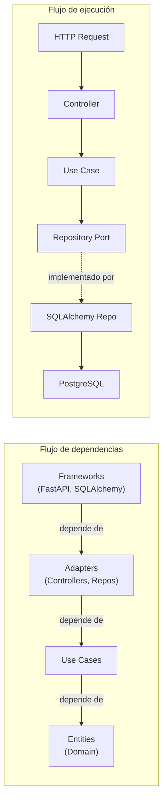

# 3. Clean Architecture

## Tabla de Contenidos

- [3.1 Introducción](#31-introducción)
- [3.2 Capas de Clean Architecture](#32-capas-de-clean-architecture)
- [3.3 Entities](#33-entities)
- [3.4 Use Cases](#34-use-cases)
- [3.5 Interface Adapters](#35-interface-adapters)
- [3.6 Frameworks y Drivers](#36-frameworks-y-drivers)
- [3.7 La Dependency Rule](#37-la-dependency-rule)
- [3.8 Estructura de Proyecto Completa](#38-estructura-de-proyecto-completa)
- [3.9 Ejemplo Completo](#39-ejemplo-completo)
- [3.10 Ejercicios Prácticos](#310-ejercicios-prácticos)
- [3.11 Resumen](#311-resumen)

---

## 3.1 Introducción

Clean Architecture, propuesta por Robert C. Martin, es un enfoque de diseño que organiza el código en capas concéntricas con una regla fundamental: **las dependencias solo pueden apuntar hacia adentro**. El objetivo es crear sistemas donde la lógica de negocio sea independiente de frameworks, bases de datos y mecanismos de entrega.

### ¿Por qué Clean Architecture?

| Problema | Solución con Clean Architecture |
|----------|-------------------------------|
| Cambiar de framework requiere reescribir todo | El framework es un detalle externo reemplazable |
| No se puede testear sin base de datos | La lógica de negocio no depende de la DB |
| La UI está acoplada al backend | Las capas de presentación son independientes |
| Cambiar de proveedor externo es costoso | Los adaptadores encapsulan integraciones |

---

## 3.2 Capas de Clean Architecture



### Regla de oro

> **Las capas internas NUNCA conocen la existencia de las capas externas.**

| Capa | Responsabilidad | Conoce a |
|------|----------------|----------|
| **Entities** | Reglas de negocio empresarial | Nada externo |
| **Use Cases** | Reglas de negocio de la aplicación | Entities y Ports |
| **Adapters** | Conversión de datos entre capas | Use Cases y Entities |
| **Frameworks** | Detalles técnicos | Adapters |

---

## 3.3 Entities

Las entidades encapsulan las reglas de negocio más críticas y universales. Son independientes de cualquier aplicación específica.

```python
# domain/entities/product.py
from dataclasses import dataclass, field
from decimal import Decimal
from uuid import UUID, uuid4

from domain.value_objects import Money, ProductName
from domain.exceptions import InsufficientStockError, InvalidDiscountError


@dataclass
class Product:
    """Entidad de dominio: reglas de negocio del producto."""

    name: ProductName
    price: Money
    stock: int
    id: UUID = field(default_factory=uuid4)

    def __post_init__(self):
        if self.stock < 0:
            raise ValueError("El stock no puede ser negativo")

    def is_available(self) -> bool:
        """Regla de negocio: un producto está disponible si tiene stock."""
        return self.stock > 0

    def reduce_stock(self, quantity: int) -> None:
        """Regla de negocio: reducir stock validando disponibilidad."""
        if quantity > self.stock:
            raise InsufficientStockError(
                product_id=self.id,
                requested=quantity,
                available=self.stock,
            )
        self.stock -= quantity

    def apply_discount(self, percentage: Decimal) -> Money:
        """Regla de negocio: aplicar descuento con validación."""
        if not (Decimal("0") <= percentage <= Decimal("50")):
            raise InvalidDiscountError(
                f"Descuento {percentage}% fuera del rango permitido (0-50%)"
            )
        discount = self.price.amount * (percentage / Decimal("100"))
        return Money(amount=self.price.amount - discount, currency=self.price.currency)
```

### Value Objects

```python
# domain/value_objects.py
from dataclasses import dataclass
from decimal import Decimal


@dataclass(frozen=True)
class Money:
    """Value Object inmutable que representa dinero."""

    amount: Decimal
    currency: str = "USD"

    def __post_init__(self):
        if self.amount < 0:
            raise ValueError("El monto no puede ser negativo")
        if len(self.currency) != 3:
            raise ValueError("La moneda debe ser un código ISO 4217")

    def add(self, other: "Money") -> "Money":
        if self.currency != other.currency:
            raise ValueError("No se pueden sumar monedas diferentes")
        return Money(amount=self.amount + other.amount, currency=self.currency)

    def multiply(self, factor: int) -> "Money":
        return Money(amount=self.amount * factor, currency=self.currency)


@dataclass(frozen=True)
class ProductName:
    """Value Object que valida nombres de producto."""

    value: str

    def __post_init__(self):
        if not self.value or len(self.value.strip()) < 3:
            raise ValueError("El nombre del producto debe tener al menos 3 caracteres")
        if len(self.value) > 200:
            raise ValueError("El nombre del producto no debe exceder 200 caracteres")


@dataclass(frozen=True)
class Email:
    """Value Object que valida emails."""

    value: str

    def __post_init__(self):
        if "@" not in self.value or "." not in self.value.split("@")[-1]:
            raise ValueError(f"Email inválido: {self.value}")
```

---

## 3.4 Use Cases

Los casos de uso contienen la lógica de negocio específica de la aplicación. Orquestan entidades y puertos para ejecutar una acción.

```python
# application/use_cases/create_order.py
from dataclasses import dataclass
from decimal import Decimal
from uuid import UUID

from domain.entities.order import Order, OrderLine
from domain.entities.product import Product
from domain.ports.repositories import OrderRepository, ProductRepository
from domain.ports.services import PaymentGateway, NotificationService
from domain.value_objects import Money


@dataclass(frozen=True)
class CreateOrderCommand:
    """DTO de entrada: datos necesarios para crear una orden."""

    customer_id: UUID
    items: list[dict]  # [{"product_id": UUID, "quantity": int}]
    payment_token: str


@dataclass(frozen=True)
class CreateOrderResult:
    """DTO de salida: resultado de la creación."""

    order_id: UUID
    total: Decimal
    status: str


class CreateOrderUseCase:
    """
    Caso de uso: Crear una orden de compra.
    
    Flujo:
    1. Validar que todos los productos existan y tengan stock.
    2. Calcular el total.
    3. Procesar el pago.
    4. Crear la orden.
    5. Reducir el stock.
    6. Notificar al cliente.
    """

    def __init__(
        self,
        product_repo: ProductRepository,
        order_repo: OrderRepository,
        payment_gateway: PaymentGateway,
        notification_service: NotificationService,
    ):
        self._product_repo = product_repo
        self._order_repo = order_repo
        self._payment = payment_gateway
        self._notification = notification_service

    def execute(self, command: CreateOrderCommand) -> CreateOrderResult:
        # 1. Obtener y validar productos
        order_lines = []
        for item in command.items:
            product = self._product_repo.find_by_id(item["product_id"])
            if product is None:
                raise ProductNotFoundError(item["product_id"])
            if not product.is_available():
                raise ProductUnavailableError(product.id)

            order_lines.append(
                OrderLine(product=product, quantity=item["quantity"])
            )

        # 2. Crear la orden (la entidad calcula el total)
        order = Order.create(
            customer_id=command.customer_id,
            lines=order_lines,
        )

        # 3. Procesar pago
        payment_result = self._payment.charge(
            amount=order.total,
            token=command.payment_token,
        )
        if not payment_result.success:
            raise PaymentFailedError(payment_result.error_message)

        order.mark_as_paid(payment_id=payment_result.transaction_id)

        # 4. Persistir orden y reducir stock
        self._order_repo.save(order)
        for line in order_lines:
            line.product.reduce_stock(line.quantity)
            self._product_repo.save(line.product)

        # 5. Notificar
        self._notification.send_order_confirmation(
            customer_id=command.customer_id,
            order_id=order.id,
        )

        return CreateOrderResult(
            order_id=order.id,
            total=order.total.amount,
            status=order.status.value,
        )
```

---

## 3.5 Interface Adapters

Los adaptadores traducen datos entre el formato de las capas externas y el formato que los use cases y entities necesitan.

### Controllers (entrada)

```python
# infrastructure/api/routes/orders.py
from fastapi import APIRouter, Depends, HTTPException, status
from pydantic import BaseModel
from uuid import UUID

from application.use_cases.create_order import CreateOrderCommand, CreateOrderUseCase
from infrastructure.di import get_create_order_use_case

router = APIRouter(prefix="/orders", tags=["orders"])


class CreateOrderRequest(BaseModel):
    """Schema de la API: validación de entrada HTTP."""

    customer_id: UUID
    items: list[dict]
    payment_token: str


class CreateOrderResponse(BaseModel):
    """Schema de la API: formato de respuesta HTTP."""

    order_id: UUID
    total: float
    status: str


@router.post(
    "/",
    response_model=CreateOrderResponse,
    status_code=status.HTTP_201_CREATED,
)
async def create_order(
    request: CreateOrderRequest,
    use_case: CreateOrderUseCase = Depends(get_create_order_use_case),
):
    """Endpoint que traduce HTTP → Use Case → HTTP."""
    try:
        command = CreateOrderCommand(
            customer_id=request.customer_id,
            items=request.items,
            payment_token=request.payment_token,
        )
        result = use_case.execute(command)
        return CreateOrderResponse(
            order_id=result.order_id,
            total=float(result.total),
            status=result.status,
        )
    except ProductNotFoundError as e:
        raise HTTPException(status_code=404, detail=str(e))
    except PaymentFailedError as e:
        raise HTTPException(status_code=402, detail=str(e))
```

### Repository Implementations (salida)

```python
# infrastructure/persistence/sqlalchemy_order_repository.py
from uuid import UUID

from sqlalchemy.orm import Session

from domain.entities.order import Order
from domain.ports.repositories import OrderRepository
from infrastructure.persistence.models import OrderModel, OrderLineModel


class SQLAlchemyOrderRepository(OrderRepository):
    """Adaptador: implementa el puerto con SQLAlchemy."""

    def __init__(self, session: Session):
        self._session = session

    def save(self, order: Order) -> None:
        model = OrderModel(
            id=str(order.id),
            customer_id=str(order.customer_id),
            total=float(order.total.amount),
            currency=order.total.currency,
            status=order.status.value,
        )
        for line in order.lines:
            model.lines.append(
                OrderLineModel(
                    product_id=str(line.product.id),
                    quantity=line.quantity,
                    unit_price=float(line.product.price.amount),
                )
            )
        self._session.add(model)
        self._session.commit()

    def find_by_id(self, order_id: UUID) -> Order | None:
        model = self._session.query(OrderModel).filter_by(id=str(order_id)).first()
        if model is None:
            return None
        return self._to_entity(model)

    def _to_entity(self, model: OrderModel) -> Order:
        """Mapea el modelo de persistencia a la entidad de dominio."""
        # ... mapeo de campos
        pass
```

---

## 3.6 Frameworks y Drivers

La capa más externa contiene los detalles técnicos: frameworks web, drivers de base de datos, clientes HTTP, etc.

```python
# infrastructure/config/database.py
from sqlalchemy import create_engine
from sqlalchemy.orm import sessionmaker

from infrastructure.config.settings import Settings


def create_database_engine(settings: Settings):
    """Detalle de infraestructura: configuración de SQLAlchemy."""
    return create_engine(
        settings.database_url,
        pool_size=settings.db_pool_size,
        max_overflow=settings.db_max_overflow,
        pool_pre_ping=True,
    )


def create_session_factory(engine):
    return sessionmaker(bind=engine, autocommit=False, autoflush=False)
```

---

## 3.7 La Dependency Rule



### Inversión de control en la práctica

```python
# infrastructure/di/container.py
"""
Punto de composición: aquí se conectan las abstracciones con las implementaciones.
Este es el ÚNICO lugar donde las capas externas conocen a las internas.
"""
from functools import lru_cache

from infrastructure.config.settings import Settings
from infrastructure.config.database import create_database_engine, create_session_factory
from infrastructure.persistence.sqlalchemy_order_repository import SQLAlchemyOrderRepository
from infrastructure.persistence.sqlalchemy_product_repository import SQLAlchemyProductRepository
from infrastructure.external.stripe_payment_gateway import StripePaymentGateway
from infrastructure.external.sendgrid_notification_service import SendGridNotificationService
from application.use_cases.create_order import CreateOrderUseCase


@lru_cache
def get_settings() -> Settings:
    return Settings()


def get_create_order_use_case() -> CreateOrderUseCase:
    settings = get_settings()
    engine = create_database_engine(settings)
    session = create_session_factory(engine)()

    return CreateOrderUseCase(
        product_repo=SQLAlchemyProductRepository(session),
        order_repo=SQLAlchemyOrderRepository(session),
        payment_gateway=StripePaymentGateway(settings.stripe_api_key),
        notification_service=SendGridNotificationService(settings.sendgrid_api_key),
    )
```

---

## 3.8 Estructura de Proyecto Completa

```
ecommerce/
├── src/
│   ├── domain/                          # Capa 1: Entidades
│   │   ├── entities/
│   │   │   ├── __init__.py
│   │   │   ├── order.py                 # Entidad Order
│   │   │   ├── product.py               # Entidad Product
│   │   │   └── customer.py              # Entidad Customer
│   │   ├── value_objects/
│   │   │   ├── __init__.py
│   │   │   ├── money.py
│   │   │   ├── email.py
│   │   │   └── address.py
│   │   ├── events/
│   │   │   ├── __init__.py
│   │   │   ├── order_created.py
│   │   │   └── payment_processed.py
│   │   ├── exceptions.py
│   │   └── ports/                       # Interfaces / Puertos
│   │       ├── __init__.py
│   │       ├── repositories.py
│   │       └── services.py
│   │
│   ├── application/                     # Capa 2: Use Cases
│   │   ├── use_cases/
│   │   │   ├── __init__.py
│   │   │   ├── create_order.py
│   │   │   ├── cancel_order.py
│   │   │   └── get_order.py
│   │   └── dtos/
│   │       ├── __init__.py
│   │       └── order_dtos.py
│   │
│   ├── infrastructure/                  # Capas 3 y 4
│   │   ├── api/                         # Adaptadores de entrada
│   │   │   ├── routes/
│   │   │   │   ├── orders.py
│   │   │   │   └── products.py
│   │   │   ├── middleware/
│   │   │   │   ├── error_handler.py
│   │   │   │   └── auth.py
│   │   │   └── schemas/
│   │   │       └── order_schemas.py
│   │   ├── persistence/                 # Adaptadores de salida
│   │   │   ├── models/
│   │   │   │   └── order_model.py
│   │   │   ├── sqlalchemy_order_repository.py
│   │   │   └── sqlalchemy_product_repository.py
│   │   ├── external/                    # Integraciones externas
│   │   │   ├── stripe_payment_gateway.py
│   │   │   └── sendgrid_notification.py
│   │   ├── config/
│   │   │   ├── settings.py
│   │   │   └── database.py
│   │   └── di/                          # Inyección de dependencias
│   │       └── container.py
│   │
│   └── main.py                          # Punto de entrada
│
├── tests/
│   ├── unit/
│   │   ├── domain/
│   │   └── application/
│   ├── integration/
│   │   └── infrastructure/
│   └── conftest.py
│
├── pyproject.toml
├── Dockerfile
└── docker-compose.yml
```

---

## 3.9 Ejemplo Completo

### Testing sin infraestructura

```python
# tests/unit/application/test_create_order.py
"""
Gracias a Clean Architecture, se puede testear el caso de uso
sin base de datos, sin Stripe, sin SendGrid.
"""
from decimal import Decimal
from uuid import uuid4

import pytest

from domain.entities.product import Product
from domain.value_objects import Money, ProductName
from application.use_cases.create_order import CreateOrderUseCase, CreateOrderCommand


class InMemoryProductRepository:
    """Implementación en memoria para testing."""

    def __init__(self, products: list[Product] | None = None):
        self._products = {p.id: p for p in (products or [])}

    def find_by_id(self, product_id):
        return self._products.get(product_id)

    def save(self, product):
        self._products[product.id] = product


class InMemoryOrderRepository:
    def __init__(self):
        self._orders = {}

    def save(self, order):
        self._orders[order.id] = order

    def find_by_id(self, order_id):
        return self._orders.get(order_id)


class FakePaymentGateway:
    def __init__(self, should_succeed: bool = True):
        self._should_succeed = should_succeed

    def charge(self, amount, token):
        from dataclasses import dataclass

        @dataclass
        class Result:
            success: bool
            transaction_id: str = "tx_fake_123"
            error_message: str = ""

        return Result(success=self._should_succeed)


class FakeNotificationService:
    def __init__(self):
        self.sent_notifications = []

    def send_order_confirmation(self, customer_id, order_id):
        self.sent_notifications.append((customer_id, order_id))


class TestCreateOrder:
    def setup_method(self):
        self.product = Product(
            name=ProductName("Laptop Pro"),
            price=Money(Decimal("999.99")),
            stock=10,
        )
        self.product_repo = InMemoryProductRepository([self.product])
        self.order_repo = InMemoryOrderRepository()
        self.payment = FakePaymentGateway(should_succeed=True)
        self.notification = FakeNotificationService()

        self.use_case = CreateOrderUseCase(
            product_repo=self.product_repo,
            order_repo=self.order_repo,
            payment_gateway=self.payment,
            notification_service=self.notification,
        )

    def test_creates_order_successfully(self):
        command = CreateOrderCommand(
            customer_id=uuid4(),
            items=[{"product_id": self.product.id, "quantity": 2}],
            payment_token="tok_test",
        )

        result = self.use_case.execute(command)

        assert result.status == "paid"
        assert result.total == Decimal("1999.98")
        assert len(self.notification.sent_notifications) == 1

    def test_fails_when_payment_rejected(self):
        self.payment = FakePaymentGateway(should_succeed=False)
        self.use_case = CreateOrderUseCase(
            product_repo=self.product_repo,
            order_repo=self.order_repo,
            payment_gateway=self.payment,
            notification_service=self.notification,
        )

        command = CreateOrderCommand(
            customer_id=uuid4(),
            items=[{"product_id": self.product.id, "quantity": 1}],
            payment_token="tok_invalid",
        )

        with pytest.raises(PaymentFailedError):
            self.use_case.execute(command)
```

---

## 3.10 Ejercicios Prácticos

### Ejercicio 1

Implementar una capa de dominio para un sistema de reservas de hotel con:
- Entidad `Reservation` con reglas de negocio (no se puede reservar en el pasado, máximo 30 días).
- Value Objects `DateRange`, `GuestName`, `RoomNumber`.
- Puerto `ReservationRepository`.

### Ejercicio 2

Crear dos implementaciones del `ReservationRepository`:
1. `InMemoryReservationRepository` para testing.
2. `SQLAlchemyReservationRepository` para producción.

### Ejercicio 3

Escribir un caso de uso `CancelReservationUseCase` que:
1. Busque la reservación.
2. Valide que se pueda cancelar (24h de anticipación mínima).
3. Procese el reembolso.
4. Notifique al huésped.

---

## 3.11 Resumen

| Concepto | Descripción |
|----------|-------------|
| **Entities** | Reglas de negocio universales, sin dependencias externas |
| **Use Cases** | Orquestación de lógica específica de la aplicación |
| **Adapters** | Traducción entre capas externas e internas |
| **Frameworks** | Detalles técnicos reemplazables |
| **Dependency Rule** | Las dependencias solo apuntan hacia adentro |
| **Ports** | Interfaces definidas por el dominio |
| **Adapters** | Implementaciones concretas de los puertos |

### 💡 Regla práctica

> Si al eliminar el framework web (FastAPI, Django) la lógica de negocio deja de compilar, la arquitectura está mal diseñada.

---

[← Anterior: SOLID](02-principios-solid.md) | [Índice](00-indice.md) | [Siguiente: DDD →](04-domain-driven-design.md)
