# RabbitMQ — Guía completa para principiantes

## ¿Qué es RabbitMQ?

RabbitMQ es un **message broker** (intermediario de mensajes). Su trabajo es recibir mensajes de un lado (productor) y entregarlos al otro lado (consumidor), sin que ambos lados necesiten conocerse ni estar disponibles al mismo tiempo.

Piénsalo como el sistema de correo postal:
- **Tú** escribes una carta (productor)
- **El correo** la guarda y enruta (RabbitMQ)
- **El destinatario** la recoge cuando puede (consumidor)

---

## Conceptos fundamentales

### 1. Message (Mensaje)

La unidad básica de información que viaja por el sistema. Contiene:
- **Body**: el contenido (JSON, texto, bytes, etc.)
- **Headers**: metadatos opcionales
- **Properties**: configuración como prioridad, TTL, tipo de contenido

```json
{
  "body": "{\"userId\": 42, \"action\": \"send_email\"}",
  "properties": {
    "content_type": "application/json",
    "delivery_mode": 2
  }
}
```

---

### 2. Producer (Productor)

Aplicación que **envía** mensajes a RabbitMQ. El productor nunca envía directamente a una cola; envía a un **exchange**.

---

### 3. Consumer (Consumidor)

Aplicación que **recibe y procesa** mensajes desde una cola. Puede haber múltiples consumidores en la misma cola.

---

### 4. Queue (Cola)

Buffer donde se almacenan los mensajes hasta que un consumidor los procesa. Las colas son **FIFO** (primero en entrar, primero en salir) por defecto.

Propiedades importantes:
| Propiedad | Descripción |
|-----------|-------------|
| `durable` | La cola sobrevive a reinicios del broker |
| `exclusive` | Solo la puede usar la conexión que la creó |
| `auto-delete` | Se elimina cuando no hay consumidores |
| `arguments` | Configuración extra (TTL, límite de mensajes, etc.) |

---

### 5. Exchange (Intercambiador)

El productor nunca habla directamente con una cola. Envía al exchange, que **enruta** el mensaje a la(s) cola(s) correcta(s) según reglas.

---

### 6. Binding (Enlace)

Es la regla que conecta un exchange con una cola. Le dice al exchange: "los mensajes con estas características van a esta cola".

---

### 7. Routing Key (Clave de enrutamiento)

Etiqueta que el productor pone en el mensaje. El exchange la usa para decidir a qué cola enviarlo.

---

## Flujo general

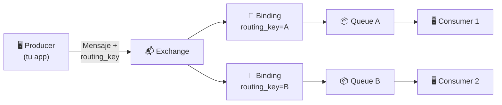

---

## Tipos de Exchange

Los exchanges son el corazón del enrutamiento. Hay 4 tipos:

### Direct Exchange

Enruta el mensaje a la cola cuyo binding key coincide **exactamente** con la routing key del mensaje.

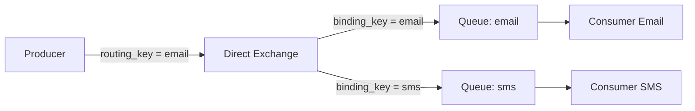

**Cuándo usarlo**: cuando quieres enviar un mensaje a un destino específico.

---

### Fanout Exchange

Ignora la routing key y envía el mensaje a **todas** las colas enlazadas. Broadcast total.

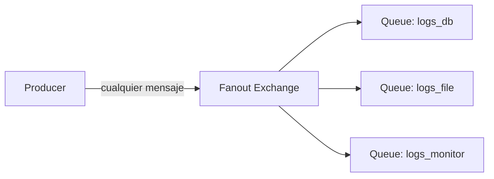

**Cuándo usarlo**: notificaciones generales, eventos que necesitan múltiples procesadores (guardar log + enviar alerta + actualizar dashboard).

---

### Topic Exchange

Enruta usando **patrones** en la routing key. Los patrones usan:
- `*` → exactamente una palabra
- `#` → cero o más palabras

Las palabras se separan con puntos: `orden.creada.mexico`

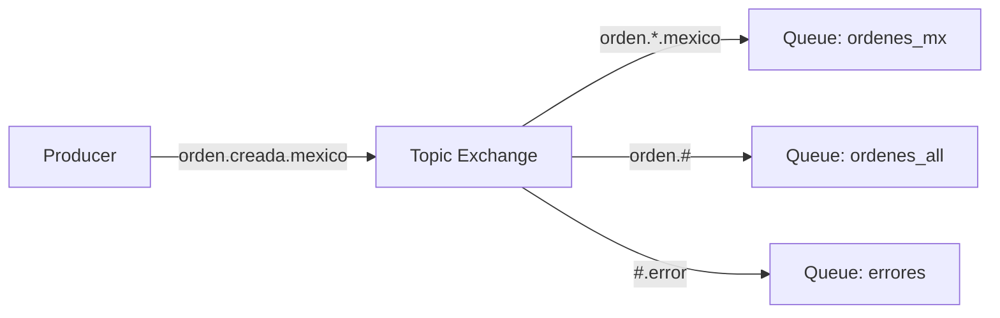

**Cuándo usarlo**: sistemas con eventos categorizados (logs por nivel y servicio, eventos por región, etc.).

---

### Headers Exchange

Enruta basándose en los **headers** del mensaje en lugar de la routing key. Más flexible pero menos común.

**Cuándo usarlo**: cuando necesitas enrutar por múltiples atributos complejos.

---

## Tabla comparativa de Exchanges

| Tipo | Routing Key | Uso típico |
|------|-------------|------------|
| `direct` | Match exacto | Tareas específicas por tipo |
| `fanout` | Se ignora | Broadcast / notificaciones |
| `topic` | Patrones con `*` y `#` | Eventos categorizados |
| `headers` | Headers del mensaje | Enrutamiento complejo |

---

## Acknowledgements (ACK/NACK)

Cuando un consumidor recibe un mensaje, RabbitMQ espera confirmación:

- **ACK (acknowledge)**: "procesé el mensaje correctamente, puedes borrarlo"
- **NACK (negative acknowledge)**: "algo salió mal, reencola el mensaje"
- **Reject**: "rechazo este mensaje" (con opción de descartarlo o reencolarlo)

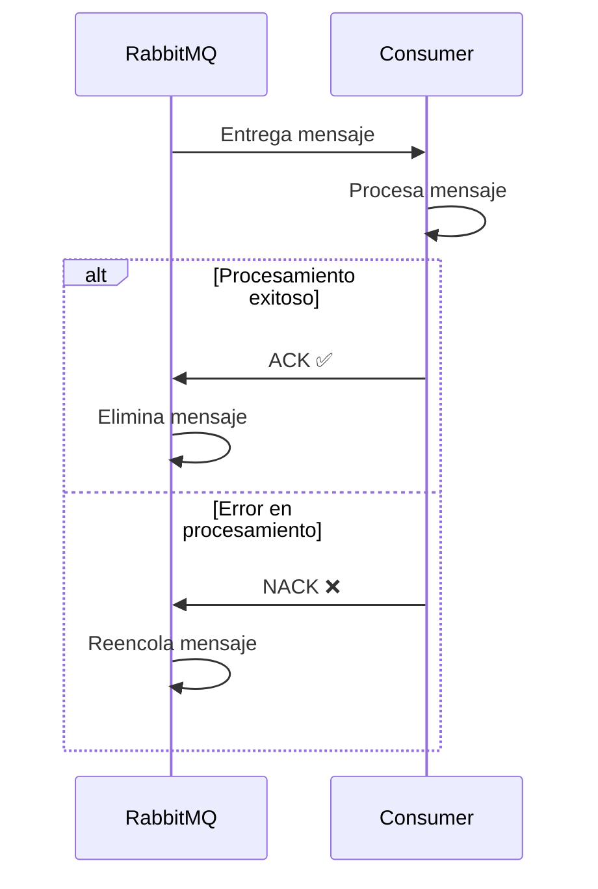

> **Importante**: si el consumidor muere sin enviar ACK, RabbitMQ reencola el mensaje automáticamente.

---

## Durabilidad y persistencia

Para no perder mensajes si RabbitMQ se reinicia, necesitas **dos cosas**:

1. **Cola durable**: la cola se recrea al reiniciar
2. **Mensaje persistente**: `delivery_mode = 2`

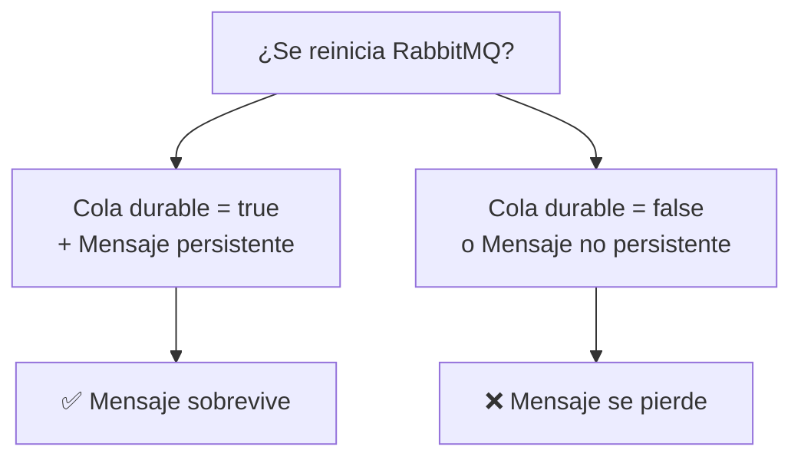

---

## Dead Letter Queue (DLQ)

Una **cola de mensajes muertos** recibe los mensajes que no pudieron ser procesados (NACK + no reencolar, TTL expirado, cola llena).

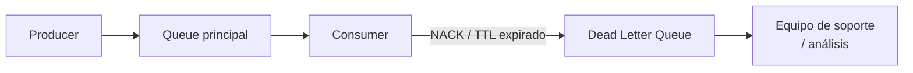

**Cuándo usarlo**: siempre que quieras inspeccionar mensajes fallidos en lugar de perderlos.

---

## Prefetch y distribución de trabajo

Cuando hay múltiples consumidores, RabbitMQ puede distribuir mensajes en round-robin. Con `prefetch_count` controlas cuántos mensajes no confirmados puede tener un consumidor a la vez.

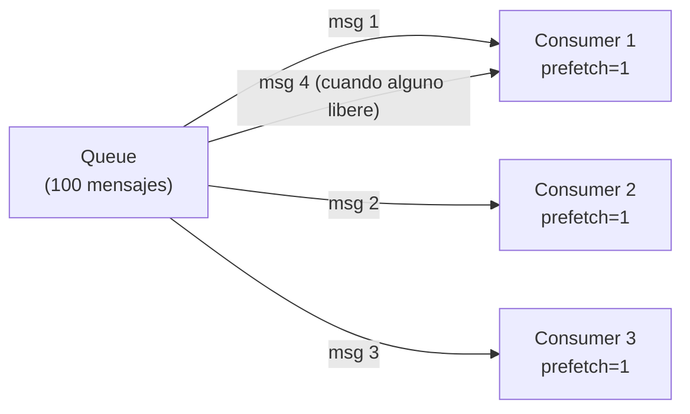

**Recomendación**: usa `prefetch_count = 1` para distribuir trabajo de forma justa cuando las tareas tienen duración variable.

---

## Virtual Hosts (vhost)

Son espacios de nombres dentro de RabbitMQ. Permiten tener múltiples entornos (dev, staging, prod) en un mismo servidor con total aislamiento.

```
RabbitMQ Server
├── /vhost-dev
│   ├── exchange: orders
│   └── queue: orders_queue
├── /vhost-staging
│   ├── exchange: orders
│   └── queue: orders_queue
└── /vhost-prod
    ├── exchange: orders
    └── queue: orders_queue
```

---

## Conexiones y Canales

- **Connection**: conexión TCP al servidor RabbitMQ. Es costosa de crear.
- **Channel**: canal virtual dentro de una conexión. Son baratos. Úsalos para operaciones individuales.

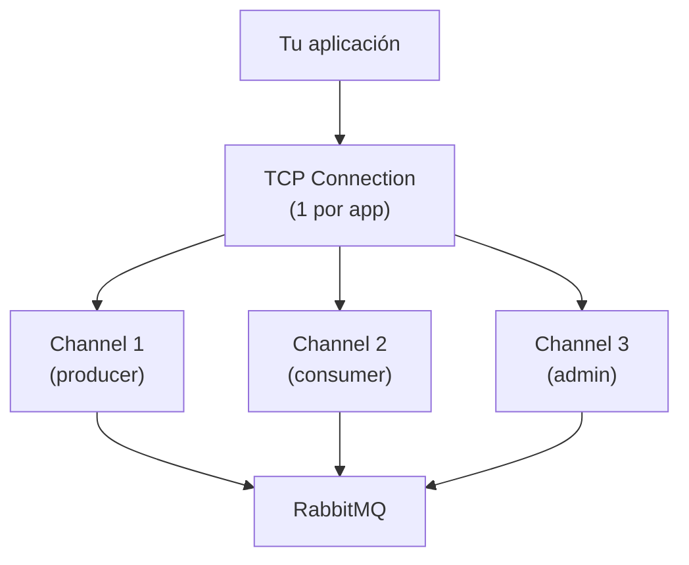

> **Buena práctica**: una conexión por aplicación, un canal por hilo/operación.

---

## Ejemplo práctico: Sistema de notificaciones

Supón que tienes una app que necesita enviar emails, SMS y guardar logs cuando un usuario se registra.

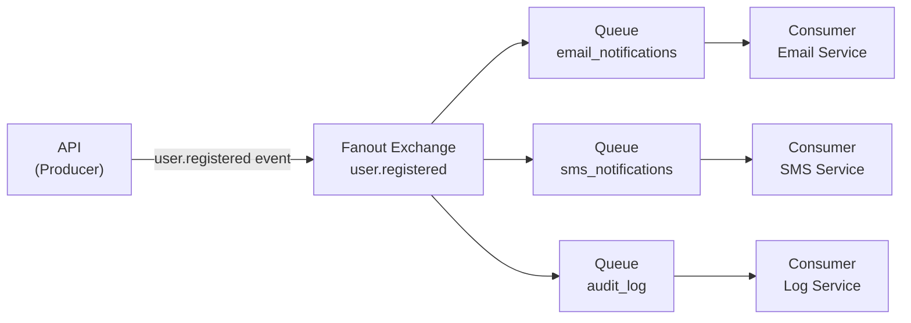

**Flujo**:
1. Usuario se registra → API publica evento en el exchange `user.registered`
2. El fanout exchange distribuye a las 3 colas
3. Cada servicio procesa de forma independiente y asíncrona
4. Si el servicio de SMS falla, los otros no se ven afectados

---

## Ejemplo práctico: Procesamiento de órdenes

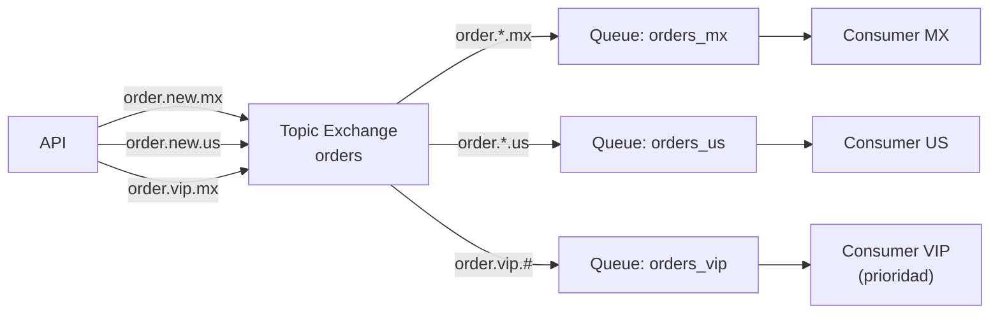

---

## Resumen de conceptos clave

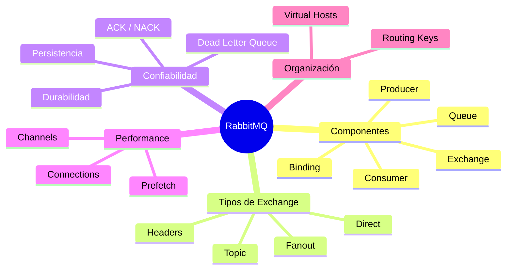

---

## Checklist para tu sistema

Antes de implementar, define:

- [ ] ¿Qué **eventos** va a publicar tu sistema?
- [ ] ¿Cuántos **consumidores** procesarán cada evento?
- [ ] ¿Qué tipo de **exchange** necesitas para cada caso?
- [ ] ¿Los mensajes deben ser **durables** (sobrevivir reinicios)?
- [ ] ¿Cómo manejarás los mensajes **fallidos** (DLQ)?
- [ ] ¿Necesitas **múltiples entornos** (vhosts)?
- [ ] ¿Cuál es el `prefetch_count` adecuado para tus consumers?

---

## Recursos para continuar

- [Documentación oficial](https://www.rabbitmq.com/documentation.html)
- [Tutoriales oficiales (6 partes)](https://www.rabbitmq.com/tutorials) — hay versiones en Python, Java, Go, JS, etc.
- Management UI: `http://localhost:15672` (usuario/contraseña: `guest/guest` por defecto)
